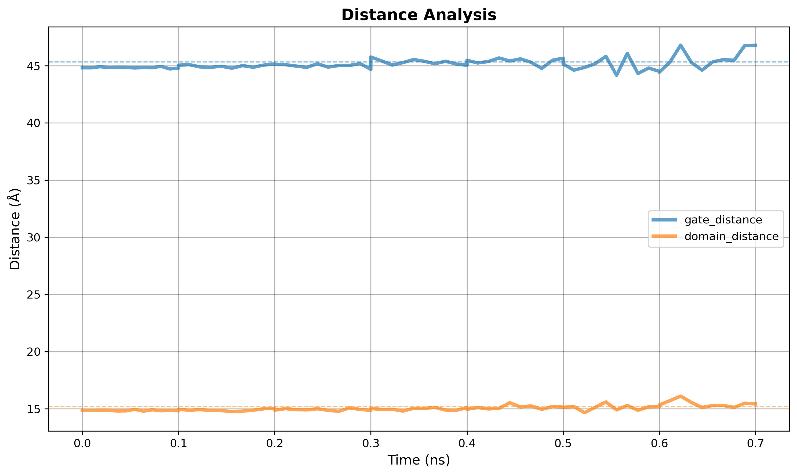

# Analysis Module API

Module for analyzing MD trajectories and NAMD energy data with easy-to-use wrapper classes supporting all GUI options.

## Overview

The analysis module provides two main classes:

- **`EnergyAnalyzer`** - Parse and plot NAMD energy data with full customization
- **`TrajectoryAnalyzer`** - Calculate and plot RMSD, RMSF, distances, and radius of gyration with complete control

**Key Features:**

- Simple 2-line API for quick analysis
- Full customization with all GUI options
- Multi-file support with proper time scaling
- Unit conversions (Å/nm, ps/ns/µs, kcal/kJ)
- Publication-quality plots (300 DPI)

## Import

```python
from gatewizard.utils.namd_analysis import (
    EnergyAnalyzer,
    TrajectoryAnalyzer,
    get_equilibration_progress
)
```

---

## Using Custom Time Input in the GUI

### For Trajectory Files (.dcd, .xtc, .trr)

When analyzing multiple trajectory files in the GUI **Structural Analysis** tab:

1. **Add Files**: Click "Add Files" or "Add Folder" to load trajectory files
2. **Input Time**: Each file will appear in the list with a time input field showing "Time (ns)"
3. **Enter Duration**: Enter the simulation duration for each file in **nanoseconds**
   - Example: For a 50 ps simulation, enter `0.05` (50 ps = 0.05 ns)
4. **Auto-Detect**: Click "Auto-Detect Time" to automatically extract times from DCD headers
5. **Reorder**: Drag files using the `:::` handle to reorder if needed

**Example File List:**
```
:::  step1_equilibration.dcd    [0.05] ns
:::  step2_equilibration.dcd    [0.05] ns  
:::  step3_equilibration.dcd    [0.05] ns
```
Total time: 0.15 ns (150 ps) continuous

### For Energy Log Files (.log)

When analyzing NAMD log files in the GUI **Energetic Analysis** tab:

1. **Add Files**: Click "Add Files" or "Add Folder" to load NAMD log files
2. **Input Time**: Each file will appear with a time input field
3. **Enter Duration**: Enter the simulation duration for each file in **nanoseconds**
   - Example: For step1_equilibration.log (50 ps), enter `0.05`
4. **Auto-Detect**: Click "Auto-Detect Time" to extract from log file timestamps
5. **Plot**: The time axis will scale correctly across all files

**Example File List:**
```
:::  step1_equilibration.log    [0.05] ns
:::  step2_equilibration.log    [0.05] ns
:::  step7_production.log       [0.10] ns
```

**Important Notes:**

- Time input is the **duration** of each file, not cumulative
- Files are processed in order - time is sequential (file1: 0-50ps, file2: 50-100ps, etc.)
- Leave empty or 0 to use default timestep-based calculation
- Time unit is always **nanoseconds** in the input fields
- You can change display units (ps/ns/µs) in Plot Settings

---

## Class: EnergyAnalyzer

Easy-to-use wrapper for NAMD energy analysis with built-in plotting and customization.

### Constructor

```python
EnergyAnalyzer(
    log_file: Union[Path, str, List[Union[Path, str]]],
    file_times: Optional[Dict[str, float]] = None
)
```

Initialize energy analyzer with NAMD log file(s).

**Parameters:**

`log_file` (Path, str, or List): Path to NAMD log file, or list of paths for multi-file analysis

  - Single file: `"step1_equilibration.log"`
  - Multiple files: `["step1.log", "step2.log", "step3.log"]`

`file_times` (Dict[str, float], optional): Mapping of log filenames to their simulation durations in **nanoseconds**

  - Example: `{"step1.log": 0.05, "step2.log": 0.05, "step3.log": 0.05}`
  - **Important:** Use just the filename (not full path) as the key
  - Time is the **duration** of each file, not cumulative
  - **Note:** In the GUI, you can input times for each file directly in the file list

**Examples:**
```python
# Single file
analyzer = EnergyAnalyzer("step1_equilibration.log")

# Multiple files with custom time
analyzer = EnergyAnalyzer(
    ["step1.log", "step2.log", "step3.log"],
    file_times={
        "step1.log": 0.05,  # 50 ps = 0.05 ns
        "step2.log": 0.05,
        "step3.log": 0.05
    }
)
```

---

### Method: `plot_energy()`

Create a 4-panel energy analysis plot with full customization.

```python
plot_energy(
    energy_units: str = "kcal/mol",
    time_units: str = "ns",
    target_temperature: Optional[float] = None,
    target_pressure: Optional[float] = None,
    bg_color: str = "#2b2b2b",
    fig_bg_color: str = "#212121",
    text_color: str = "Auto",
    show_grid: bool = True,
    title: Optional[str] = None,
    save: Optional[str] = None,
    show: bool = False,
    figsize: tuple = (12, 10),
    dpi: int = 300
)
```

**Parameters:**

| Parameter | Type | Default | Description |
|-----------|------|---------|-------------|
| `energy_units` | str | `"kcal/mol"` | Energy units: `"kcal/mol"` or `"kJ/mol"` |
| `time_units` | str | `"ns"` | Time units: `"ps"`, `"ns"`, or `"µs"` |
| `target_temperature` | float or None | `None` | Target temperature for reference line (K). Defaults to 300.0 K if not provided. |
| `target_pressure` | float or None | `None` | Target pressure for reference line (atm). Defaults to 1.0 atm if not provided. |
| `bg_color` | str | `"#2b2b2b"` | Plot area background color (hex or `"none"`) |
| `fig_bg_color` | str | `"#212121"` | Figure border background color (hex or `"none"`) |
| `text_color` | str | `"Auto"` | Text/axes color (`"Auto"`, color name, or hex) |
| `show_grid` | bool | `True` | Show grid lines on plots |
| `title` | str or None | `None` | Custom main title (auto-generated if None) |
| `save` | str or None | `None` | Filename to save plot |
| `show` | bool | `False` | Display plot interactively |
| `figsize` | tuple | `(12, 10)` | Figure size (width, height) in inches |
| `dpi` | int | `300` | Resolution for saved figure |

**Plots Generated:**

1. **Total Energy** - Convergence over time
2. **Potential & Kinetic** - Energy components
3. **Temperature** - Stability with target line
4. **Pressure** - Fluctuations (or energy components if no pressure)

---

### Method: `plot_properties()`

Create custom plots of selected energy/thermodynamic properties with full control over visualization.

This method provides complete API access to all GUI plotting capabilities, allowing users to:

- Analyze multiple log files with custom time assignments
- Select specific properties to plot
- Combine or separate data from multiple files
- Apply full customization (colors, units, grid, limits, etc.)

```python
plot_properties(
    properties: Union[str, List[str]],
    separate_plots: bool = False,
    energy_units: str = "kcal/mol",
    time_units: str = "ns",
    line_colors: Optional[Union[str, List[str]]] = None,
    bg_color: str = "#2b2b2b",
    fig_bg_color: str = "#212121",
    text_color: str = "Auto",
    grid_color: str = "#444444",
    show_grid: bool = True,
    xlim: Optional[tuple] = None,
    ylim: Optional[tuple] = None,
    title: Optional[str] = None,
    save_prefix: Optional[str] = None,
    show: bool = False,
    figsize: tuple = (10, 6),
    dpi: int = 300
)
```

**Parameters:**

| Parameter | Type | Default | Description |
|-----------|------|---------|-------------|
| `properties` | str or List[str] | - | Property name(s) to plot. See available properties below. |
| `separate_plots` | bool | `False` | If True, create individual plots per file; if False, combine all files on same plot |
| `energy_units` | str | `"kcal/mol"` | Energy units: `"kcal/mol"` or `"kJ/mol"` |
| `time_units` | str | `"ns"` | Time units: `"ps"`, `"ns"`, or `"µs"` |
| `line_colors` | str or List[str] | `None` | Line color(s). Single color or list for multiple files. Auto-assigned if None. |
| `bg_color` | str | `"#2b2b2b"` | Plot area background color (hex, color name, or `"none"`) |
| `fig_bg_color` | str | `"#212121"` | Figure border background color (hex, color name, or `"none"`) |
| `text_color` | str | `"Auto"` | Text/axes color. `"Auto"` auto-detects from bg luminance. |
| `grid_color` | str | `"#444444"` | Grid line color (hex or color name) |
| `show_grid` | bool | `True` | Show grid lines |
| `xlim` | tuple or None | `None` | X-axis limits: `(min, max)` |
| `ylim` | tuple or None | `None` | Y-axis limits: `(min, max)` |
| `title` | str or None | `None` | Custom plot title (auto-generated if None) |
| `save_prefix` | str or None | `None` | Prefix for saved filenames. Files saved as `{prefix}_{property}.png` |
| `show` | bool | `False` | Display plot interactively |
| `figsize` | tuple | `(10, 6)` | Figure size (width, height) in inches |
| `dpi` | int | `300` | Resolution for saved figures |

**Available Properties:**

Use `get_available_properties()` method to see all properties in your log file(s).

**Note:** Property names are **case-insensitive** and support multiple formats. For example, to plot temperature, you can use:

- `"TEMP"`, `"temp"`, `"Temp"` (short names)
- `"Temperature"`, `"TEMPERATURE"`, `"temperature"` (full names)
- Any mixed case variation like `"TeMpErAtUrE"` will also work!

The same applies to all properties - use whatever format is most convenient for you.

| Property | Alternative Names | Description | Units |
|----------|------------------|-------------|-------|
| `"TOTAL"` | `"Total"`, `"total"`, `"Total Energy"`, etc. | Total energy | kcal/mol or kJ/mol |
| `"KINETIC"` | `"Kinetic"`, `"kinetic"`, `"kin"`, `"Kinetic Energy"` | Kinetic energy | kcal/mol or kJ/mol |
| `"POTENTIAL"` | `"Potential"`, `"potential"`, `"pot"`, `"Potential Energy"` | Potential energy | kcal/mol or kJ/mol |
| `"ELECT"` | `"Elect"`, `"elect"`, `"elec"`, `"Electrostatic Energy"` | Electrostatic energy | kcal/mol or kJ/mol |
| `"VDW"` | `"vdw"`, `"Vdw"`, `"Van der Waals Energy"` | van der Waals energy | kcal/mol or kJ/mol |
| `"TEMP"` | `"temp"`, `"Temp"`, `"Temperature"` | Temperature | K |
| `"PRESSURE"` | `"pressure"`, `"Pressure"`, `"press"`, `"Press"` | Pressure | bar |
| `"VOLUME"` | `"volume"`, `"Volume"`, `"vol"`, `"Vol"` | System volume | Ų |
| `"BOND"` | `"bond"`, `"Bond"`, `"Bond Energy"` | Bond energy | kcal/mol or kJ/mol |
| `"ANGLE"` | `"angle"`, `"Angle"`, `"Angle Energy"` | Angle energy | kcal/mol or kJ/mol |
| `"DIHEDRAL"` | `"dihedral"`, `"Dihedral"`, `"Dihedral Energy"` | Dihedral energy | kcal/mol or kJ/mol |
| `"IMPROPER"` | `"improper"`, `"Improper"`, `"Improper Energy"` | Improper energy | kcal/mol or kJ/mol |

### Example 1: Basic Energy Analysis

Simplest energy analysis using `plot_energy()` - 4-panel plot with default settings.

```python
from pathlib import Path
from gatewizard.utils.namd_analysis import EnergyAnalyzer

# Get the directory where this script is located
script_dir = Path(__file__).parent
data_dir = script_dir / "equilibration_folder"

# Multiple log files from equilibration_folder
log_files = [
    data_dir / "step1_equilibration.log",
    data_dir / "step2_equilibration.log",
    data_dir / "step3_equilibration.log"
]

# Initialize analyzer with custom time for each file (in nanoseconds)
analyzer = EnergyAnalyzer(
    [str(f) for f in log_files],
    file_times={
        "step1_equilibration.log": 0.1,  # 100 ps
        "step2_equilibration.log": 0.1,  # 100 ps
        "step3_equilibration.log": 0.1   # 100 ps
    }
)

# Generate comprehensive 4-panel energy plot
analyzer.plot_energy(target_temperature=300,    # 300 K
                     target_pressure=1.01325,   # 1.01325 atm (1 bar)
                     time_units="ps",
                     save="energy_analysis_example_01.png")

print(f"Energy analysis complete!")
print(f"Plot saved: energy_analysis_example_01.png")
```

**Output figure:**


*Figure: Default energy plot using the specified NAMD .log files.*


---

**Multi-File Color Assignment:**

When plotting multiple files on the same plot, colors are automatically assigned:

- If `line_colors` is a single color: all files use that color
- If `line_colors` is a list: each file gets corresponding color
- If `line_colors=None`: auto-assigned from matplotlib color cycle

**Time Scaling with `file_times`:**

The `file_times` parameter in the constructor allows mapping data points to correct time ranges:
```python
# Example: 3 files with different simulation times
# File 1: 0-50 ns (5000 frames)
# File 2: 50-125 ns (7500 frames)  
# File 3: 125-200 ns (7500 frames)

analyzer = EnergyAnalyzer(
    log_file=["file1.log", "file2.log", "file3.log"],
    file_times=[(0, 50), (50, 125), (125, 200)],
    # or
    #file_times={
    #    "file1.log": 0.05,  # 50 ps = 0.05 ns
    #    "file2.log": 0.05,
    #    "file3.log": 0.05
    #}
)

# Now time axis will correctly show 0-200 ns with proper frame distribution
analyzer.plot_properties(properties="TEMP", time_units="ns")
```

---

### Method: `get_available_properties()`

Get list of all plottable properties available in the loaded log file(s).

```python
get_available_properties() -> List[str]
```

**Returns:** List of property names that can be passed to `plot_properties()`

### Example 2: Get available properties

```python
from pathlib import Path
from gatewizard.utils.namd_analysis import EnergyAnalyzer

# Get the directory where this script is located
script_dir = Path(__file__).parent

# Path to log file in equilibration_folder
log_file = script_dir / "equilibration_folder" / "step1_equilibration.log"

# Initialize energy analyzer
analyzer = EnergyAnalyzer(log_file)
props = analyzer.get_available_properties()
print(f"Can plot: {', '.join(props)}")
# Output: Can plot: Total Energy, Potential Energy, Kinetic Energy, 
# Electrostatic Energy, Van der Waals Energy, Bond Energy, 
# Angle Energy, Dihedral Energy, Improper Energy, Pressure, Volume

```

---


### Example 3: Individual energy plots
```python
from pathlib import Path
from gatewizard.utils.namd_analysis import EnergyAnalyzer

# Get the directory where this script is located
script_dir = Path(__file__).parent
data_dir = script_dir / "equilibration_folder"

# Multiple log files from equilibration_folder
log_files = [
    data_dir / "step1_equilibration.log",
    data_dir / "step2_equilibration.log",
    data_dir / "step3_equilibration.log",
    data_dir / "step4_equilibration.log",
    data_dir / "step5_equilibration.log",
    data_dir / "step6_equilibration.log",
    data_dir / "step7_production.log"
]

# Initialize analyzer with custom time for each file (in nanoseconds)
analyzer = EnergyAnalyzer(
    [str(f) for f in log_files],
    file_times={
        "step1_equilibration.log": 0.1,  # 100 ps
        "step2_equilibration.log": 0.1,  # 100 ps
        "step3_equilibration.log": 0.1,  # 100 ps
        "step4_equilibration.log": 0.1,  # 100 ps
        "step5_equilibration.log": 0.1,  # 100 ps
        "step6_equilibration.log": 0.1,  # 100 ps
        "step7_production.log": 0.1,     # 100 ps
    }
)

# Plot specific energy properties
analyzer.plot_properties(
    properties=["bond energy", "angle energy", "dihedral energy"],
    energy_units="kcal/mol",
    time_units="ps",
    bg_color = "#ffffff",
    fig_bg_color = "#FFFFFF",
    save="energy_analysis_example_03.png",
    dpi=300,
)

print(f"Energy properties plot complete!")
print(f"Plot saved: energy_analysis_example_03.png")
```

**Example Output:**


*Figure: Multiple energy properties plot.*

---

### Method: `get_statistics()`

Get statistical summary of all energy components.

```python
get_statistics() -> Dict[str, Dict[str, float]]
```

**Returns:** Dictionary with statistics for each energy term

**Statistics Provided:**

- `mean` - Average value
- `std` - Standard deviation
- `min` - Minimum value
- `max` - Maximum value
- `initial` - First value
- `final` - Last value

**Available Energy Terms:**

- `timestep`, `total`, `kinetic`, `potential`
- `elect`, `vdw`, `boundary`, `misc`
- `temp`, `pressure`, `volume`

### Example 4: Individual energy plots

```python
from pathlib import Path
from gatewizard.utils.namd_analysis import EnergyAnalyzer

# Get the directory where this script is located
script_dir = Path(__file__).parent

# Path to log file in equilibration_folder
log_file = script_dir / "equilibration_folder" / "step2_equilibration.log"

# Initialize energy analyzer
analyzer = EnergyAnalyzer(log_file)

stats = analyzer.get_statistics()

# Temperature
temp = stats['temp']
print(f"Temperature: {temp['mean']:.1f} ± {temp['std']:.1f} K")
print(f"  Range: {temp['min']:.1f} - {temp['max']:.1f} K")

# Energy
energy = stats['bond']
print(f"Bond Energy: {energy['mean']:.0f} kcal/mol")
print(f"  Final: {energy['final']:.0f} kcal/mol")
print(f"  Convergence: {abs(energy['final'] - energy['mean']):.0f} kcal/mol")

# Output: 
# Temperature: 303.6 ± 2.1 K
#   Range: 299.4 - 306.3 K
# Bond Energy: 2080 kcal/mol
#   Final: 2097 kcal/mol
#   Convergence: 17 kcal/mol
```

---

## Class: TrajectoryAnalyzer

Easy-to-use wrapper for MD trajectory analysis with built-in plotting and full customization.

### Constructor

```python
TrajectoryAnalyzer(
    topology: Path,
    trajectory: Path | List[Path],
    file_times: Optional[Dict[str, float]] = None
)
```

Initialize trajectory analyzer with topology and trajectory file(s).

**Parameters:**

- `topology` (Path or str): Path to topology file (PSF, PDB, IMPCRD, etc.)
- `trajectory` (Path, str, or List): Path(s) to trajectory file(s) (DCD, XTC, TRR, etc.)
- Single file: `"trajectory.dcd"`
- Multiple files: `["eq1.dcd", "eq2.dcd", "prod.dcd"]`
- `file_times` (Dict[str, float], optional): Mapping of trajectory filenames to their simulation durations in **nanoseconds**

Example: `{"eq1.dcd": 0.05, "eq2.dcd": 0.05, "prod.dcd": 0.05}`

  - **Important:** Use just the filename (not full path) as the key
  - Time is the **duration** of that file, not cumulative
  - **Note:** In the GUI, you can input times for each file directly in the file list

**Examples:**

**Single Trajectory:**
```python
analyzer = TrajectoryAnalyzer("system.pdb", "trajectory.dcd")
```

**Multiple Trajectories with Time Scaling:**
```python
analyzer = TrajectoryAnalyzer(
    "system.pdb",
    ["step1_equilibration.dcd", "step2_equilibration.dcd", "step7_production.dcd"],
    file_times={
        "step1_equilibration.dcd": 0.05,  # 50 ps
        "step2_equilibration.dcd": 0.05,  # 50 ps
        "step7_production.dcd": 0.05      # 50 ps
    }
)
# Time axis will be continuous: [0...0.05] [0.05...0.10] [0.10...0.15] ns
```

---

### Method: `calculate_rmsd()`

Calculate RMSD for selected atoms.

```python
calculate_rmsd(
    selection: str = "protein and backbone",
    reference_frame: int = 0,
    align: bool = True
) -> Dict[str, np.ndarray]
```

**Parameters:**

- `selection` (str): MDTraj selection string
- `reference_frame` (int): Frame to use as reference (0 = first frame)
- `align` (bool): If True, perform structural alignment (rotation + translation) before RMSD.
                 If False, calculate raw coordinate RMSD without alignment.

**Returns:** Dictionary with:

- `'time'`: Time array in **nanoseconds**
- `'rmsd'`: RMSD values in **Angstroms**

**Example:**
```python
data = analyzer.calculate_rmsd("protein and backbone", align=True)
print(f"Time range: {data['time'][0]:.3f} - {data['time'][-1]:.3f} ns")
print(f"RMSD range: {data['rmsd'].min():.2f} - {data['rmsd'].max():.2f} Å")
```

---

### Method: `plot_rmsd()`

Plot RMSD with full customization options including line styling, threshold highlighting, and convergence line control.

```python
plot_rmsd(
    selection: str = "protein and backbone",
    reference_frame: int = 0,
    align: bool = True,
    distance_units: str = "Å",
    time_units: str = "ns",
    line_color: str = "blue",
    line_width: float = 1.2,
    line_style: str = "-",
    bg_color: str = "#2b2b2b",
    fig_bg_color: str = "#212121",
    text_color: str = "Auto",
    show_grid: bool = True,
    xlim: Optional[tuple] = None,
    ylim: Optional[tuple] = None,
    title: Optional[str] = None,
    xlabel: Optional[str] = None,
    ylabel: Optional[str] = None,
    highlight_threshold: Optional[float] = None,
    highlight_color: str = "orange",
    highlight_alpha: float = 0.2,
    show_convergence: bool = True,
    convergence_color: str = "red",
    convergence_style: str = "--",
    convergence_width: float = 1.5,
    hlines: Optional[List[float]] = None,
    hline_colors: Optional[List[str]] = None,
    hline_styles: Optional[List[str]] = None,
    hline_widths: Optional[List[float]] = None,
    vlines: Optional[List[float]] = None,
    vline_colors: Optional[List[str]] = None,
    vline_styles: Optional[List[str]] = None,
    vline_widths: Optional[List[float]] = None,
    save: Optional[str] = None,
    show: bool = False,
    figsize: tuple = (10, 6),
    dpi: int = 300
)
```

**Parameters:**

| Parameter | Type | Default | Description |
|-----------|------|---------|-------------|
| `selection` | str | `"protein and backbone"` | MDTraj selection string |
| `reference_frame` | int | `0` | Reference frame index |
| `align` | bool | `True` | Perform structural alignment before RMSD |
| `distance_units` | str | `"Å"` | Distance units: `"Å"` or `"nm"` |
| `time_units` | str | `"ns"` | Time units: `"ps"`, `"ns"`, or `"µs"` |
| `line_color` | str | `"blue"` | Plot line color (matplotlib color or hex) |
| `line_width` | float | `1.2` | Line thickness/width |
| `line_style` | str | `"-"` | Line style: `"-"` (solid), `"--"` (dashed), `"-."` (dash-dot), `":"` (dotted) |
| `bg_color` | str | `"#2b2b2b"` | Plot area background (hex or `"none"`) |
| `fig_bg_color` | str | `"#212121"` | Figure border background (hex or `"none"`) |
| `text_color` | str | `"Auto"` | Text/axes color (`"Auto"`, color, or hex) |
| `show_grid` | bool | `True` | Show grid lines |
| `xlim` | tuple or None | `None` | X-axis limits (min, max) |
| `ylim` | tuple or None | `None` | Y-axis limits (min, max) |
| `title` | str or None | `None` | Custom title (auto-generated if None) |
| `xlabel` | str or None | `None` | Custom X-label (auto with units if None) |
| `ylabel` | str or None | `None` | Custom Y-label (auto with units if None) |
| `highlight_threshold` | float or None | `None` | Highlight regions above this RMSD value |
| `highlight_color` | str | `"orange"` | Color for highlight region and line |
| `highlight_alpha` | float | `0.2` | Alpha transparency for highlight fill |
| `show_convergence` | bool | `True` | Show convergence line (mean of last 20% of trajectory) |
| `convergence_color` | str | `"red"` | Color for convergence line |
| `convergence_style` | str | `"--"` | Line style for convergence line |
| `convergence_width` | float | `1.5` | Width of convergence line |
| `hlines` | list or None | `None` | List of Y values for horizontal reference lines |
| `hline_colors` | list or None | `None` | List of colors for horizontal lines |
| `hline_styles` | list or None | `None` | List of line styles for horizontal lines (default: `"--"`) |
| `hline_widths` | list or None | `None` | List of line widths for horizontal lines (default: `1.0`) |
| `vlines` | list or None | `None` | List of X values for vertical reference lines |
| `vline_colors` | list or None | `None` | List of colors for vertical lines |
| `vline_styles` | list or None | `None` | List of line styles for vertical lines (default: `"--"`) |
| `vline_widths` | list or None | `None` | List of line widths for vertical lines (default: `1.0`) |
| `save` | str or None | `None` | Filename to save plot |
| `show` | bool | `False` | Display plot interactively |
| `figsize` | tuple | `(10, 6)` | Figure size (width, height) |
| `dpi` | int | `300` | Resolution for saved figure |

### Example 5: RMSD Plot

```python
from pathlib import Path
from gatewizard.utils.namd_analysis import TrajectoryAnalyzer

# Get the directory where this script is located
script_dir = Path(__file__).parent
data_dir = script_dir / "equilibration_folder"

# Path to topology in equilibration_folder
topology_file = data_dir / "system.pdb"

# Multiple trajectory files from equilibration_folder
trajectory_files = [
    data_dir / "step1_equilibration.dcd",
    data_dir / "step2_equilibration.dcd",
    data_dir / "step3_equilibration.dcd"
]

# Initialize analyzer with custom time for each file (in nanoseconds)
analyzer = TrajectoryAnalyzer(
    topology_file,
    trajectory_files,
    file_times={
        "step1_equilibration.dcd": 0.1,  # 100 ps
        "step2_equilibration.dcd": 0.1,  # 100 ps
        "step3_equilibration.dcd": 0.1   # 100 ps
    }
)

# Plot RMSD across all trajectories
analyzer.plot_rmsd(
    selection="protein and backbone",
    time_units="ns",
    bg_color="white",
    fig_bg_color="white",
    text_color="black",
    show_grid=False,
    line_color="#1f77b4",
    line_width=2,
    #title=" ",
    save="trajectory_analysis_example_05.png",
    dpi=300,
    # other settings...
)


print(f"Multi-file trajectory analysis complete!")
print(f"Plot saved: trajectory_analysis_example_05.png")
print(f"Total simulation time: 300 ps")
```

---

### Method: `calculate_rmsf()`

Calculate RMSF (Root Mean Square Fluctuation) for selected atoms.

```python
calculate_rmsf(
    selection: str = "protein and name CA"
) -> Dict[str, np.ndarray]
```

**Parameters:**

- `selection` (str): MDTraj selection string

**Returns:** Dictionary with:

- `'resids'`: Residue numbers
- `'rmsf'`: RMSF values in **Angstroms**
- `'resnames'`: Residue names (e.g., ALA, GLY, VAL)
- `'atom_indices'`: Atom indices

### Example 6: RMSF Calculation

```python
from pathlib import Path
from gatewizard.utils.namd_analysis import TrajectoryAnalyzer

# Get the directory where this script is located
script_dir = Path(__file__).parent
data_dir = script_dir / "equilibration_folder"

# Path to topology in equilibration_folder
topology_file = data_dir / "system.pdb"

# Multiple trajectory files from equilibration_folder
trajectory_files = [
    data_dir / "step1_equilibration.dcd",
    data_dir / "step2_equilibration.dcd",
    data_dir / "step3_equilibration.dcd"
]

# Initialize analyzer with custom time for each file (in nanoseconds)
analyzer = TrajectoryAnalyzer(
    topology_file,
    trajectory_files,
    file_times={
        "step1_equilibration.dcd": 0.1,  # 100 ps
        "step2_equilibration.dcd": 0.1,  # 100 ps
        "step3_equilibration.dcd": 0.1   # 100 ps
    }
)

# Calculate RMSF for alpha carbon atoms
data = analyzer.calculate_rmsf("protein and name CA")
print(f"Residues analyzed: {len(data['resids'])}")
print(f"RMSF range: {data['rmsf'].min():.2f} - {data['rmsf'].max():.2f} Å")
print(f"Mean RMSF: {data['rmsf'].mean():.2f} Å")

# Output:
# Residues analyzed: 26
# RMSF range: 0.09 - 0.15 Å
# Mean RMSF: 0.12 Å

```

---

### Method: `plot_rmsf()`

Plot RMSF with full customization including line styling, residue labeling, and flexibility highlighting.

```python
plot_rmsf(
    selection: str = "protein and name CA",
    xaxis_type: str = "residue_number",
    show_residue_labels: bool = True,
    residue_name_format: str = "single",
    label_frequency: str = "auto",
    distance_units: str = "Å",
    line_color: str = "blue",
    line_width: float = 1.2,
    line_style: str = "-",
    bg_color: str = "#2b2b2b",
    fig_bg_color: str = "#212121",
    text_color: str = "Auto",
    show_grid: bool = True,
    xlim: Optional[tuple] = None,
    ylim: Optional[tuple] = None,
    title: Optional[str] = None,
    xlabel: Optional[str] = None,
    ylabel: Optional[str] = None,
    highlight_threshold: Optional[float] = None,
    highlight_color: str = "orange",
    highlight_alpha: float = 0.2,
    hlines: Optional[List[float]] = None,
    hline_colors: Optional[List[str]] = None,
    hline_styles: Optional[List[str]] = None,
    hline_widths: Optional[List[float]] = None,
    vlines: Optional[List[float]] = None,
    vline_colors: Optional[List[str]] = None,
    vline_styles: Optional[List[str]] = None,
    vline_widths: Optional[List[float]] = None,
    save: Optional[str] = None,
    show: bool = False,
    figsize: tuple = (12, 6),
    dpi: int = 300
)
```

**Parameters:**

| Parameter | Type | Default | Description |
|-----------|------|---------|-------------|
| `selection` | str | `"protein and name CA"` | MDTraj selection string |
| `xaxis_type` | str | `"residue_number"` | X-axis type: `"residue_number"`, `"residue_type_number"`, `"atom_index"` |
| `show_residue_labels` | bool | `True` | Show residue labels on X-axis |
| `residue_name_format` | str | `"single"` | Residue format: `"single"` (A, G, V) or `"triple"` (ALA, GLY, VAL) |
| `label_frequency` | str | `"auto"` | Label frequency: `"all"`, `"auto"`, `"every_2"`, `"every_5"`, `"every_10"`, `"every_20"` |
| `distance_units` | str | `"Å"` | Distance units: `"Å"` or `"nm"` |
| `line_color` | str | `"blue"` | Plot line color (matplotlib color or hex) |
| `line_width` | float | `1.2` | Line thickness/width |
| `line_style` | str | `"-"` | Line style: `"-"` (solid), `"--"` (dashed), `"-."` (dash-dot), `":"` (dotted) |
| `highlight_threshold` | float or None | `None` | If set, highlight residues above this RMSF value |
| `highlight_color` | str | `"orange"` | Color for highlight region and threshold line |
| `highlight_alpha` | float | `0.2` | Alpha transparency for highlight fill region |
| `hlines` | list or None | `None` | List of Y values for horizontal reference lines |
| `hline_colors` | list or None | `None` | List of colors for horizontal lines (cycles if fewer than lines) |
| `hline_styles` | list or None | `None` | List of line styles for horizontal lines (default: `"--"`) |
| `hline_widths` | list or None | `None` | List of line widths for horizontal lines (default: 1.0) |
| `vlines` | list or None | `None` | List of X values (residue numbers) for vertical reference lines |
| `vline_colors` | list or None | `None` | List of colors for vertical lines (cycles if fewer than lines) |
| `vline_styles` | list or None | `None` | List of line styles for vertical lines (default: `"--"`) |
| `vline_widths` | list or None | `None` | List of line widths for vertical lines (default: 1.0) |
| *...other params* | | | Same as `plot_rmsd()` for colors, grid, limits, etc. |

**X-Axis Types:**

- `"residue_number"` - Simple numbers: 1, 2, 3, ...
- `"residue_type_number"` - Type + number: ALA1, GLY2, VAL3, ...
- `"atom_index"` - Atom indices: 0, 15, 30, ...

**Label Frequencies:**

- `"all"` - Every residue labeled
- `"auto"` - Smart frequency based on count (<20: all, <50: every_2, <100: every_5, <200: every_10, else: every_20)
- `"every_2"`, `"every_5"`, `"every_10"`, `"every_20"` - Specific intervals

### Example 7: RMSF Plotting

```python
from pathlib import Path
from gatewizard.utils.namd_analysis import TrajectoryAnalyzer

# Get the directory where this script is located
script_dir = Path(__file__).parent
data_dir = script_dir / "equilibration_folder"

# Path to topology in equilibration_folder
topology_file = data_dir / "system.pdb"

# Multiple trajectory files from equilibration_folder
trajectory_files = [
    data_dir / "step1_equilibration.dcd",
    data_dir / "step2_equilibration.dcd",
    data_dir / "step3_equilibration.dcd",
    data_dir / "step4_equilibration.dcd",
    data_dir / "step5_equilibration.dcd",  
    data_dir / "step6_equilibration.dcd",
    data_dir / "step7_production.dcd",
]

# Initialize analyzer with custom time for each file (in nanoseconds)
analyzer = TrajectoryAnalyzer(
    topology_file,
    trajectory_files,
    file_times={
        "step1_equilibration.dcd": 0.1,  # 100 ps
        "step2_equilibration.dcd": 0.1,  # 100 ps
        "step3_equilibration.dcd": 0.1,   # 100 ps
        "step4_equilibration.dcd": 0.1,  # 100 ps
        "step5_equilibration.dcd": 0.1,  # 100 ps
        "step6_equilibration.dcd": 0.1,  # 100 ps
        "step7_production.dcd": 0.1      # 100 ps
    }
)

# Plot RMSF across all trajectories
analyzer.plot_rmsf(
    selection="protein and name C",
    xaxis_type= "residue_type_number",
    residue_name_format="triple",
    label_frequency="all",
    highlight_threshold=0.6,
    highlight_color="red",
    bg_color="white",
    fig_bg_color="white",
    text_color="black",
    show_grid=False,
    line_color="#1f77b4",
    line_width=2,
    #title=" ",
    save="trajectory_analysis_example_07.png",
    dpi=300,
    # other settings...
)

```

**Output figure:**


*Figure: RMSF plot for multiple with threshold highlight.*

---

### Method: `calculate_distances()`

Calculate distances between atom selections over time.

```python
calculate_distances(
    selections: Dict[str, tuple]
) -> Dict[str, Dict[str, np.ndarray]]
```

**Parameters:**

- `selections` (dict): Dictionary of `{name: (selection1, selection2)}`

**Returns:** Dictionary with distance data for each named selection:

- `'time'`: Time array in **nanoseconds**
- `'distance'`: Distance array in **Angstroms**

**Example:**
```python
results = analyzer.calculate_distances({
    "gate": ("resid 1-3 and name CA", "resid 18-20 and name CA"),
    "binding_site": ("resid 100-110", "resname LIG")
})

for name, data in results.items():
    print(f"{name}:")
    print(f"  Time: {data['time'][0]:.3f} - {data['time'][-1]:.3f} ns")
    print(f"  Distance: {data['distance'].mean():.2f} ± {data['distance'].std():.2f} Å")
```

---

### Method: `plot_distances()`

Plot distances with full customization including line styling.

```python
plot_distances(
    selections: Dict[str, tuple],
    distance_units: str = "Å",
    time_units: str = "ns",
    line_colors: Optional[List[str]] = None,
    line_width: float = 1.2,
    line_style: str = "-",
    bg_color: str = "#2b2b2b",
    fig_bg_color: str = "#212121",
    text_color: str = "Auto",
    show_grid: bool = True,
    xlim: Optional[tuple] = None,
    ylim: Optional[tuple] = None,
    title: Optional[str] = None,
    xlabel: Optional[str] = None,
    ylabel: Optional[str] = None,
    show_mean_lines: bool = True,
    hlines: Optional[List[float]] = None,
    hline_colors: Optional[List[str]] = None,
    hline_styles: Optional[List[str]] = None,
    hline_widths: Optional[List[float]] = None,
    vlines: Optional[List[float]] = None,
    vline_colors: Optional[List[str]] = None,
    vline_styles: Optional[List[str]] = None,
    vline_widths: Optional[List[float]] = None,
    save: Optional[str] = None,
    show: bool = False,
    figsize: tuple = (10, 6),
    dpi: int = 300
)
```

**Parameters:**

| Parameter | Type | Default | Description |
|-----------|------|---------|-------------|
| `selections` | dict | - | Dictionary of `{name: (sel1, sel2)}` |
| `distance_units` | str | `"Å"` | Distance units: `"Å"` or `"nm"` |
| `time_units` | str | `"ns"` | Time units: `"ps"`, `"ns"`, or `"µs"` |
| `line_colors` | list or None | `None` | List of colors for each distance pair |
| `line_width` | float | `1.2` | Line thickness/width |
| `line_style` | str | `"-"` | Line style: `"-"` (solid), `"--"` (dashed), `"-."` (dash-dot), `":"` (dotted) |
| `show_mean_lines` | bool | `True` | Show dashed mean distance lines |
| `hlines` | list or None | `None` | List of Y values for horizontal reference lines |
| `hline_colors` | list or None | `None` | List of colors for horizontal lines (cycles if fewer than lines) |
| `hline_styles` | list or None | `None` | List of line styles for horizontal lines (default: `"--"`) |
| `hline_widths` | list or None | `None` | List of line widths for horizontal lines (default: 1.0) |
| `vlines` | list or None | `None` | List of X values (time points) for vertical reference lines |
| `vline_colors` | list or None | `None` | List of colors for vertical lines (cycles if fewer than lines) |
| `vline_styles` | list or None | `None` | List of line styles for vertical lines (default: `"--"`) |
| `vline_widths` | list or None | `None` | List of line widths for vertical lines (default: 1.0) |
| *...other params* | | | Same as `plot_rmsd()` |


### Example 8: Distances

```python
from pathlib import Path
from gatewizard.utils.namd_analysis import TrajectoryAnalyzer

# Get the directory where this script is located
script_dir = Path(__file__).parent
data_dir = script_dir / "equilibration_folder"

# Path to topology in equilibration_folder
topology_file = data_dir / "system.pdb"

# Multiple trajectory files from equilibration_folder
trajectory_files = [
    data_dir / "step1_equilibration.dcd",
    data_dir / "step2_equilibration.dcd",
    data_dir / "step3_equilibration.dcd",
    data_dir / "step4_equilibration.dcd",
    data_dir / "step5_equilibration.dcd",  
    data_dir / "step6_equilibration.dcd",
    data_dir / "step7_production.dcd",
]

# Initialize analyzer with custom time for each file (in nanoseconds)
analyzer = TrajectoryAnalyzer(
    topology_file,
    trajectory_files,
    file_times={
        "step1_equilibration.dcd": 0.1,  # 100 ps
        "step2_equilibration.dcd": 0.1,  # 100 ps
        "step3_equilibration.dcd": 0.1,   # 100 ps
        "step4_equilibration.dcd": 0.1,  # 100 ps
        "step5_equilibration.dcd": 0.1,  # 100 ps
        "step6_equilibration.dcd": 0.1,  # 100 ps
        "step7_production.dcd": 0.1      # 100 ps
    }
)
# Calculate and plot distances between selections
analyzer.plot_distances(
    selections={
        "gate_distance": ("resid 1 and name C", "resid 28 and name C"),
        "domain_distance": ("resid 1-2 and name C", "resid 9-10 and name C")
    },
    bg_color="white",
    fig_bg_color="white",
    text_color="black",
    line_width=3,
    save="trajectory_analysis_example_08_distances.png"
)

print(f"Distances plot saved: trajectory_analysis_example_08_distances.png")
```

**Output figure:**



*Figure: Distances plot for multiple defined regions on the protein.*


---

### Method: `calculate_radius_of_gyration()`

Calculate radius of gyration over trajectory.

```python
calculate_radius_of_gyration(
    selection: str = "protein"
) -> Dict[str, np.ndarray]
```

**Parameters:**

- `selection` (str): MDTraj selection string

**Returns:** Dictionary with:

- `'time'`: Time array in **nanoseconds**
- `'rg'`: Radius of gyration in **Angstroms**

**Example:**
```python
data = analyzer.calculate_radius_of_gyration("protein")
print(f"Rg range: {data['rg'].min():.2f} - {data['rg'].max():.2f} Å")
print(f"Mean Rg: {data['rg'].mean():.2f} Å")
```

---

### Method: `plot_radius_of_gyration()`

Plot radius of gyration with full customization including line styling and convergence control.

```python
plot_radius_of_gyration(
    selection: str = "protein",
    distance_units: str = "Å",
    time_units: str = "ns",
    line_color: str = "purple",
    line_width: float = 1.2,
    line_style: str = "-",
    bg_color: str = "#2b2b2b",
    fig_bg_color: str = "#212121",
    text_color: str = "Auto",
    show_grid: bool = True,
    xlim: Optional[tuple] = None,
    ylim: Optional[tuple] = None,
    title: Optional[str] = None,
    xlabel: Optional[str] = None,
    ylabel: Optional[str] = None,
    show_convergence: bool = True,
    convergence_color: str = "red",
    convergence_style: str = "--",
    convergence_width: float = 1.5,
    hlines: Optional[List[float]] = None,
    hline_colors: Optional[List[str]] = None,
    hline_styles: Optional[List[str]] = None,
    hline_widths: Optional[List[float]] = None,
    vlines: Optional[List[float]] = None,
    vline_colors: Optional[List[str]] = None,
    vline_styles: Optional[List[str]] = None,
    vline_widths: Optional[List[float]] = None,
    save: Optional[str] = None,
    show: bool = False,
    figsize: tuple = (10, 6),
    dpi: int = 300
)
```

**Parameters:**

| Parameter | Type | Default | Description |
|-----------|------|---------|-------------|
| `selection` | str | `"protein"` | MDTraj selection string |
| `distance_units` | str | `"Å"` | Distance units: `"Å"` or `"nm"` |
| `time_units` | str | `"ns"` | Time units: `"ps"`, `"ns"`, or `"µs"` |
| `line_color` | str | `"purple"` | Plot line color (matplotlib color or hex) |
| `line_width` | float | `1.2` | Line thickness/width |
| `line_style` | str | `"-"` | Line style: `"-"` (solid), `"--"` (dashed), `"-."` (dash-dot), `":"` (dotted) |
| `show_convergence` | bool | `True` | Show convergence line (mean of last 20% of trajectory) |
| `convergence_color` | str | `"red"` | Color for convergence line |
| `convergence_style` | str | `"--"` | Line style for convergence line |
| `convergence_width` | float | `1.5` | Width of convergence line |
| `hlines` | list or None | `None` | List of Y values for horizontal reference lines |
| `hline_colors` | list or None | `None` | List of colors for horizontal lines (cycles if fewer than lines) |
| `hline_styles` | list or None | `None` | List of line styles for horizontal lines (default: `"--"`) |
| `hline_widths` | list or None | `None` | List of line widths for horizontal lines (default: 1.0) |
| `vlines` | list or None | `None` | List of X values (time points) for vertical reference lines |
| `vline_colors` | list or None | `None` | List of colors for vertical lines (cycles if fewer than lines) |
| `vline_styles` | list or None | `None` | List of line styles for vertical lines (default: `"--"`) |
| `vline_widths` | list or None | `None` | List of line widths for vertical lines (default: 1.0) |
| *...other params* | | | Same as `plot_rmsd()` for colors, grid, limits, etc. |

### Example 9: Radius of gyration

```python
from pathlib import Path
from gatewizard.utils.namd_analysis import TrajectoryAnalyzer

# Get the directory where this script is located
script_dir = Path(__file__).parent
data_dir = script_dir / "equilibration_folder"

# Path to topology in equilibration_folder
topology_file = data_dir / "system.pdb"

# Multiple trajectory files from equilibration_folder
trajectory_files = [
    data_dir / "step1_equilibration.dcd",
    data_dir / "step2_equilibration.dcd",
    data_dir / "step3_equilibration.dcd",
    data_dir / "step4_equilibration.dcd",
    data_dir / "step5_equilibration.dcd",  
    data_dir / "step6_equilibration.dcd",
    data_dir / "step7_production.dcd",
]

# Initialize analyzer with custom time for each file (in nanoseconds)
analyzer = TrajectoryAnalyzer(
    topology_file,
    trajectory_files,
    file_times={
        "step1_equilibration.dcd": 0.1,  # 100 ps
        "step2_equilibration.dcd": 0.1,  # 100 ps
        "step3_equilibration.dcd": 0.1,   # 100 ps
        "step4_equilibration.dcd": 0.1,  # 100 ps
        "step5_equilibration.dcd": 0.1,  # 100 ps
        "step6_equilibration.dcd": 0.1,  # 100 ps
        "step7_production.dcd": 0.1      # 100 ps
    }
)
# Calculate and plot radius of gyration of a selection
analyzer.plot_radius_of_gyration(
    selection="protein",
    bg_color="white",
    fig_bg_color="white",
    text_color="black",
    line_width=3,
    save="trajectory_analysis_example_09_rdgyr.png",
    dpi=300,
)

```

---

### Method: `plot_comprehensive()`

Create a 4-panel analysis plot with RMSD, RMSF, Rg, and statistics.

```python
plot_comprehensive(
    save: Optional[str] = None,
    show: bool = False,
    figsize: tuple = (14, 10),
    dpi: int = 300
)
```

**Parameters:**

- `save` (str, optional): Filename to save plot
- `show` (bool): Display plot interactively
- `figsize` (tuple): Figure size
- `dpi` (int): Resolution

**Example:**
```python
analyzer.plot_comprehensive(save="comprehensive_analysis.png")
```

---

## Tips & Best Practices

### 1. Always Provide file_times for Multiple Files

```python
# ✅ GOOD: Proper time scaling
file_times = {
    "step1_equilibration.dcd": 0.05,  # 50 ps
    "step2_equilibration.dcd": 0.05,
    "step3_equilibration.dcd": 0.05
}

# ❌ BAD: Frame-based time (incorrect)
file_times = None  # Will use frame indices
```

### 2. Match Units to Your Analysis

```python
# Short simulations (< 1 ns)
time_units="ps", distance_units="Å"

# Medium simulations (1-100 ns)
time_units="ns", distance_units="Å"

# Long simulations (> 100 ns)
time_units="ns", distance_units="nm"
```

### 3. RMSF Labeling for Different Protein Sizes

```python
# Small protein (< 100 residues)
label_frequency="every_2"

# Medium protein (100-300 residues)
label_frequency="every_5"

# Large protein (> 300 residues)
label_frequency="every_10" or "every_20"
```

### 4. Color Schemes

```python
# Dark theme (presentations)
bg_color="#2b2b2b", text_color="Auto"

# Light theme (publications)
bg_color="#ffffff", text_color="black"

# Transparent (overlays)
bg_color="none", fig_bg_color="none"
```

---

## Function: get_equilibration_progress()

Get progress information from NAMD equilibration logs.

```python
get_equilibration_progress(
    log_directory: Path,
    output_file: Optional[Path] = None
) -> Dict[str, NAMDProgress]
```

**Parameters:**

- `log_directory` (Path): Directory containing NAMD log files
- `output_file` (Path, optional): Save progress summary to JSON

**Returns:** Dictionary of progress information for each stage

**Example:**
```python
from gatewizard.utils.namd_analysis import get_equilibration_progress

progress = get_equilibration_progress("equilibration/")
for stage, info in progress.items():
    print(f"{stage}: {info.progress_percent:.1f}% complete")
```

---

## Line Styling and Customization

All trajectory analysis plotting methods (`plot_rmsd()`, `plot_rmsf()`, `plot_distances()`, `plot_radius_of_gyration()`) support line styling options for full control over plot appearance.

### Common Line Parameters

Available in all plotting methods:

| Parameter | Type | Default | Description |
|-----------|------|---------|-------------|
| `line_color` | str | varies | Color name (e.g., `"blue"`) or hex code (e.g., `"#1f77b4"`) |
| `line_width` | float | `1.2` | Line thickness (e.g., `0.8`, `1.5`, `2.5`) |
| `line_style` | str | `"-"` | Line style (see options below) |

### Line Style Options

| Style | Value | Visual | Use Case |
|-------|-------|--------|----------|
| Solid | `"-"` | ──────── | Default, standard plots |
| Dashed | `"--"` | ── ── ── | Highlighting, predictions |
| Dash-dot | `"-."` | ── · ── · | Alternative highlighting |
| Dotted | `":"` | · · · · · | Subtle lines, backgrounds |

### RMSD & Radius of Gyration Specific

Additional convergence line control for `plot_rmsd()` and `plot_radius_of_gyration()`:

| Parameter | Type | Default | Description |
|-----------|------|---------|-------------|
| `show_convergence` | bool | `True` | Toggle convergence line on/off |
| `convergence_color` | str | `"red"` | Color for convergence line |
| `convergence_style` | str | `"--"` | Line style for convergence |
| `convergence_width` | float | `1.5` | Width of convergence line |

### RMSD Specific

Threshold highlighting for `plot_rmsd()`:

| Parameter | Type | Default | Description |
|-----------|------|---------|-------------|
| `highlight_threshold` | float or None | `None` | Highlight regions above this RMSD value (in Å or nm) |

### RMSF Specific

Flexibility highlighting for `plot_rmsf()`:

| Parameter | Type | Default | Description |
|-----------|------|---------|-------------|
| `highlight_threshold` | float or None | `None` | Highlight residues above this RMSF value (in Å or nm) |

### Quick Reference Examples

**Thick Dashed Line:**
```python
analyzer.plot_rmsd(line_width=2.5, line_style="--")
```

**Thin Dotted Line:**
```python
analyzer.plot_rmsf(line_width=0.8, line_style=":")
```

**Custom Convergence (Green Dash-dot):**
```python
analyzer.plot_rmsd(
    convergence_color="green",
    convergence_style="-.",
    convergence_width=2.0
)
```

**No Convergence Line:**
```python
analyzer.plot_radius_of_gyration(show_convergence=False)
```

**RMSD with Threshold:**
```python
analyzer.plot_rmsd(highlight_threshold=3.0)  # Highlight > 3.0 Å
```

**RMSF with Flexibility Threshold:**
```python
analyzer.plot_rmsf(highlight_threshold=2.0)  # Highlight > 2.0 Å
```

---

## MDTraj Selection Syntax

### Common Selections

```python
"protein"                          # All protein atoms
"protein and backbone"             # Backbone atoms (N, CA, C, O)
"protein and name CA"              # C-alpha atoms only
"resid 50-150"                     # Residues 50 to 150
"resid 50-70 and name CA"          # C-alpha of residues 50-70
"resname LIG"                      # Ligand with residue name LIG
"protein and not name H*"          # Protein without hydrogens
"within 5 of resname LIG"          # Atoms within 5Å of ligand
```

### Combining Selections

```python
"(resid 1-50) or (resid 100-150)"    # Two regions
"protein and (name CA or name N)"    # Multiple atom names
"resid 25 and name NH1 NH2"          # Multiple atoms in residue
```

---

## Examples

Complete working examples are available in `tests/analysis_examples/`. Each example demonstrates specific analysis capabilities and can be run directly.

### Example 10: Dark Theme RMSD Analysis - Full Customization


Complete RMSD customization with dark themes showing **all available plot options**.

```python
from pathlib import Path
from gatewizard.utils.namd_analysis import TrajectoryAnalyzer

# Get the directory where this script is located
script_dir = Path(__file__).parent
data_dir = script_dir / "equilibration_folder"

# ============================================================================
# Dark Theme RMSD Analysis - Full Customization
# ============================================================================

topology_file = data_dir / "system.pdb"
# Multiple trajectory files from equilibration_folder
trajectory_files = [
    data_dir / "step1_equilibration.dcd",
    data_dir / "step2_equilibration.dcd",
    data_dir / "step3_equilibration.dcd",
    data_dir / "step4_equilibration.dcd",
]

# Initialize analyzer with custom time for each file (in nanoseconds)
analyzer = TrajectoryAnalyzer(
    topology_file,
    trajectory_files,
    file_times={
        "step1_equilibration.dcd": 0.1,  # 100 ps
        "step2_equilibration.dcd": 0.1,  # 100 ps
        "step3_equilibration.dcd": 0.1,   # 100 ps
        "step4_equilibration.dcd": 0.1,  # 100 ps
    }
)

# RMSD plot with full dark theme customization
analyzer.plot_rmsd(
    selection="protein and backbone",
    reference_frame=0,
    align=True,
    distance_units="Å",
    time_units="ps",
    line_color="#00d9ff",        # Bright cyan
    line_width=2.0,
    line_style="-",
    bg_color="#1a1a2e",          # Dark blue-black
    fig_bg_color="#16213e",      # Darker border
    text_color="#eee",           # Light gray
    show_grid=True,
    xlim=None,
    ylim=None,
    title="Dark Theme RMSD - Full Customization",
    xlabel="Time (ps)",
    ylabel="RMSD (Å)",
    highlight_threshold=None,
    highlight_color="orange",
    highlight_alpha=0.2,
    show_convergence=True,
    convergence_color="#ff006e",  # Magenta
    convergence_style="--",
    convergence_width=2.0,
    hlines=None,
    hline_colors=None,
    hline_styles=None,
    hline_widths=None,
    vlines=None,
    vline_colors=None,
    vline_styles=None,
    vline_widths=None,
    save="dark_theme_rmsd_example_10.png",
    show=False,
    figsize=(12, 7),
    dpi=300
)

print(f"Dark theme RMSD plot saved: dark_theme_rmsd_example_10.png")

# ============================================================================
# Dark Theme RMSD - With Threshold and Reference Lines
# ============================================================================

analyzer.plot_rmsd(
    selection="protein and backbone",
    align=True,
    distance_units="Å",
    time_units="ps",
    line_color="#7fff00",        # Chartreuse
    line_width=1.8,
    line_style="-",
    bg_color="#0d1117",          # GitHub dark
    fig_bg_color="#010409",
    text_color="#c9d1d9",
    show_grid=True,
    title="Dark Theme RMSD - With Threshold and Reference Lines",
    xlabel="Time (ps)",
    ylabel="RMSD (Å)",
    highlight_threshold=0.25,     # Highlight regions > 0.25 Å
    highlight_color="#ff6b6b",   # Red highlight
    highlight_alpha=0.5,
    show_convergence=True,
    convergence_color="#ffd700",  # Gold
    convergence_style="-.",
    convergence_width=1.5,
    hlines=[0.1, 0.2, 0.25],      # Horizontal reference lines
    hline_colors=["#4ecdc4", "#95e1d3", "#ff6b6b"],  # Teal to red gradient
    hline_styles=[":", ":", ":"],
    hline_widths=[1.0, 1.0, 1.0],
    save="dark_theme_rmsd_with_lines_example_10.png",
    figsize=(12, 7),
    dpi=300
)

print(f"Dark theme RMSD with lines saved: dark_theme_rmsd_with_lines_example_10.png")

# ============================================================================
# Dark Theme RMSD - Minimal Style
# ============================================================================

analyzer.plot_rmsd(
    selection="protein and backbone",
    align=True,
    distance_units="Å",
    time_units="ps",
    line_color="#ffffff",        # Pure white line
    line_width=1.5,
    line_style="-",
    bg_color="#000000",          # Pure black
    fig_bg_color="#000000",
    text_color="#ffffff",
    show_grid=False,             # No grid for minimal look
    title="",                    # No title
    show_convergence=False,      # No convergence line
    save="dark_theme_rmsd_minimal_example_10.png",
    figsize=(10, 6),
    dpi=300
)

print(f"Dark theme RMSD minimal saved: dark_theme_rmsd_minimal_example_10.png")

print(f"\nAll dark theme RMSD figures created with:")
print(f"  - Custom dark backgrounds")
print(f"  - Full customization options")
print(f"  - High resolution (300 DPI)")
```

**Output figures** Three dark-themed RMSD plots:


*Figure: Dark theme RMSD plot*


*Figure: Dark theme RMSD with lines*


*Figure: Dark theme RMSD minimal*

---

## See Also

- [User Guide](../user-guide.md) - Complete usage guide
- [Examples](../../tests/analysis_examples/) - Working code examples
- [Troubleshooting](../troubleshooting.md) - Common issues
