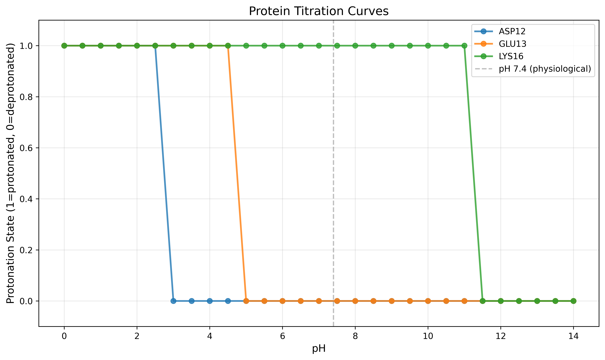
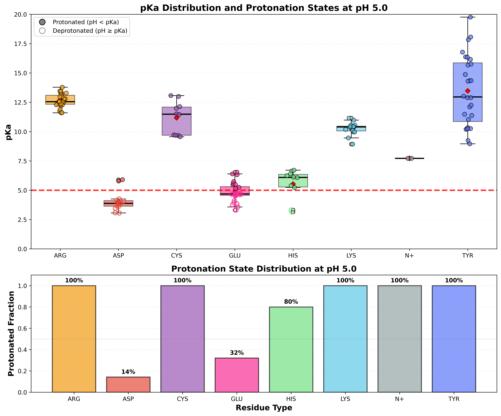

# Preparation Module

Module for predicting pKa values and managing protonation states in protein structures. This module includes:

- pKa prediction and analysis
- Protonation state assignment based on pH
- Disulfide bond detection and application
- Protein capping with ACE/NME groups
- pH-dependent protein structure preparation

## Import

```python
from gatewizard.core.propka import PropkaAnalyzer
from gatewizard.utils.protein_capping import ProteinCapper
```

## Class: PropkaAnalyzer

Main class for running Propka analysis and managing protein protonation states.

### Constructor

```python
PropkaAnalyzer(propka_version: str = "3")
```

**Parameters:**

| Parameter | Type | Default | Description |
|-----------|------|---------|-------------|
| `propka_version` | `str` | `"3"` | Version of Propka to use |

**Returns:** `PropkaAnalyzer` instance

**Example:**
```python
from gatewizard.core.propka import PropkaAnalyzer

analyzer = PropkaAnalyzer(propka_version="3")
print(f"Using PROPKA version: {analyzer.propka_version}")
```

---

## Core Methods

### Method: run_analysis()

Run Propka analysis on a PDB file to predict pKa values.

```python
run_analysis(pdb_file: str, output_dir: Optional[str] = None) -> str
```

**Parameters:**

| Parameter | Type | Required | Description |
|-----------|------|----------|-------------|
| `pdb_file` | `str` | Yes | Path to input PDB file |
| `output_dir` | `str` | No | Directory for output files. If None, uses input file's directory |

**Returns:** `str` - Path to generated `.pka` file

**Raises:**

- `FileNotFoundError` - If input PDB file doesn't exist
- `PropkaError` - If Propka execution fails

**Output Files:**

- `{basename}.pka` - Full Propka output file

**Example:**
```python
from gatewizard.core.propka import PropkaAnalyzer

analyzer = PropkaAnalyzer()
pka_file = analyzer.run_analysis("protein.pdb")
# Returns: "protein.pka"
```

---

### Method: extract_summary()

Extract the summary section from a Propka output file.

```python
extract_summary(
    propka_file: str,
    output_file: Optional[str] = None,
    output_dir: Optional[str] = None
) -> str
```

**Parameters:**

| Parameter | Type | Required | Description |
|-----------|------|----------|-------------|
| `propka_file` | `str` | Yes | Path to `.pka` file from `run_analysis()` |
| `output_file` | `str` | No | Custom name for output file |
| `output_dir` | `str` | No | Directory for output file |

**Returns:** `str` - Path to summary file

**Raises:**
- `PropkaError` - If summary section not found in `.pka` file

**Output Files:**
- `{basename}_summary_of_prediction.txt` - Extracted summary section

**Example:**
```python
from gatewizard.core.propka import PropkaAnalyzer

analyzer = PropkaAnalyzer()

# First run analysis to generate the .pka file
analyzer.run_analysis("protein.pdb")

# Then extract summary
summary_file = analyzer.extract_summary("protein.pka")
# Returns: "protein_summary_of_prediction.txt"
```

---

### Method: parse_summary()

Parse summary file and extract residue information as structured data.

```python
parse_summary(summary_file: Optional[str] = None) -> List[Dict[str, Any]]
```

**Parameters:**

| Parameter | Type | Required | Description |
|-----------|------|----------|-------------|
| `summary_file` | `str` | No | Path to summary file. If None, uses last extracted summary |

**Returns:** `List[Dict[str, Any]]` - List of residue dictionaries

**Dictionary Structure:**

| Key | Type | Description | Example |
|-----|------|-------------|---------|
| `"residue"` | `str` | Residue/ligand name | `"ASP"`, `"HIS"`, `"P5S"`, `"LPE"` |
| `"res_id"` | `int` | Residue number (0 for ligands) | `42`, `156`, `0` |
| `"chain"` | `str` | Chain identifier | `"A"`, `"B"` |
| `"pka"` | `float` | Predicted pKa value | `3.85`, `6.45`, `10.83` |
| `"atom"` | `str` | Atom name (for ligands only) | `""`, `"N"`, `"CAX"`, `"O15"` |
| `"atom_type"` | `str` | Atom type classification | `""`, `"N31"`, `"OCO"`, `"OP"` |
| `"model_pka"` | `float` or `None` | Model pKa value | `3.80`, `6.00`, `10.00` |

**Understanding Protein vs. Ligand Entries:**

PROPKA analyzes both **protein residues** and **ligand molecules** for ionizable groups:

**For Protein Residues:**

- `res_id`: Actual residue number (12, 52, 115, etc.)
- `atom`: Empty string (protein residues are treated at residue level)
- `atom_type`: Empty string
- Example: `ASP 52 A` means Aspartate at position 52 in chain A

**For Ligand Atoms:**

- `res_id`: Set to 0 (ligands don't have meaningful residue numbers)
- `atom`: Specific atom name in the ligand (`N`, `CAX`, `O15`, etc.)
- `atom_type`: Atom type classification (`N31`, `OCO`, `OP`, etc.)
- Example: `P5S N A` means atom N in ligand P5S in chain A

**PROPKA Summary Format:**
```
       Group      pKa  model-pKa   ligand atom-type
   ASP  52 A     4.33       3.80                      ← Protein residue
   GLU  65 A     4.87       4.50                      ← Protein residue
   HIS  77 A     6.07       6.50                      ← Protein residue
   N+    8 A     7.66       8.00                      ← N-terminus
   P5S   N A    10.83      10.00                N31   ← Ligand atom
   LPE   N A     9.87      10.00                N31   ← Ligand atom
   Y01 CAX A     4.62       4.50                OCO   ← Ligand atom
   P5S O15 A     5.46       6.00                 OP   ← Ligand atom
```

**Common Atom Type Classifications:**

- **N31** - Tertiary amine nitrogen (sp³, 3 bonds)
- **N33** - Quaternary nitrogen (sp³, 4 bonds, charged)
- **OCO** - Carboxyl oxygen (in -COO⁻)
- **OP** - Phosphate oxygen (in -PO₄²⁻)
- **O3** - Hydroxyl oxygen (sp³)
- **S3** - Thiol sulfur (sp³)

**Raises:**

- `FileNotFoundError` - If summary file doesn't exist
- `PropkaError` - If no ionizable residues found

**Example:**
```python
from gatewizard.core.propka import PropkaAnalyzer

analyzer = PropkaAnalyzer()

# First run analysis and extract summary to generate the summary file
analyzer.run_analysis("protein.pdb")
analyzer.extract_summary("protein.pka")

# Now parse the summary file
residues = analyzer.parse_summary("protein_summary_of_prediction.txt")
print(residues)
# Returns: [
#     # Protein residues:
#     {'residue': 'ASP', 'res_id': 52, 'chain': 'A', 'pka': 4.33, 
#      'atom': '', 'atom_type': '', 'model_pka': 3.8},
#     {'residue': 'GLU', 'res_id': 65, 'chain': 'A', 'pka': 3.87, 
#      'atom': '', 'atom_type': '', 'model_pka': 4.5},
#     
#     # Ligand atoms:
#     {'residue': 'P5S', 'res_id': 0, 'chain': 'A', 'pka': 10.83, 
#      'atom': 'N', 'atom_type': 'N31', 'model_pka': 10.0},
#     {'residue': 'LPE', 'res_id': 0, 'chain': 'A', 'pka': 9.87, 
#      'atom': 'N', 'atom_type': 'N31', 'model_pka': 10.0},
#     {'residue': 'Y01', 'res_id': 0, 'chain': 'A', 'pka': 4.62, 
#      'atom': 'CAX', 'atom_type': 'OCO', 'model_pka': 4.5},
#     {'residue': 'P5S', 'res_id': 0, 'chain': 'A', 'pka': 5.46, 
#      'atom': 'O15', 'atom_type': 'OP', 'model_pka': 6.0},
#     ...
# ]

# Separate protein residues from ligand atoms
protein_residues = [r for r in residues if r['res_id'] > 0]
ligand_atoms = [r for r in residues if r['res_id'] == 0]

print(f"Found {len(protein_residues)} ionizable protein residues")
print(f"Found {len(ligand_atoms)} ionizable ligand atoms")

# Analyze ligands
for lig in ligand_atoms:
    print(f"Ligand {lig['residue']} atom {lig['atom']} ({lig['atom_type']}): "
          f"pKa = {lig['pka']:.2f}")

# Group by ligand type
from collections import defaultdict
ligands_by_type = defaultdict(list)
for lig in ligand_atoms:
    ligands_by_type[lig['residue']].append(lig)

for ligand_name, atoms in ligands_by_type.items():
    print(f"\n{ligand_name}: {len(atoms)} ionizable atoms")
    for atom in atoms:
        print(f"  {atom['atom']:6s} pKa={atom['pka']:5.2f} ({atom['atom_type']})")
```

**Output:**
```
...
Found 272 ionizable protein residues
Found 22 ionizable ligand atoms
Ligand P5S atom N (N31): pKa = 10.83
Ligand LPE atom N (N31): pKa = 9.87
Ligand OJ0 atom N02 (N33): pKa = 8.82
Ligand P5S atom C (OCO): pKa = 4.16
Ligand Y01 atom CAX (OCO): pKa = 4.62
Ligand Y01 atom CAX (OCO): pKa = 4.56
Ligand Y01 atom CAX (OCO): pKa = 5.05
Ligand Y01 atom CAX (OCO): pKa = 4.52
Ligand Y01 atom CAX (OCO): pKa = 4.68
Ligand Y01 atom CAX (OCO): pKa = 4.65
Ligand P5S atom O15 (OP): pKa = 5.46
Ligand LPE atom O31 (OP): pKa = 5.15
Ligand PCW atom O1P (OP): pKa = 6.08
Ligand LPE atom O31 (OP): pKa = 6.46
Ligand PCW atom O1P (OP): pKa = 5.62
Ligand PCW atom O1P (OP): pKa = 7.02
Ligand LPE atom O32 (OP): pKa = 6.01
Ligand LPE atom O31 (OP): pKa = 6.54
Ligand LPE atom O32 (OP): pKa = 6.30
Ligand LPE atom O32 (OP): pKa = 6.81
Ligand PCW atom O1P (OP): pKa = 6.17
Ligand PCW atom O1P (OP): pKa = 4.64

P5S: 3 ionizable atoms
  N      pKa=10.83 (N31)
  C      pKa= 4.16 (OCO)
  O15    pKa= 5.46 (OP)

LPE: 7 ionizable atoms
  N      pKa= 9.87 (N31)
  O31    pKa= 5.15 (OP)
  O31    pKa= 6.46 (OP)
  O32    pKa= 6.01 (OP)
  O31    pKa= 6.54 (OP)
  O32    pKa= 6.30 (OP)
  O32    pKa= 6.81 (OP)

OJ0: 1 ionizable atoms
  N02    pKa= 8.82 (N33)

Y01: 6 ionizable atoms
  CAX    pKa= 4.62 (OCO)
  CAX    pKa= 4.56 (OCO)
  CAX    pKa= 5.05 (OCO)
  CAX    pKa= 4.52 (OCO)
  CAX    pKa= 4.68 (OCO)
  CAX    pKa= 4.65 (OCO)

PCW: 5 ionizable atoms
  O1P    pKa= 6.08 (OP)
  O1P    pKa= 5.62 (OP)
  O1P    pKa= 7.02 (OP)
  O1P    pKa= 6.17 (OP)
  O1P    pKa= 4.64 (OP)
```

---

### Method: apply_protonation_states()

Apply predicted protonation states to a PDB file based on pH and Propka results.

```python
apply_protonation_states(
    input_pdb: str,
    output_pdb: str,
    ph: float,
    custom_states: Optional[Dict[str, str]] = None,
    residues: Optional[List[Dict[str, Any]]] = None
) -> Dict[str, int]
```

**Parameters:**

| Parameter | Type | Required | Description |
|-----------|------|----------|-------------|
| `input_pdb` | `str` | Yes | Path to input PDB file |
| `output_pdb` | `str` | Yes | Path for output PDB file with modified residue names |
| `ph` | `float` | Yes | Target pH value for protonation state prediction |
| `custom_states` | `Dict[str, str]` | No | Custom state overrides (format: `{"ASP42": "ASH"}` or `{"ASP42_A": "ASH"}`) |
| `residues` | `List[Dict]` | No | Residue list. If None, uses last parsed results |

**Returns:** `Dict[str, int]` - Statistics dictionary

**Return Dictionary:**

| Key | Type | Description |
|-----|------|-------------|
| `"residue_changes"` | `int` | Number of unique residues modified |
| `"record_changes"` | `int` | Total number of PDB records (atoms) modified |

**Raises:**

- `FileNotFoundError` - If input PDB file doesn't exist
- `PropkaError` - If no residue data available (need to run `parse_summary()` first)

**Protonation State Logic:**

The method automatically determines protonation states based on pKa vs pH:

| Residue | Condition | State | AMBER Code |
|---------|-----------|-------|------------|
| ASP | pH < pKa | Protonated | ASH |
| ASP | pH ≥ pKa | Deprotonated | ASP |
| GLU | pH < pKa | Protonated | GLH |
| GLU | pH ≥ pKa | Deprotonated | GLU |
| HIS | pH < pKa | Protonated | HIP |
| HIS | pH ≥ pKa | Neutral (ε) | HIE |
| LYS | pH < pKa | Protonated | LYS |
| LYS | pH ≥ pKa | Neutral | LYN |
| CYS | pH < pKa | Free thiol | CYS |
| CYS | pH ≥ pKa | Deprotonated | CYM |

**Important Notes:**

- This method **only modifies residue names** in the PDB file (e.g., ASP → ASH, HIS → HIP)
- It does **NOT** add or remove hydrogen atoms
- For MD simulations, you may need additional preparation:
  - Use `pdb4amber` or LEaP to add missing hydrogens
  - Use system preparation tools to add solvent and parameterize

**Custom States Format:**

Custom states can be specified with or without chain identifiers:

- `{"ASP12": "ASH"}` - Applies to all chains
- `{"ASP12_A": "ASH"}` - Applies only to chain A
- `{"HIS15": "HID"}` - Use delta-protonated histidine instead of epsilon

**Example:**
```python
from gatewizard.core.propka import PropkaAnalyzer

analyzer = PropkaAnalyzer()
pka_file = analyzer.run_analysis("protein.pdb")
summary_file = analyzer.extract_summary(pka_file)
residues = analyzer.parse_summary(summary_file)

# Basic usage - automatic protonation at pH 7.4
stats = analyzer.apply_protonation_states(
    input_pdb="protein.pdb",
    output_pdb="protein_ph7.4.pdb",
    ph=7.4,
    residues=residues
)
print(f"Modified {stats['residue_changes']} residues ({stats['record_changes']} atoms)")

# With custom states - override specific residues
custom = {
    "ASP12": "ASH",    # Want to protonate original ASP12
    "GLU13": "GLH",    # Want to protonate original GLU13
    "HIS15": "HID"     # Want delta-protonated original HIS15
}

stats = analyzer.apply_protonation_states(
    input_pdb="protein.pdb",
    output_pdb="protein_custom.pdb",
    ph=7.4,
    custom_states=custom,
    residues=residues
)
```

---

### Method: get_default_protonation_state()

Get the default protonation state for a residue at a given pH.

```python
get_default_protonation_state(
    residue: Dict[str, Any],
    ph: float
) -> str
```

**Parameters:**

| Parameter | Type | Required | Description |
|-----------|------|----------|-------------|
| `residue` | `Dict[str, Any]` | Yes | Residue dictionary from `parse_summary()` |
| `ph` | `float` | Yes | Target pH value |

**Returns:** `str` - Three-letter AMBER residue code

**Example:**
```python
from gatewizard.core.propka import PropkaAnalyzer

analyzer = PropkaAnalyzer()
pka_file = analyzer.run_analysis("protein.pdb")
summary_file = analyzer.extract_summary(pka_file)
residues = analyzer.parse_summary(summary_file)

for res in residues:
    states = [analyzer.get_default_protonation_state(res, ph=p) for p in [2.0, 7.0, 11.0]]
    print(f"{res['residue']}{res['res_id']} (pKa={res['pka']:.2f}): "
          f"pH2={states[0]}, pH7={states[1]}, pH11={states[2]}")
```

---

## Protonation State Methods

### Method: get_available_states()

Get available protonation states for a residue type.

```python
get_available_states(residue_type: str) -> Dict[str, str]
```

**Parameters:**

| Parameter | Type | Required | Description |
|-----------|------|----------|-------------|
| `residue_type` | `str` | Yes | Three-letter residue code (e.g., "ASP", "HIS") |

**Returns:** `Dict[str, str]` - Dictionary of available states

**Example:**
```python
from gatewizard.core.propka import PropkaAnalyzer

analyzer = PropkaAnalyzer()
his_states = analyzer.get_available_states("HIS")
print(his_states)
# Output: {'neutral_epsilon': 'HIE', 'neutral_delta': 'HID', 'protonated': 'HIP'}
```

---

### AMBER-Compatible Residue Names

| Standard | Protonated | Deprotonated | Notes |
|----------|------------|--------------|-------|
| **ASP** | ASH | ASP | Aspartic acid |
| **GLU** | GLH | GLU | Glutamic acid |
| **HIS** | HIP | HIE/HID | HIP=both N protonated, HIE=ε, HID=δ |
| **LYS** | LYS | LYN | Lysine |
| **ARG** | ARG | - | Arginine (always protonated in AMBER) |
| **CYS** | CYS | CYM | Cysteine (free thiol) |
| **CYS** | - | CYX | Cysteine in disulfide bond |
| **TYR** | TYR | TYM | Tyrosine |

---

## Disulfide Bond Methods

### Method: detect_disulfide_bonds()

Automatically detect potential disulfide bonds based on sulfur-sulfur distance.

```python
detect_disulfide_bonds(
    pdb_file: str,
    distance_threshold: float = 2.5
) -> List[Tuple[Tuple[str, int], Tuple[str, int]]]
```

**Parameters:**

| Parameter | Type | Default | Description |
|-----------|------|---------|-------------|
| `pdb_file` | `str` | Required | Path to PDB file |
| `distance_threshold` | `float` | `2.5` | Maximum S-S distance in Ångströms |

**Returns:** List of bond pairs: `[((res_name, res_id), (res_name, res_id)), ...]`

**Algorithm:**
1. Extracts all cysteine SG (sulfur gamma) atoms from PDB
2. Calculates pairwise distances between all SG atoms
3. Identifies pairs within the distance threshold
4. Returns list of bonded residue pairs

**Example:**
```python
from gatewizard.core.propka import PropkaAnalyzer

analyzer = PropkaAnalyzer()
# Detect with default 2.5 Å threshold
bonds = analyzer.detect_disulfide_bonds("protein.pdb")
print(f"Found {len(bonds)} disulfide bonds:")

for bond in bonds:
    (res1_name, res1_id), (res2_name, res2_id) = bond
    print(f"  {res1_name}{res1_id} ↔ {res2_name}{res2_id}")
# Output:
# Found 1 disulfide bonds:
#   CYS18 ↔ CYS34

# Use stricter threshold
bonds_strict = analyzer.detect_disulfide_bonds("protein.pdb", distance_threshold=2.0)
print(f"Strict (2.0 Å): {len(bonds_strict)} bonds")

# Output:
# Strict (2.0 Å): 0 bonds
```

---

### Method: apply_disulfide_bonds()

Apply disulfide bond assignments by renaming CYS → CYX for bonded cysteines.

```python
apply_disulfide_bonds(
    input_pdb: str,
    output_pdb: str,
    disulfide_bonds: Optional[List[Tuple[Tuple[str, int], Tuple[str, int]]]] = None,
    auto_detect: bool = True
) -> int
```

**Parameters:**

| Parameter | Type | Default | Description |
|-----------|------|---------|-------------|
| `input_pdb` | `str` | Required | Input PDB file path |
| `output_pdb` | `str` | Required | Output PDB file path |
| `disulfide_bonds` | `List[Tuple]` | `None` | Pre-detected bonds (auto-detect if None) |
| `auto_detect` | `bool` | `True` | Auto-detect if bonds not provided |

**Returns:** `int` - Number of disulfide bonds applied (NOT the number of atoms changed)

**What it does:**
1. Identifies cysteines involved in disulfide bonds
2. Changes residue name from CYS to CYX in all ATOM/HETATM records
3. Preserves all other PDB information (coordinates, chains, etc.)
4. Returns count of bonds (e.g., 1 bond = 2 cysteines = ~20 atom records changed)

**Example:**
```python
from gatewizard.core.propka import PropkaAnalyzer

analyzer = PropkaAnalyzer()
# Auto-detect and apply
num_bonds = analyzer.apply_disulfide_bonds(
    input_pdb="protein.pdb",
    output_pdb="protein_ss_auto.pdb"
)
print(f"✓ Applied {num_bonds} disulfide bonds")

# Use pre-detected bonds with custom threshold
bonds = analyzer.detect_disulfide_bonds("protein.pdb", distance_threshold=2.3)
num_bonds = analyzer.apply_disulfide_bonds(
    input_pdb="protein.pdb",
    output_pdb="protein_ss_custom.pdb",
    disulfide_bonds=bonds,
    auto_detect=False
)
```

**Integration with Protonation Workflow:**

Disulfide bonds should be applied **after** protonation states:

**Example:**
```python
from gatewizard.core.propka import PropkaAnalyzer

analyzer = PropkaAnalyzer()
pka_file = analyzer.run_analysis("protein.pdb")
summary_file = analyzer.extract_summary(pka_file)
residues = analyzer.parse_summary(summary_file)
# Step 1: Apply protonation states
stats = analyzer.apply_protonation_states(
    input_pdb="protein.pdb",
    output_pdb="protein_ph7.pdb",
    ph=7.4,
    residues=residues,
)

# Step 2: Apply disulfide bonds to protonated structure
num_bonds = analyzer.apply_disulfide_bonds(
    input_pdb="protein_ph7.pdb",
    output_pdb="protein_ph7_ss.pdb"
)
```

---

## Utility Methods

### Method: get_residue_statistics()

Get statistics about the protonable residues.

```python
get_residue_statistics() -> Dict[str, int]
```

**Returns:** `Dict[str, int]` - Dictionary with residue type counts

**Example:**
```python
from gatewizard.core.propka import PropkaAnalyzer

analyzer = PropkaAnalyzer()
pka_file = analyzer.run_analysis("protein.pdb")
summary_file = analyzer.extract_summary(pka_file)
residues = analyzer.parse_summary(summary_file)

stats = analyzer.get_residue_statistics()
for res_type, count in stats.items():
    print(f"{res_type}: {count}")
# Output:
# ASP: 2
# GLU: 2
# HIS: 1
# CYS: 3
# TYR: 1
# LYS: 1
# ARG: 2
# N+: 1
```

---

### Method: get_ph_titration_curve()

Generate titration curves for all protonable residues.

```python
get_ph_titration_curve(
    ph_range: Tuple[float, float] = (0, 14),
    ph_step: float = 0.5
) -> Dict[str, List[Tuple[float, str]]]
```

**Parameters:**

| Parameter | Type | Default | Description |
|-----------|------|---------|-------------|
| `ph_range` | `Tuple[float, float]` | `(0, 14)` | pH range as (min, max) |
| `ph_step` | `float` | `0.5` | Step size for pH values |

**Returns:** `Dict[str, List[Tuple[float, str]]]` - Mapping of residue IDs to (pH, state) tuples

**Example:**
```python
from gatewizard.core.propka import PropkaAnalyzer

analyzer = PropkaAnalyzer()
pka_file = analyzer.run_analysis("protein.pdb")
summary_file = analyzer.extract_summary(pka_file)
residues = analyzer.parse_summary(summary_file)

curves = analyzer.get_ph_titration_curve(ph_range=(4, 10), ph_step=1.0)

for residue_id, curve in curves.items():
    print(f"\n{residue_id}:")
    for ph, state in curve:
        print(f"  pH {ph:.1f}: {state}")
```

**Plotting Example:**

You can visualize titration curves using matplotlib. For readability, it's best to plot only specific residues of interest:

```python
from gatewizard.core.propka import PropkaAnalyzer
import matplotlib.pyplot as plt

analyzer = PropkaAnalyzer()
pka_file = analyzer.run_analysis("protein.pdb")
summary_file = analyzer.extract_summary(pka_file)
residues = analyzer.parse_summary(summary_file)

# Get titration curves
curves = analyzer.get_ph_titration_curve(ph_range=(0, 14), ph_step=0.5)

# State encoding for plotting (1 = protonated, 0 = deprotonated)
state_map = {'ASH': 1, 'ASP': 0, 'GLH': 1, 'GLU': 0, 
             'HIP': 1, 'HIE': 0, 'HID': 0, 'LYS': 1, 'LYN': 0,
             'CYS': 0, 'CYM': 0, 'TYR': 0, 'TYM': 0, 'ARG': 1}

# Option 1: Select specific residues by name
selected_residues = ['ASP12', 'GLU13', 'LYS16']
filtered_curves = {k: v for k, v in curves.items() if k in selected_residues}

# Option 2: Select by residue type (e.g., only histidines)
# filtered_curves = {k: v for k, v in curves.items() if k.startswith('HIS')}

# Option 3: Select residues with pKa near physiological pH (6-8)
# pka_dict = {f"{r['residue']}{r['res_id']}_{r['chain']}": r['pka'] 
#             for r in residues if r['res_id'] > 0}
# filtered_curves = {k: v for k, v in curves.items() 
#                    if k in pka_dict and 6 <= pka_dict[k] <= 8}

# Plot selected curves
fig, ax = plt.subplots(figsize=(10, 6))

for residue_id, curve in filtered_curves.items():
    ph_values = [ph for ph, _ in curve]
    protonation = [state_map.get(state, 0.5) for _, state in curve]
    ax.plot(ph_values, protonation, marker='o', label=residue_id, 
            linewidth=2, markersize=6, alpha=0.8)

ax.axvline(x=7.4, color='gray', linestyle='--', linewidth=1.5, 
           alpha=0.5, label='pH 7.4 (physiological)')
ax.set_xlabel('pH', fontsize=12)
ax.set_ylabel('Protonation State (1=protonated, 0=deprotonated)', fontsize=12)
ax.set_title('Protein Titration Curves', fontsize=14)
ax.set_ylim(-0.1, 1.1)
ax.grid(True, alpha=0.3)
ax.legend(fontsize=10)
plt.tight_layout()
plt.savefig('propka_titration_curves.png', dpi=300, bbox_inches='tight')
plt.show()

print(f"Plotted {len(filtered_curves)} out of {len(curves)} total residues")
# Output
# Plotted 3 out of 13 total residues
```

**Example Output:**



*Figure: Titration curves for selected residues showing protonation state transitions across pH range. The vertical dashed line indicates physiological pH (7.4).*

---

**Alternative: Plot pKa Distribution with Protonation States:**

```python
import matplotlib.pyplot as plt
import numpy as np

analyzer = PropkaAnalyzer()
pka_file = analyzer.run_analysis("protein.pdb")
summary_file = analyzer.extract_summary(pka_file)
residues = analyzer.parse_summary(summary_file)

# Filter protein residues only
protein_residues = [r for r in residues if r['res_id'] > 0]

# Set target pH for protonation state analysis
target_ph = 5.0  # Change this to analyze different pH

# Group by residue type and calculate protonation states
residue_data = {}
for res in protein_residues:
    res_type = res['residue']
    if res_type not in residue_data:
        residue_data[res_type] = {'pka': [], 'protonated': [], 'state': []}
    
    residue_data[res_type]['pka'].append(res['pka'])
    
    # Determine protonation state at target pH
    state = analyzer.get_default_protonation_state(res, ph=target_ph)
    residue_data[res_type]['state'].append(state)
    
    # Check if protonated (pH < pKa => protonated)
    is_protonated = target_ph < res['pka']
    residue_data[res_type]['protonated'].append(is_protonated)

# Prepare data for plotting
res_names = []
pka_values_list = []
protonation_list = []
colors_list = []

color_map = {'ASP': '#e74c3c', 'GLU': "#f92f94", 'HIS': "#72e183", 
             'LYS': "#60cae7", 'CYS': '#9b59b6', 'TYR': "#5b76f8", 
             'ARG': '#f39c12', 'N+': '#95a5a6', 'C-': '#34495e'}

for res_type in sorted(residue_data.keys()):
    res_names.append(res_type)
    pka_values_list.append(residue_data[res_type]['pka'])
    protonation_list.append(residue_data[res_type]['protonated'])
    colors_list.append(color_map.get(res_type, '#7f8c8d'))

# Create figure with two subplots
fig, (ax1, ax2) = plt.subplots(2, 1, figsize=(12, 10), 
                                gridspec_kw={'height_ratios': [2, 1]})

# --- Top plot: pKa distribution with protonation states ---
bp = ax1.boxplot(pka_values_list, labels=res_names, patch_artist=True,
                 showmeans=True, meanline=False,
                 medianprops={'color': 'black', 'linewidth': 2},
                 meanprops={'marker': 'D', 'markerfacecolor': 'red', 
                           'markeredgecolor': 'darkred', 'markersize': 6})

# Color each box
for patch, color in zip(bp['boxes'], colors_list):
    patch.set_facecolor(color)
    patch.set_alpha(0.6)

# Add individual points colored by protonation state
for i, (res_type, pka_vals, prot_states) in enumerate(zip(res_names, pka_values_list, protonation_list)):
    x = np.random.normal(i+1, 0.04, size=len(pka_vals))
    # Protonated = filled circles, Deprotonated = open circles
    for xi, pka, is_prot in zip(x, pka_vals, prot_states):
        if is_prot:
            ax1.scatter(xi, pka, s=50, color=colors_list[i], alpha=0.7, 
                       edgecolors='black', linewidth=1, marker='o', zorder=3)
        else:
            ax1.scatter(xi, pka, s=50, facecolors='none', edgecolors=colors_list[i], 
                       alpha=0.7, linewidth=2, marker='o', zorder=3)

# Add pH reference line
ax1.axhline(y=target_ph, color='red', linestyle='--', linewidth=2.5, 
           alpha=0.8, label=f'pH {target_ph} (target)', zorder=2)

ax1.set_ylabel('pKa', fontsize=13, fontweight='bold')
ax1.set_title(f'pKa Distribution and Protonation States at pH {target_ph}', 
              fontsize=15, fontweight='bold')
ax1.grid(True, alpha=0.3, axis='y', linestyle=':')
ax1.legend(loc='upper right', fontsize=11)
ax1.set_ylim(0, 20)

# Add legend for protonation states
from matplotlib.patches import Patch
from matplotlib.lines import Line2D
legend_elements = [
    Line2D([0], [0], marker='o', color='w', markerfacecolor='gray', 
           markersize=10, markeredgecolor='black', linewidth=1, 
           label='Protonated (pH < pKa)'),
    Line2D([0], [0], marker='o', color='w', markerfacecolor='none', 
           markersize=10, markeredgecolor='gray', linewidth=2, 
           label='Deprotonated (pH ≥ pKa)')
]
ax1.legend(handles=legend_elements, loc='upper left', fontsize=10)

# --- Bottom plot: Protonation fraction bar chart ---
protonation_fractions = []
for prot_states in protonation_list:
    if len(prot_states) > 0:
        fraction = sum(prot_states) / len(prot_states)
    else:
        fraction = 0
    protonation_fractions.append(fraction)

bars = ax2.bar(range(1, len(res_names)+1), protonation_fractions, 
               color=colors_list, alpha=0.7, edgecolor='black', linewidth=1.5)

# Add percentage labels on bars
for i, (bar, frac) in enumerate(zip(bars, protonation_fractions)):
    height = bar.get_height()
    ax2.text(bar.get_x() + bar.get_width()/2., height + 0.02,
             f'{frac*100:.0f}%', ha='center', va='bottom', fontsize=10, fontweight='bold')

ax2.set_xlabel('Residue Type', fontsize=13, fontweight='bold')
ax2.set_ylabel('Protonated Fraction', fontsize=13, fontweight='bold')
ax2.set_title(f'Protonation State Distribution at pH {target_ph}', fontsize=14, fontweight='bold')
ax2.set_xticks(range(1, len(res_names)+1))
ax2.set_xticklabels(res_names)
ax2.set_ylim(0, 1.1)
ax2.axhline(y=0.5, color='gray', linestyle=':', linewidth=1, alpha=0.5)
ax2.grid(True, alpha=0.3, axis='y', linestyle=':')

plt.tight_layout()
plt.savefig('propka_pka_distribution.png', dpi=600, bbox_inches='tight')
plt.show()

# Print statistics
print(f"\npKa Statistics and Protonation States at pH {target_ph}:")
print("=" * 80)
for res_type, data in sorted(residue_data.items()):
    pka_vals = data['pka']
    n_prot = sum(data['protonated'])
    n_total = len(pka_vals)
    prot_frac = n_prot / n_total if n_total > 0 else 0
    
    print(f"\n{res_type:4s}: n={n_total:2d}  "
          f"pKa range=[{min(pka_vals):5.2f}, {max(pka_vals):5.2f}]  "
          f"mean={np.mean(pka_vals):5.2f}")
    print(f"      Protonated: {n_prot}/{n_total} ({prot_frac*100:.0f}%)  "
          f"Deprotonated: {n_total-n_prot}/{n_total} ({(1-prot_frac)*100:.0f}%)")
    print(f"      States: {', '.join(set(data['state']))}")
```

**Example Output:**



*Figure: (Top) pKa distribution by residue type with protonation states at pH 5.0. Filled circles indicate protonated residues (pH < pKa), open circles indicate deprotonated residues (pH ≥ pKa). The red dashed line shows the target pH. (Bottom) Fraction of each residue type that is protonated at pH 5.0.*

---

## Protein Capping

**Module:** `gatewizard.utils.protein_capping`

Protein capping adds **ACE** (N-acetyl) and **NME** (N-methylamide) groups to protein termini to:

- Neutralize charges at termini
- Improve Propka analysis accuracy
- Better represent membrane protein environments
- Mimic peptide bond continuation in protein fragments

### Class: ProteinCapper

```python
from gatewizard.utils.protein_capping import ProteinCapper, cap_protein

capper = ProteinCapper()
```

### Method: remove_hydrogens_and_cap()

Main method to add ACE/NME caps and track residue renumbering.

```python
remove_hydrogens_and_cap(
    input_file: Union[str, Path],
    output_file: Optional[Union[str, Path]] = None,
    target_dir: Optional[Union[str, Path]] = None
) -> Tuple[str, Dict]
```

**Parameters:**

| Parameter | Type | Default | Description |
|-----------|------|---------|-------------|
| `input_file` | `str/Path` | Required | Input PDB file |
| `output_file` | `str/Path` | `None` | Output file (auto-generated if None) |
| `target_dir` | `str/Path` | `None` | Directory for mapping file |

**Returns:** `Tuple[str, Dict]`

- `str` - Path to capped PDB file
- `Dict` - Residue mapping dictionary

**Residue Mapping Dictionary:**

```python
{
    (original_resname, chain, original_resid): (new_resname, chain, new_resid),
    ...
}
```

**What Happens During Capping:**

```
Before: MET1 - ALA2 - ... - GLY50
After:  ACE1 - MET2 - ALA3 - ... - GLY51 - NME52
```

All residue numbers shift by +1, and ACE/NME caps are added.

**Example:**
```python
from gatewizard.utils.protein_capping import ProteinCapper

capper = ProteinCapper()

# Add caps and get mapping
capped_file, residue_mapping = capper.remove_hydrogens_and_cap(
    input_file="protein.pdb",
    output_file="protein_capped.pdb",
    target_dir="output"
)

print(f"✓ Capped protein: {capped_file}")
print(f"✓ Residue mapping: {len(residue_mapping)} residues tracked")

# Show first few mappings
for (orig_resname, chain, orig_resid), (new_resname, new_chain, new_resid) in list(residue_mapping.items())[:5]:
    print(f"  {orig_resname}{orig_resid} (Chain {chain}) → {new_resname}{new_resid}")
# Output:
#  LEU1 (Chain A) → LEU2
#  PRO2 (Chain A) → PRO3
#  ALA3 (Chain A) → ALA4
#  GLY4 (Chain A) → GLY5
#  ILE5 (Chain A) → ILE6
```

### Convenience Function: cap_protein()

Simplified wrapper for protein capping.

```python
from gatewizard.utils.protein_capping import cap_protein

capped_file, mapping = cap_protein(
    input_file="protein.pdb",
    output_file="protein_capped.pdb"
)
```

---

## pdb4amber Integration

**Important Distinction:**

| Method | Runs pdb4amber? | Output |
|--------|-----------------|---------|
| **GUI** "Apply States & Run pdb4amber" button | ✅ **YES** (automatic) | AMBER-ready PDB with hydrogens |
| **API** `apply_protonation_states()` | ❌ **NO** (manual) | Only residue name changes |
| **API** `apply_disulfide_bonds()` | ❌ **NO** (manual) | Only CYS→CYX changes |

The API methods only modify residue names in PDB files. For MD simulations, you must run pdb4amber separately:

**Option 1: Command Line**
```bash
pdb4amber -i protein_protonated_ss.pdb -o protein_prepared.pdb
```

**Option 2: Python subprocess**
```python
import subprocess

result = subprocess.run([
    "pdb4amber",
    "-i", "protein_protonated_ss.pdb",
    "-o", "protein_prepared.pdb"
], capture_output=True, text=True, check=True)
```

### ACE/NME Cap HETATM Fix

**Critical Note:** When using protein capping (ACE/NME), pdb4amber converts cap ATOM records to HETATM records, which can cause compatibility issues with downstream tools like packmol-memgen.

**The Problem:**
```
# Before pdb4amber (correct for caps):
ATOM      1  C   ACE A   1      12.640  -9.437  14.871  1.00  0.00      A
ATOM      2  CH3 ACE A   1      12.660 -10.927  15.173  1.00  0.00      A

# After pdb4amber (incorrect - becomes heteroatom):
HETATM    1  C   ACE A   1      12.640  -9.437  14.871  1.00  0.00           C
HETATM    2  CH3 ACE A   1      12.660 -10.927  15.173  1.00  0.00           C
```

### Method: run_pdb4amber_with_cap_fix()

Run pdb4amber to add hydrogens and prepare PDB for AMBER, with optional ACE/NME cap HETATM fix.

```python
run_pdb4amber_with_cap_fix(
    input_pdb: str,
    output_pdb: str,
    fix_caps: bool = True,
    pdb4amber_options: Optional[Dict[str, Any]] = None
) -> Dict[str, Any]
```

**Parameters:**

| Parameter | Type | Default | Description |
|-----------|------|---------|-------------|
| `input_pdb` | `str` | Required | Path to input PDB file |
| `output_pdb` | `str` | Required | Path for output PDB file |
| `fix_caps` | `bool` | `True` | If True, automatically converts ACE/NME HETATM→ATOM after pdb4amber |
| `pdb4amber_options` | `Dict[str, Any]` | `None` | Optional dictionary of pdb4amber command-line options |

**Returns:** `Dict[str, Any]` - Result dictionary with execution details

**Return Dictionary:**

| Key | Type | Description |
|-----|------|-------------|
| `"success"` | `bool` | Whether pdb4amber execution succeeded |
| `"output_file"` | `str` | Path to the output PDB file |
| `"hetatm_fixed"` | `int` | Number of HETATM records converted to ATOM (0 if fix_caps=False) |
| `"stdout"` | `str` | Standard output from pdb4amber command |
| `"stderr"` | `str` | Standard error from pdb4amber command |

**Raises:**

- `FileNotFoundError` - If input PDB file doesn't exist
- `RuntimeError` - If pdb4amber command fails or is not found

**What This Method Does:**

**Runs pdb4amber**: Executes the AmberTools pdb4amber utility to:

   - Prepare PDB structure for AMBER force field
   - Remove problematic records
   - Renumber atoms and residues if needed

**Optionally Fixes ACE/NME Caps** (if `fix_caps=True`):

   - Detects ACE (N-acetyl) and NME (N-methylamide) cap residues
   - Converts their HETATM records back to ATOM records
   - This fixes compatibility issues with tools like packmol-memgen

**The ACE/NME Cap HETATM Problem:**

When protein capping is used, pdb4amber incorrectly converts cap ATOM records to HETATM:

```
# Before pdb4amber (correct):
ATOM      1  C   ACE A   1      12.640  -9.437  14.871  1.00  0.00           C
ATOM      2  CH3 ACE A   1      12.660 -10.927  15.173  1.00  0.00           C

# After pdb4amber (incorrect - becomes heteroatom):
HETATM    1  C   ACE A   1      12.640  -9.437  14.871  1.00  0.00           C
HETATM    2  CH3 ACE A   1      12.660 -10.927  15.173  1.00  0.00           C
```

This causes compatibility issues because:

- packmol-memgen expects caps as ATOM records
- Other MD preparation tools may skip HETATM records
- Caps should be treated as part of the protein chain

**pdb4amber_options Dictionary:**

You can pass custom pdb4amber command-line options:

```python
options = {
    "reduce": True,        # Use reduce for hydrogen addition (default: True)
    "dry": False,          # Keep water molecules (default: False)
    "keep-altlocs": False, # Remove alternative locations (default: False)
    "strip-waters": True,  # Remove water molecules (default: True)
}
```

**Example - Basic Usage:**

```python
from gatewizard.core.propka import PropkaAnalyzer

analyzer = PropkaAnalyzer()

# Run pdb4amber with automatic cap fix (recommended for capped proteins)
result = analyzer.run_pdb4amber_with_cap_fix(
    input_pdb="protein_capped_ph7_ss.pdb",
    output_pdb="protein_prepared.pdb",
    fix_caps=True  # Default: automatically fix ACE/NME caps
)

if result['success']:
    print(f"✓ pdb4amber completed successfully")
    print(f"✓ Output: {result['output_file']}")
    if result['hetatm_fixed'] > 0:
        print(f"✓ Fixed {result['hetatm_fixed']} HETATM records for ACE/NME caps")
else:
    print(f"✗ pdb4amber failed")
    print(f"Error: {result['stderr']}")
```

**Example - Without Cap Fix:**

```python
from gatewizard.core.propka import PropkaAnalyzer

analyzer = PropkaAnalyzer()

# Run pdb4amber without cap fix (for uncapped proteins)
result = analyzer.run_pdb4amber_with_cap_fix(
    input_pdb="protein_uncapped_ph7_ss.pdb",
    output_pdb="protein_prepared.pdb",
    fix_caps=False  # No cap fix needed
)

print(f"Success: {result['success']}")
print(f"HETATM records fixed: {result['hetatm_fixed']}")  # Will be 0
```

**Example - With Custom pdb4amber Options:**

```python
from gatewizard.core.propka import PropkaAnalyzer

analyzer = PropkaAnalyzer()

# Run with custom pdb4amber options
custom_options = {
    "dry": False,          # Keep crystallographic waters
    "keep-altlocs": True,  # Keep alternative locations
}

result = analyzer.run_pdb4amber_with_cap_fix(
    input_pdb="protein_capped_ph7_ss.pdb",
    output_pdb="protein_prepared.pdb",
    fix_caps=True,
    pdb4amber_options=custom_options
)

print(f"pdb4amber output:\n{result['stdout']}")
```

**Integration with Complete Workflow:**

```python
from gatewizard.core.propka import PropkaAnalyzer
from gatewizard.utils.protein_capping import ProteinCapper

# Step 1: Add caps
capper = ProteinCapper()
capped_file, mapping = capper.remove_hydrogens_and_cap("protein.pdb")

# Step 2: Run Propka analysis
analyzer = PropkaAnalyzer()
pka_file = analyzer.run_analysis(capped_file)
summary_file = analyzer.extract_summary(pka_file)
residues = analyzer.parse_summary(summary_file)

# Step 3: Apply protonation states
analyzer.apply_protonation_states(
    input_pdb=capped_file,
    output_pdb="protein_capped_ph7.pdb",
    ph=7.4,
    residues=residues
)

# Step 4: Apply disulfide bonds
bonds = analyzer.detect_disulfide_bonds(capped_file)
analyzer.apply_disulfide_bonds(
    input_pdb="protein_capped_ph7.pdb",
    output_pdb="protein_capped_ph7_ss.pdb",
    disulfide_bonds=bonds
)

# Step 5: Run pdb4amber with automatic cap fix
result = analyzer.run_pdb4amber_with_cap_fix(
    input_pdb="protein_capped_ph7_ss.pdb",
    output_pdb="protein_prepared.pdb",
    fix_caps=True  # Critical for capped proteins!
)

print(f"✓ Final AMBER-ready structure: {result['output_file']}")
```

**GUI Behavior:**

When using the GUI:

- The "Apply States & Run pdb4amber" button automatically uses this method
- Automatically detects when capping was used (checks capping checkbox)
- Sets `fix_caps=True` if capping was applied
- Reports number of fixed HETATM records in success message
- Displays pdb4amber output in the GUI log

**Important Notes:**

⚠️ **When to use fix_caps=True:**

- When you used protein capping (ACE/NME groups added)
- When planning to use packmol-memgen or similar tools
- When you need caps to be part of the protein chain (ATOM records)

⚠️ **When to use fix_caps=False:**

- When no capping was applied
- When you want standard pdb4amber behavior
- When working with uncapped protein structures

⚠️ **Requirements:**

- Requires AmberTools installation (pdb4amber command must be available)
- Input PDB should already have correct protonation states and disulfide bonds applied

---

## Complete Workflow Examples

### Advanced Workflow with Protonation and Disulfide Bonds

```python
from gatewizard.core.propka import PropkaAnalyzer

analyzer = PropkaAnalyzer()

# Step 1: Run Propka analysis
pka_file = analyzer.run_analysis("protein.pdb", output_dir="output")
summary_file = analyzer.extract_summary(pka_file, output_dir="output")
residues = analyzer.parse_summary(summary_file)
print(f"✓ Found {len(residues)} ionizable residues")

# Step 2: Detect disulfide bonds
bonds = analyzer.detect_disulfide_bonds("protein.pdb", distance_threshold=2.5)
print(f"✓ Detected {len(bonds)} disulfide bonds")

# Step 3: Apply protonation states
stats = analyzer.apply_protonation_states(
    input_pdb="protein.pdb",
    output_pdb="output/protein_ph7.pdb",
    ph=7.4,
    residues=residues
)
print(f"✓ Protonation: {stats['residue_changes']} residues, "
      f"{stats['record_changes']} PDB records changed")

# Step 4: Apply disulfide bonds
num_bonds = analyzer.apply_disulfide_bonds(
    input_pdb="output/protein_ph7.pdb",
    output_pdb="output/protein_ph7_ss.pdb",
    disulfide_bonds=bonds,
    auto_detect=False
)
print(f"✓ Applied {num_bonds} disulfide bonds (CYS → CYX)")
```

### Workflow with Protein Capping

```python
from gatewizard.core.propka import PropkaAnalyzer
from gatewizard.utils.protein_capping import ProteinCapper

# Step 1: Add ACE/NME caps
capper = ProteinCapper()
capped_file, residue_mapping = capper.remove_hydrogens_and_cap(
    input_file="protein.pdb",
    output_file="protein_capped.pdb",
    target_dir="output"
)
print(f"✓ Capped protein: {len(residue_mapping)} residues tracked")

# Step 2: Run Propka on capped structure
analyzer = PropkaAnalyzer()
pka_file = analyzer.run_analysis(capped_file, output_dir="output")
summary_file = analyzer.extract_summary(pka_file, output_dir="output")
residues = analyzer.parse_summary(summary_file)

# Step 3: Detect disulfide bonds
bonds = analyzer.detect_disulfide_bonds(capped_file)

# Step 4: Apply protonation
stats = analyzer.apply_protonation_states(
    input_pdb=capped_file,
    output_pdb="output/protein_capped_ph7.pdb",
    ph=7.4,
    residues=residues
)

# Step 5: Apply disulfide bonds
num_bonds = analyzer.apply_disulfide_bonds(
    input_pdb="output/protein_capped_ph7.pdb",
    output_pdb="output/protein_capped_ph7_ss.pdb",
    disulfide_bonds=bonds,
    auto_detect=False
)

# Step 6: Run pdb4amber with automatic ACE/NME HETATM fix
result = analyzer.run_pdb4amber_with_cap_fix(
    input_pdb="output/protein_capped_ph7_ss.pdb",
    output_pdb="output/protein_prepared.pdb",
    fix_caps=True  # Automatically fix ACE/NME HETATM records
)

print(f"✓ pdb4amber completed: {result['output_file']}")
if result['hetatm_fixed'] > 0:
    print(f"✓ Fixed {result['hetatm_fixed']} HETATM records for ACE/NME caps")
print(f"✓ Final structure ready: protein_prepared.pdb")
```

### Multiple pH Variants

```python
from gatewizard.core.propka import PropkaAnalyzer

analyzer = PropkaAnalyzer()

# Run analysis once
pka_file = analyzer.run_analysis("protein.pdb", output_dir="output")
summary_file = analyzer.extract_summary(pka_file, output_dir="output")
residues = analyzer.parse_summary(summary_file)
bonds = analyzer.detect_disulfide_bonds("protein.pdb")

# Generate structures for different pH values
for ph in [5.0, 6.0, 7.0, 7.4, 8.0, 9.0]:
    # Apply protonation
    stats = analyzer.apply_protonation_states(
        input_pdb="protein.pdb",
        output_pdb=f"output/protein_ph{ph:.1f}.pdb",
        ph=ph,
        residues=residues
    )
    
    # Apply disulfide bonds
    analyzer.apply_disulfide_bonds(
        input_pdb=f"output/protein_ph{ph:.1f}.pdb",
        output_pdb=f"output/protein_ph{ph:.1f}_ss.pdb",
        disulfide_bonds=bonds,
        auto_detect=False
    )
    
    print(f"pH {ph:.1f}: {stats['residue_changes']} residues modified, "
          f"{len(bonds)} S-S bonds")
```

---

## Advanced Topics

### Residue Mapping After Capping

When proteins are capped, residue numbers change (all shift by +1). Use the mapping dictionary to translate:

```python
import re
from gatewizard.core.propka import PropkaAnalyzer
from gatewizard.utils.protein_capping import ProteinCapper

# Step 1: Add ACE/NME caps to get residue mapping
capper = ProteinCapper()
capped_file, residue_mapping = capper.remove_hydrogens_and_cap(
    input_file="protein.pdb",
    output_file="protein_capped.pdb",
    target_dir="output"
)
print(f"✓ Capped protein with {len(residue_mapping)} residues tracked")

# Step 2: Run Propka analysis on capped structure
analyzer = PropkaAnalyzer()
pka_file = analyzer.run_analysis(capped_file, output_dir="output")
summary_file = analyzer.extract_summary(pka_file, output_dir="output")
residues = analyzer.parse_summary(summary_file)
print(f"✓ Analyzed {len(residues)} ionizable residues")

# Step 3: Define custom states using ORIGINAL (uncapped) numbering
original_custom_states = {
    "ASP12": "ASH",  # Force protonate ASP at original position 12
    "GLU13": "GLH"   # Force protonate GLU at original position 13
}

# Step 4: Translate to NEW numbering after capping (all shifted by +1)
custom_states_new = {}
for orig_spec, state in original_custom_states.items():
    match = re.match(r'([A-Z]+)(\d+)(?:_([A-Z]))?', orig_spec)
    if match:
        resname, resid, chain = match.groups()
        resid = int(resid)
        chain = chain or "A"
        
        # Look up the new numbering from mapping
        original_key = (resname, chain, resid)
        if original_key in residue_mapping:
            new_resname, new_chain, new_resid = residue_mapping[original_key]
            new_spec = f"{new_resname}{new_resid}_{new_chain}"
            custom_states_new[new_spec] = state
            print(f"  Mapped {orig_spec} → {new_spec} ({state})")
        else:
            print(f"  Warning: {orig_spec} not found in mapping")

# Step 5: Apply protonation states using the TRANSLATED custom states
stats = analyzer.apply_protonation_states(
    input_pdb=capped_file,
    output_pdb="output/protein_capped_custom.pdb",
    ph=7.4,
    custom_states=custom_states_new,  # Use translated states
    residues=residues
)
print(f"✓ Applied protonation: {stats['residue_changes']} residues modified")
```

**Example Output:**
```
✓ Capped protein with 50 residues tracked
✓ Analyzed 12 ionizable residues
  Mapped ASP12 → ASP13_A (ASH)
  Mapped GLU13 → GLU14_A (GLH)
✓ Applied protonation: 12 residues modified
```

### Custom Protonation States

Override automatic pH-based protonation with custom states for specific residues:

```python
from gatewizard.core.propka import PropkaAnalyzer

# Step 1: Run standard Propka workflow
analyzer = PropkaAnalyzer()
pka_file = analyzer.run_analysis("protein.pdb", output_dir="output")
summary_file = analyzer.extract_summary(pka_file, output_dir="output")
residues = analyzer.parse_summary(summary_file)
print(f"✓ Analyzed {len(residues)} ionizable residues")

# Step 2: Specify custom states to override automatic pH-based assignment
custom_states = {
    "ASP12_A": "ASH",  # Force protonated aspartate in chain A
    "HIS15_A": "HID",  # Force delta-protonated histidine (instead of HIE or HIP)
    "GLU22": "GLH"     # Force protonated in all chains
}

# Step 3: Apply protonation with custom overrides
stats = analyzer.apply_protonation_states(
    input_pdb="protein.pdb",
    output_pdb="output/protein_custom.pdb",
    ph=7.4,
    custom_states=custom_states,
    residues=residues
)
print(f"✓ Modified {stats['residue_changes']} residues ({stats['record_changes']} atoms)")
print(f"  Custom states applied: {len(custom_states)}")

# Step 4: Verify the changes
for spec, state in custom_states.items():
    print(f"  {spec} → {state}")
```

**Example Output:**
```
✓ Analyzed 13 ionizable residues
✓ Modified 3 residues (44 atoms)
  Custom states applied: 3
  ASP12_A → ASH
  HIS15_A → HID
  GLU22 → GLH
```

**Use Cases:**

- Force specific protonation for catalytic residues
- Match experimental conditions or known structures
- Test different protonation hypotheses
- Override PROPKA predictions based on domain knowledge

---

### Filtering and Analysis

Identify residues with unusual pKa shifts that may indicate important interactions:

```python
from gatewizard.core.propka import PropkaAnalyzer

# Step 1: Run Propka analysis
analyzer = PropkaAnalyzer()
pka_file = analyzer.run_analysis("protein.pdb", output_dir="output")
summary_file = analyzer.extract_summary(pka_file, output_dir="output")
residues = analyzer.parse_summary(summary_file)

# Step 2: Define expected model pKa values
# NOTE: These are typical model pKa values for reference only.
# For reliable interpretation, use validated reference values appropriate for your system
# (e.g., from experimental data, literature, or established databases like PROPKA's model values)
expected_pka = {
    'ASP': 3.9, 'GLU': 4.3, 'HIS': 6.0,
    'LYS': 10.5, 'ARG': 12.5, 'CYS': 8.3, 'TYR': 10.1
}

# Step 3: Find residues with significant pKa shifts (>1.0 units)
print("Residues with unusual pKa shifts (>1.0 units):")
print("=" * 70)

shifted_residues = []
for res in residues:
    # Only analyze protein residues (skip ligands)
    if res['res_id'] == 0:
        continue
    
    res_name = res['residue']
    if res_name in expected_pka:
        pka_diff = abs(res['pka'] - expected_pka[res_name])
        if pka_diff > 1.0:
            shifted_residues.append({
                'id': f"{res_name}{res['res_id']}_{res['chain']}",
                'type': res_name,
                'pka': res['pka'],
                'expected': expected_pka[res_name],
                'shift': res['pka'] - expected_pka[res_name]
            })
            print(f"{res_name}{res['res_id']:3d} (Chain {res['chain']}): "
                  f"pKa={res['pka']:5.2f} (expected ~{expected_pka[res_name]:.1f}, "
                  f"shift={res['pka'] - expected_pka[res_name]:+.1f})")

print(f"\nSummary: Found {len(shifted_residues)} residues with significant pKa shifts")

# Step 4: Categorize by shift direction
upshifted = [r for r in shifted_residues if r['shift'] > 1.0]
downshifted = [r for r in shifted_residues if r['shift'] < -1.0]

print(f"  Upshifted (more basic): {len(upshifted)}")
print(f"  Downshifted (more acidic): {len(downshifted)}")

# Step 5: Find extreme cases (>2.0 units shift)
extreme_shifts = [r for r in shifted_residues if abs(r['shift']) > 2.0]
if extreme_shifts:
    print(f"\n⚠ Extreme shifts (>2.0 units): {len(extreme_shifts)}")
    for r in extreme_shifts:
        print(f"  {r['id']}: {r['shift']:+.2f} units")
```

**Example Output:**
```
Residues with unusual pKa shifts (>1.0 units):
======================================================================
ASP 42 (Chain A): pKa= 6.23 (expected ~3.9, shift=+2.3)
GLU 58 (Chain A): pKa= 2.15 (expected ~4.3, shift=-2.2)
HIS 77 (Chain A): pKa= 8.45 (expected ~6.0, shift=+2.5)
LYS115 (Chain A): pKa= 8.32 (expected ~10.5, shift=-2.2)
CYS128 (Chain A): pKa=10.87 (expected ~8.3, shift=+2.6)

Summary: Found 5 residues with significant pKa shifts
  Upshifted (more basic): 3
  Downshifted (more acidic): 2

⚠ Extreme shifts (>2.0 units): 5
  ASP42_A: +2.33 units
  GLU58_A: -2.15 units
  HIS77_A: +2.45 units
  LYS115_A: -2.18 units
  CYS128_A: +2.57 units
```

**Interpretation:**

- **Large upshifts** (more basic): May indicate buried residues, salt bridges, or hydrogen bonding networks
- **Large downshifts** (more acidic): May indicate proximity to positive charges or unusual electrostatic environments
- **Extreme shifts (>2 units)**: Often mark functionally important residues like active sites, binding pockets, or structural switches


---

## Important Notes

### Output Directory Behavior

⚠️ **Important**: When using `output_dir`, the code automatically:

- Creates the directory if it doesn't exist
- Converts input file paths to absolute paths
- Places all output files in the specified directory

### PDB Records vs Residues

⚠️ **Important distinction**:

- **Residue changes**: Number of unique residues modified
- **PDB record changes**: Number of ATOM/HETATM lines modified

Example: Changing 1 histidine residue with 10 atoms:

- `residue_changes` = 1
- `record_changes` = 10

### Dictionary Key Names

⚠️ **Common Mistake**: The parsed residues use these exact key names:

- ✓ Correct: `res['residue']` (not `res['residue_name']`)
- ✓ Correct: `res['res_id']` (not `res['residue_number']`)
- ✓ Correct: `res['chain']` (not `res['chain_id']`)
- ✓ Correct: `res['atom']` (atom name for ligands, empty for protein residues)
- ✓ Correct: `res['atom_type']` (atom type classification like 'N31', 'OCO', 'OP')

**Note on Ligands:**

- Protein residues have `res_id > 0`, `atom == ''`, `atom_type == ''`
- Ligand atoms have `res_id == 0`, `atom` contains atom name, `atom_type` contains classification
- Use `res_id` to distinguish: `if res['res_id'] > 0:` → protein, else → ligand

### Output Files

The analysis generates several files:
- `*.pka` - Full Propka output
- `*_summary_of_prediction.txt` - Extracted summary section
- `*_protonated.pdb` - After applying protonation states
- `*_ss.pdb` - After applying disulfide bonds
- `*_gatewizard_residue_mapping.txt` - Residue mapping (if capping used)
