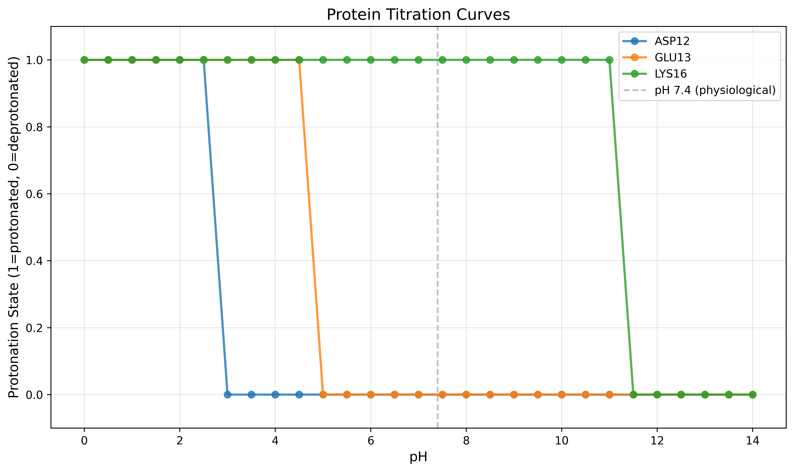
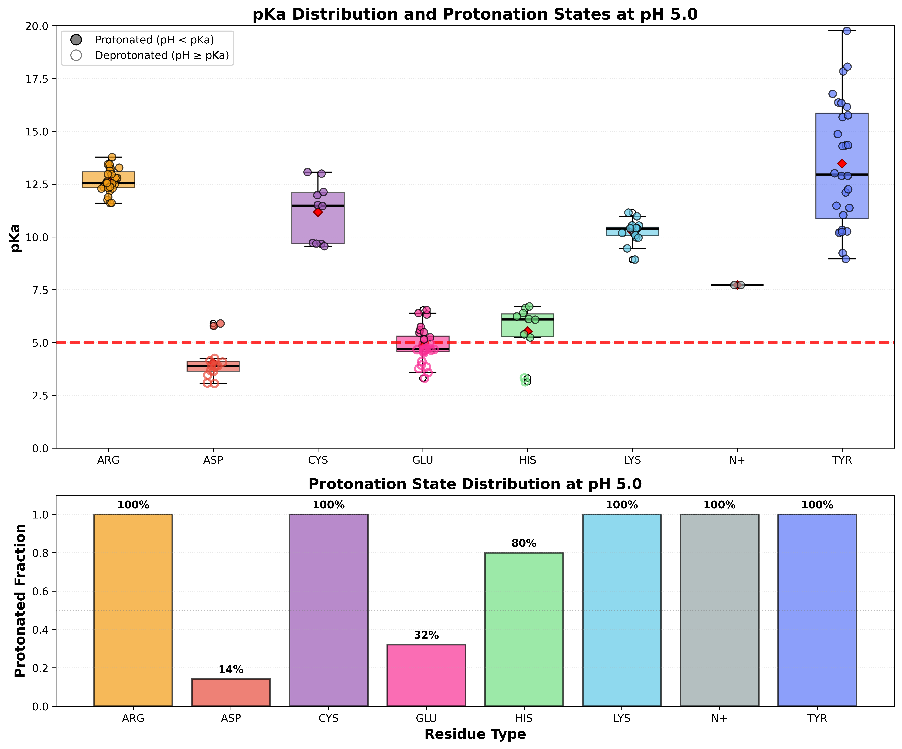

# Preparation Module

Module for predicting pKa values and managing protonation states in protein structures. This module includes:

- pKa prediction and analysis
- Protonation state assignment based on pH
- Disulfide bond detection and application
- Protein capping with ACE/NME groups
- pH-dependent protein structure preparation

## Import

```python
from gatewizard.core.preparation import PreparationManager
from gatewizard.utils.protein_capping import ProteinCapper
```

## Class: PreparationManager

Main class for running Propka analysis and managing protein protonation states.

### Constructor

```python
PreparationManager(propka_version: str = "3")
```

**Parameters:**

| Parameter | Type | Default | Description |
|-----------|------|---------|-------------|
| `propka_version` | `str` | `"3"` | Version of Propka to use |

**Returns:** `PreparationManager` instance

**Example:**
```python
--8<-- "tests/preparation_examples/preparation_example_01.py"
```

---

## Core Methods

### run_analysis

Run Propka analysis on a PDB file to predict pKa values.

```python
run_analysis(pdb_file: str, output_dir: Optional[str] = None) -> str
```

**Parameters:**

| Parameter | Type | Required | Description |
|-----------|------|----------|-------------|
| `pdb_file` | `str` | Yes | Path to input PDB file |
| `output_dir` | `str` | No | Directory for output files. If None, uses input file's directory |

**Returns:** `str` - Path to generated `.pka` file

**Raises:**

- `FileNotFoundError` - If input PDB file doesn't exist
- `PreparationError` - If Propka execution fails

**Output Files:**

- `{basename}.pka` - Full Propka output file

**Example:**
```python
--8<-- "tests/preparation_examples/preparation_example_02.py"
```

---

### extract_summary

Extract the summary section from a Propka output file.

```python
extract_summary(
    propka_file: str,
    output_file: Optional[str] = None,
    output_dir: Optional[str] = None
) -> str
```

**Parameters:**

| Parameter | Type | Required | Description |
|-----------|------|----------|-------------|
| `propka_file` | `str` | Yes | Path to `.pka` file from `run_analysis()` |
| `output_file` | `str` | No | Custom name for output file |
| `output_dir` | `str` | No | Directory for output file |

**Returns:** `str` - Path to summary file

**Raises:**
- `PreparationError` - If summary section not found in `.pka` file

**Output Files:**
- `{basename}_summary_of_prediction.txt` - Extracted summary section

**Example:**
```python
--8<-- "tests/preparation_examples/preparation_example_03.py"
```

---

### parse_summary

Parse summary file and extract residue information as structured data.

```python
parse_summary(summary_file: Optional[str] = None) -> List[Dict[str, Any]]
```

**Parameters:**

| Parameter | Type | Required | Description |
|-----------|------|----------|-------------|
| `summary_file` | `str` | No | Path to summary file. If None, uses last extracted summary |

**Returns:** `List[Dict[str, Any]]` - List of residue dictionaries

**Dictionary Structure:**

| Key | Type | Description | Example |
|-----|------|-------------|---------|
| `"residue"` | `str` | Residue/ligand name | `"ASP"`, `"HIS"`, `"P5S"`, `"LPE"` |
| `"res_id"` | `int` | Residue number (0 for ligands) | `42`, `156`, `0` |
| `"chain"` | `str` | Chain identifier | `"A"`, `"B"` |
| `"pka"` | `float` | Predicted pKa value | `3.85`, `6.45`, `10.83` |
| `"atom"` | `str` | Atom name (for ligands only) | `""`, `"N"`, `"CAX"`, `"O15"` |
| `"atom_type"` | `str` | Atom type classification | `""`, `"N31"`, `"OCO"`, `"OP"` |
| `"model_pka"` | `float` or `None` | Model pKa value | `3.80`, `6.00`, `10.00` |

**Understanding Protein vs. Ligand Entries:**

PROPKA analyzes both **protein residues** and **ligand molecules** for ionizable groups:

**For Protein Residues:**

- `res_id`: Actual residue number (12, 52, 115, etc.)
- `atom`: Empty string (protein residues are treated at residue level)
- `atom_type`: Empty string
- Example: `ASP 52 A` means Aspartate at position 52 in chain A

**For Ligand Atoms:**

- `res_id`: Set to 0 (ligands don't have meaningful residue numbers)
- `atom`: Specific atom name in the ligand (`N`, `CAX`, `O15`, etc.)
- `atom_type`: Atom type classification (`N31`, `OCO`, `OP`, etc.)
- Example: `P5S N A` means atom N in ligand P5S in chain A

**PROPKA Summary Format:**
```
       Group      pKa  model-pKa   ligand atom-type
   ASP  52 A     4.33       3.80                      ← Protein residue
   GLU  65 A     4.87       4.50                      ← Protein residue
   HIS  77 A     6.07       6.50                      ← Protein residue
   N+    8 A     7.66       8.00                      ← N-terminus
   P5S   N A    10.83      10.00                N31   ← Ligand atom
   LPE   N A     9.87      10.00                N31   ← Ligand atom
   Y01 CAX A     4.62       4.50                OCO   ← Ligand atom
   P5S O15 A     5.46       6.00                 OP   ← Ligand atom
```

**Common Atom Type Classifications:**

- **N31** - Tertiary amine nitrogen (sp³, 3 bonds)
- **N33** - Quaternary nitrogen (sp³, 4 bonds, charged)
- **OCO** - Carboxyl oxygen (in -COO⁻)
- **OP** - Phosphate oxygen (in -PO₄²⁻)
- **O3** - Hydroxyl oxygen (sp³)
- **S3** - Thiol sulfur (sp³)

**Raises:**

- `FileNotFoundError` - If summary file doesn't exist
- `PreparationError` - If no ionizable residues found

**Example:**
```python
--8<-- "tests/preparation_examples/preparation_example_04.py"
```

**Output:**
```
...
Found 272 ionizable protein residues
Found 22 ionizable ligand atoms
Ligand P5S atom N (N31): pKa = 10.83
Ligand LPE atom N (N31): pKa = 9.87
Ligand OJ0 atom N02 (N33): pKa = 8.82
Ligand P5S atom C (OCO): pKa = 4.16
Ligand Y01 atom CAX (OCO): pKa = 4.62
Ligand Y01 atom CAX (OCO): pKa = 4.56
Ligand Y01 atom CAX (OCO): pKa = 5.05
Ligand Y01 atom CAX (OCO): pKa = 4.52
Ligand Y01 atom CAX (OCO): pKa = 4.68
Ligand Y01 atom CAX (OCO): pKa = 4.65
Ligand P5S atom O15 (OP): pKa = 5.46
Ligand LPE atom O31 (OP): pKa = 5.15
Ligand PCW atom O1P (OP): pKa = 6.08
Ligand LPE atom O31 (OP): pKa = 6.46
Ligand PCW atom O1P (OP): pKa = 5.62
Ligand PCW atom O1P (OP): pKa = 7.02
Ligand LPE atom O32 (OP): pKa = 6.01
Ligand LPE atom O31 (OP): pKa = 6.54
Ligand LPE atom O32 (OP): pKa = 6.30
Ligand LPE atom O32 (OP): pKa = 6.81
Ligand PCW atom O1P (OP): pKa = 6.17
Ligand PCW atom O1P (OP): pKa = 4.64

P5S: 3 ionizable atoms
  N      pKa=10.83 (N31)
  C      pKa= 4.16 (OCO)
  O15    pKa= 5.46 (OP)

LPE: 7 ionizable atoms
  N      pKa= 9.87 (N31)
  O31    pKa= 5.15 (OP)
  O31    pKa= 6.46 (OP)
  O32    pKa= 6.01 (OP)
  O31    pKa= 6.54 (OP)
  O32    pKa= 6.30 (OP)
  O32    pKa= 6.81 (OP)

OJ0: 1 ionizable atoms
  N02    pKa= 8.82 (N33)

Y01: 6 ionizable atoms
  CAX    pKa= 4.62 (OCO)
  CAX    pKa= 4.56 (OCO)
  CAX    pKa= 5.05 (OCO)
  CAX    pKa= 4.52 (OCO)
  CAX    pKa= 4.68 (OCO)
  CAX    pKa= 4.65 (OCO)

PCW: 5 ionizable atoms
  O1P    pKa= 6.08 (OP)
  O1P    pKa= 5.62 (OP)
  O1P    pKa= 7.02 (OP)
  O1P    pKa= 6.17 (OP)
  O1P    pKa= 4.64 (OP)
```

---

### apply_protonation_states

Apply predicted protonation states to a PDB file based on pH and Propka results.

```python
apply_protonation_states(
    input_pdb: str,
    output_pdb: str,
    ph: float,
    custom_states: Optional[Dict[str, str]] = None,
    residues: Optional[List[Dict[str, Any]]] = None
) -> Dict[str, int]
```

**Parameters:**

| Parameter | Type | Required | Description |
|-----------|------|----------|-------------|
| `input_pdb` | `str` | Yes | Path to input PDB file |
| `output_pdb` | `str` | Yes | Path for output PDB file with modified residue names |
| `ph` | `float` | Yes | Target pH value for protonation state prediction |
| `custom_states` | `Dict[str, str]` | No | Custom state overrides (format: `{"ASP42": "ASH"}` or `{"ASP42_A": "ASH"}`) |
| `residues` | `List[Dict]` | No | Residue list. If None, uses last parsed results |

**Returns:** `Dict[str, int]` - Statistics dictionary

**Return Dictionary:**

| Key | Type | Description |
|-----|------|-------------|
| `"residue_changes"` | `int` | Number of unique residues modified |
| `"record_changes"` | `int` | Total number of PDB records (atoms) modified |

**Raises:**

- `FileNotFoundError` - If input PDB file doesn't exist
- `PreparationError` - If no residue data available (need to run `parse_summary()` first)

**Protonation State Logic:**

The method automatically determines protonation states based on pKa vs pH:

| Residue | Condition | State | AMBER Code |
|---------|-----------|-------|------------|
| ASP | pH < pKa | Protonated | ASH |
| ASP | pH ≥ pKa | Deprotonated | ASP |
| GLU | pH < pKa | Protonated | GLH |
| GLU | pH ≥ pKa | Deprotonated | GLU |
| HIS | pH < pKa | Protonated | HIP |
| HIS | pH ≥ pKa | Neutral (ε) | HIE |
| LYS | pH < pKa | Protonated | LYS |
| LYS | pH ≥ pKa | Neutral | LYN |
| CYS | pH < pKa | Free thiol | CYS |
| CYS | pH ≥ pKa | Deprotonated | CYM |

**Important Notes:**

- This method **only modifies residue names** in the PDB file (e.g., ASP → ASH, HIS → HIP)
- It does **NOT** add or remove hydrogen atoms
- For MD simulations, you may need additional preparation:
  - Use `pdb4amber` or LEaP to add missing hydrogens
  - Use system preparation tools to add solvent and parameterize

**Custom States Format:**

Custom states can be specified with or without chain identifiers:

- `{"ASP12": "ASH"}` - Applies to all chains
- `{"ASP12_A": "ASH"}` - Applies only to chain A
- `{"HIS15": "HID"}` - Use delta-protonated histidine instead of epsilon

**Example:**
```python
--8<-- "tests/preparation_examples/preparation_example_05.py"
```

---

### get_default_protonation_state

Get the default protonation state for a residue at a given pH.

```python
get_default_protonation_state(
    residue: Dict[str, Any],
    ph: float
) -> str
```

**Parameters:**

| Parameter | Type | Required | Description |
|-----------|------|----------|-------------|
| `residue` | `Dict[str, Any]` | Yes | Residue dictionary from `parse_summary()` |
| `ph` | `float` | Yes | Target pH value |

**Returns:** `str` - Three-letter AMBER residue code

**Example:**
```python
--8<-- "tests/preparation_examples/preparation_example_06.py"
```

---

## Protonation State Methods

### get_available_states

Get available protonation states for a residue type.

```python
get_available_states(residue_type: str) -> Dict[str, str]
```

**Parameters:**

| Parameter | Type | Required | Description |
|-----------|------|----------|-------------|
| `residue_type` | `str` | Yes | Three-letter residue code (e.g., "ASP", "HIS") |

**Returns:** `Dict[str, str]` - Dictionary of available states

**Example:**
```python
--8<-- "tests/preparation_examples/preparation_example_07.py"
```

---

### AMBER-Compatible Residue Names

| Standard | Protonated | Deprotonated | Notes |
|----------|------------|--------------|-------|
| **ASP** | ASH | ASP | Aspartic acid |
| **GLU** | GLH | GLU | Glutamic acid |
| **HIS** | HIP | HIE/HID | HIP=both N protonated, HIE=ε, HID=δ |
| **LYS** | LYS | LYN | Lysine |
| **ARG** | ARG | - | Arginine (always protonated in AMBER) |
| **CYS** | CYS | CYM | Cysteine (free thiol) |
| **CYS** | - | CYX | Cysteine in disulfide bond |
| **TYR** | TYR | TYM | Tyrosine |

---

## Disulfide Bond Methods

### detect_disulfide_bonds

Automatically detect potential disulfide bonds based on sulfur-sulfur distance.

```python
detect_disulfide_bonds(
    pdb_file: str,
    distance_threshold: float = 2.5
) -> List[Tuple[Tuple[str, int], Tuple[str, int]]]
```

**Parameters:**

| Parameter | Type | Default | Description |
|-----------|------|---------|-------------|
| `pdb_file` | `str` | Required | Path to PDB file |
| `distance_threshold` | `float` | `2.5` | Maximum S-S distance in Ångströms |

**Returns:** List of bond pairs: `[((res_name, res_id), (res_name, res_id)), ...]`

**Algorithm:**
1. Extracts all cysteine SG (sulfur gamma) atoms from PDB
2. Calculates pairwise distances between all SG atoms
3. Identifies pairs within the distance threshold
4. Returns list of bonded residue pairs

**Example:**
```python
--8<-- "tests/preparation_examples/preparation_example_08.py"
```

---

### apply_disulfide_bonds

Apply disulfide bond assignments by renaming CYS → CYX for bonded cysteines.

```python
apply_disulfide_bonds(
    input_pdb: str,
    output_pdb: str,
    disulfide_bonds: Optional[List[Tuple[Tuple[str, int], Tuple[str, int]]]] = None,
    auto_detect: bool = True
) -> int
```

**Parameters:**

| Parameter | Type | Default | Description |
|-----------|------|---------|-------------|
| `input_pdb` | `str` | Required | Input PDB file path |
| `output_pdb` | `str` | Required | Output PDB file path |
| `disulfide_bonds` | `List[Tuple]` | `None` | Pre-detected bonds (auto-detect if None) |
| `auto_detect` | `bool` | `True` | Auto-detect if bonds not provided |

**Returns:** `int` - Number of disulfide bonds applied (NOT the number of atoms changed)

**What it does:**
1. Identifies cysteines involved in disulfide bonds
2. Changes residue name from CYS to CYX in all ATOM/HETATM records
3. Preserves all other PDB information (coordinates, chains, etc.)
4. Returns count of bonds (e.g., 1 bond = 2 cysteines = ~20 atom records changed)

**Example:**
```python
--8<-- "tests/preparation_examples/preparation_example_09.py"
```

**Integration with Protonation Workflow:**

Disulfide bonds should be applied **after** protonation states:

**Example:**
```python
--8<-- "tests/preparation_examples/preparation_example_10.py"
```

---

## Utility Methods

### get_residue_statistics

Get statistics about the protonable residues.

```python
get_residue_statistics() -> Dict[str, int]
```

**Returns:** `Dict[str, int]` - Dictionary with residue type counts

**Example:**
```python
--8<-- "tests/preparation_examples/preparation_example_11.py"
```

---

### get_ph_titration_curve

Generate titration curves for all protonable residues.

```python
get_ph_titration_curve(
    ph_range: Tuple[float, float] = (0, 14),
    ph_step: float = 0.5
) -> Dict[str, List[Tuple[float, str]]]
```

**Parameters:**

| Parameter | Type | Default | Description |
|-----------|------|---------|-------------|
| `ph_range` | `Tuple[float, float]` | `(0, 14)` | pH range as (min, max) |
| `ph_step` | `float` | `0.5` | Step size for pH values |

**Returns:** `Dict[str, List[Tuple[float, str]]]` - Mapping of residue IDs to (pH, state) tuples

**Example:**
```python
--8<-- "tests/preparation_examples/preparation_example_12.py"
```

**Plotting Example:**

You can visualize titration curves using matplotlib. For readability, it's best to plot only specific residues of interest:

```python
--8<-- "tests/preparation_examples/preparation_example_13.py"
```

**Example Output:**



*Figure: Titration curves for selected residues showing protonation state transitions across pH range. The vertical dashed line indicates physiological pH (7.4).*

---

### build_titration_figure

Run PropKa and return the residue list, every curve, and the figure panels the GUI draws.

```python
build_titration_figure(
    pdb_file: str,
    *,
    target_ph: float = 7.0,
    ph_min: float = 0.0,
    ph_max: float = 14.0,
    ph_step: float = 0.5,
    exclude_ids: Optional[List[str]] = None,
    curve_ids: Optional[List[str]] = None,
    type_filter: Optional[List[str]] = None,
) -> Dict[str, Any]
```

**Parameters:**

| Parameter | Type | Default | Description |
|-----------|------|---------|-------------|
| `pdb_file` | `str` | — | PDB path |
| `target_ph` | `float` | `7.0` | pH used to mark a residue protonated (`pH < pKa`) |
| `ph_min` | `float` | `0.0` | First pH on the curves |
| `ph_max` | `float` | `14.0` | Last pH on the curves |
| `ph_step` | `float` | `0.5` | pH spacing |
| `exclude_ids` | `List[str]` | `None` | Residues left out of panels A and B. Each entry may be `CYS77`, `CYS77:A`, or the figure id |
| `curve_ids` | `List[str]` | `None` | Residues drawn in panel C. Omit to keep every curve |
| `type_filter` | `List[str]` | `None` | Residue names kept in A, B, and C. Empty means all types |

**Returns:** `Dict[str, Any]` — `residues` and `curves` are the full set. `figure` holds `types` (panels A and B), `curves` (panel C), and `excluded_ids`. Cysteines in a disulfide (SG–SG within 2.5 Å, or an SSBOND record) are omitted from panels A and B. `disulfide_warning` explains that PropKa writes pKa 99.99 for those residues as a cysteine-bridge placeholder, not a titration constant. `disulfide_hidden` lists the omitted residues.

`gatewizard.render_titration_png(spec)` draws that figure. Pass `layout.pixels` (each panel's on-screen width and height) so font sizes match the GUI. `c_ypad` is extra space above and below the panel C Y limits; ticks stay on the limits.

---

**Alternative: Plot pKa Distribution with Protonation States:**

```python
--8<-- "tests/preparation_examples/preparation_example_14.py"
```

**Example Output:**



*Figure: (Top) pKa distribution by residue type with protonation states at pH 5.0. Filled circles indicate protonated residues (pH < pKa), open circles indicate deprotonated residues (pH ≥ pKa). The red dashed line shows the target pH. (Bottom) Fraction of each residue type that is protonated at pH 5.0.*

---

## Protein Capping

**Module:** `gatewizard.utils.protein_capping`

Protein capping adds **ACE** (N-acetyl) and **NME** (N-methylamide) groups to protein termini to:

- Neutralize charges at termini
- Improve Propka analysis accuracy
- Better represent membrane protein environments
- Mimic peptide bond continuation in protein fragments

### Class: ProteinCapper

```python
from gatewizard.utils.protein_capping import ProteinCapper, cap_protein

capper = ProteinCapper()
```

### remove_hydrogens_and_cap

Main method to add ACE/NME caps and track residue renumbering.

```python
remove_hydrogens_and_cap(
    input_file: Union[str, Path],
    output_file: Optional[Union[str, Path]] = None,
    target_dir: Optional[Union[str, Path]] = None
) -> Tuple[str, Dict]
```

**Parameters:**

| Parameter | Type | Default | Description |
|-----------|------|---------|-------------|
| `input_file` | `str/Path` | Required | Input PDB file |
| `output_file` | `str/Path` | `None` | Output file (auto-generated if None) |
| `target_dir` | `str/Path` | `None` | Directory for mapping file |

**Returns:** `Tuple[str, Dict]`

- `str` - Path to capped PDB file
- `Dict` - Residue mapping dictionary

**Residue Mapping Dictionary:**

```python
{
    (original_resname, chain, original_resid): (new_resname, chain, new_resid),
    ...
}
```

**What Happens During Capping:**

```
Before: MET1 - ALA2 - ... - GLY50
After:  ACE1 - MET2 - ALA3 - ... - GLY51 - NME52
```

All residue numbers shift by +1, and ACE/NME caps are added.

**Example:**
```python
--8<-- "tests/preparation_examples/preparation_example_15.py"
```

### cap_protein

Simplified wrapper for protein capping.

```python
--8<-- "tests/preparation_examples/preparation_example_16.py"
```

---

## pdb4amber Integration

**Important Distinction:**

| Method | Runs pdb4amber? | Output |
|--------|-----------------|---------|
| **GUI** "Apply States & Run pdb4amber" button | ✅ **YES** (automatic) | AMBER-ready PDB with hydrogens |
| **API** `apply_protonation_states()` | ❌ **NO** (manual) | Only residue name changes |
| **API** `apply_disulfide_bonds()` | ❌ **NO** (manual) | Only CYS→CYX changes |

The API methods only modify residue names in PDB files. For MD simulations, you must run pdb4amber separately:

**Option 1: Command Line**
```bash
pdb4amber -i protein_protonated_ss.pdb -o protein_prepared.pdb
```

**Option 2: Python subprocess**
```python
import subprocess

result = subprocess.run([
    "pdb4amber",
    "-i", "protein_protonated_ss.pdb",
    "-o", "protein_prepared.pdb"
], capture_output=True, text=True, check=True)
```

### ACE/NME Cap HETATM Fix

**Critical Note:** When using protein capping (ACE/NME), pdb4amber converts cap ATOM records to HETATM records, which can cause compatibility issues with downstream tools like packmol-memgen.

**The Problem:**
```
# Before pdb4amber (correct for caps):
ATOM      1  C   ACE A   1      12.640  -9.437  14.871  1.00  0.00      A
ATOM      2  CH3 ACE A   1      12.660 -10.927  15.173  1.00  0.00      A

# After pdb4amber (incorrect - becomes heteroatom):
HETATM    1  C   ACE A   1      12.640  -9.437  14.871  1.00  0.00           C
HETATM    2  CH3 ACE A   1      12.660 -10.927  15.173  1.00  0.00           C
```

### run_pdb4amber_with_cap_fix

Run pdb4amber to add hydrogens and prepare PDB for AMBER, with optional ACE/NME cap HETATM fix.

```python
run_pdb4amber_with_cap_fix(
    input_pdb: str,
    output_pdb: str,
    fix_caps: bool = True,
    pdb4amber_options: Optional[Dict[str, Any]] = None,
    preserve_residue_numbers: bool = False,
    cap_mapping_path: Optional[str] = None,
    original_pdb: Optional[str] = None
) -> Dict[str, Any]
```

**Parameters:**

| Parameter | Type | Default | Description |
|-----------|------|---------|-------------|
| `input_pdb` | `str` | Required | Path to input PDB file |
| `output_pdb` | `str` | Required | Path for output PDB file |
| `fix_caps` | `bool` | `True` | If True, automatically converts ACE/NME HETATM→ATOM after pdb4amber |
| `pdb4amber_options` | `Dict[str, Any]` | `None` | Optional dictionary of pdb4amber command-line options |
| `preserve_residue_numbers` | `bool` | `False` | After Amber, restore original residue numbers and chains. Default False keeps sequential Amber numbering for tleap / MD. |
| `cap_mapping_path` | `str` | `None` | Optional `*_gatewizard_residue_mapping.txt` so loop gaps survive a prior cap step |
| `original_pdb` | `str` | `None` | Optional pre-cap PDB used when composing originals |

**Returns:** `Dict[str, Any]` - Result dictionary with execution details

**Return Dictionary:**

| Key | Type | Description |
|-----|------|-------------|
| `"success"` | `bool` | Whether pdb4amber execution succeeded |
| `"output_file"` | `str` | Path to the output PDB file |
| `"hetatm_fixed"` | `int` | Number of HETATM records converted to ATOM (0 if fix_caps=False) |
| `"stdout"` | `str` | Standard output from pdb4amber command |
| `"stderr"` | `str` | Standard error from pdb4amber command |
| `"residue_numbers_preserved"` | `bool` | True when originals were rewritten onto the output |
| `"remum_path"` | `str` | Path to pdb4amber `*_renum.txt` when found |
| `"cap_assignments"` | `dict` | New ACE/NME residue numbers when preserve is on |

**Raises:**

- `FileNotFoundError` - If input PDB file doesn't exist
- `RuntimeError` - If pdb4amber command fails or is not found

**What This Method Does:**

**Runs pdb4amber**: Executes the AmberTools pdb4amber utility to:

   - Prepare PDB structure for AMBER force field
   - Remove problematic records
   - Renumber atoms and residues if needed

**Optionally Fixes ACE/NME Caps** (if `fix_caps=True`):

   - Detects ACE (N-acetyl) and NME (N-methylamide) cap residues
   - Converts their HETATM records back to ATOM records
   - This fixes compatibility issues with tools like packmol-memgen

**The ACE/NME Cap HETATM Problem:**

When protein capping is used, pdb4amber incorrectly converts cap ATOM records to HETATM:

```
# Before pdb4amber (correct):
ATOM      1  C   ACE A   1      12.640  -9.437  14.871  1.00  0.00           C
ATOM      2  CH3 ACE A   1      12.660 -10.927  15.173  1.00  0.00           C

# After pdb4amber (incorrect - becomes heteroatom):
HETATM    1  C   ACE A   1      12.640  -9.437  14.871  1.00  0.00           C
HETATM    2  CH3 ACE A   1      12.660 -10.927  15.173  1.00  0.00           C
```

This causes compatibility issues because:

- packmol-memgen expects caps as ATOM records
- Other MD preparation tools may skip HETATM records
- Caps should be treated as part of the protein chain

**pdb4amber_options Dictionary:**

You can pass custom pdb4amber command-line options:

```python
options = {
    "reduce": True,        # Use reduce for hydrogen addition
    "dry": False,          # Keep water molecules (default: False)
    "keep-altlocs": False, # Remove alternative locations (default: False)
    "strip-waters": True,  # Remove water molecules (default: True)
}
```

`reduce=True` requires the Amber `reduce` CLI. If that binary is not installed (common in slim conda envs that still have `pdb4amber`), GateWizard drops `--reduce`, strips stale CONECT/LINK records first, and keeps hydrogens from `complete_missing_heavy_atoms` / tleap. The result dict then has `reduce_skipped=True` and `conect_records_removed`.

CONECT/LINK warnings from ParmEd (missing serials after atoms were added, or K+ coordination LINKs) are not fatal. They are avoided by dropping those records before `pdb4amber`.

### strip_conect_and_link_records

```python
from gatewizard.core.preparation import strip_conect_and_link_records
```

Remove CONECT and LINK lines. Use this when serials no longer match (after tleap completion or any renumber).

### resolve_reduce_executable

```python
from gatewizard.core.preparation import resolve_reduce_executable
```

Return the Amber `reduce` path (`CONDA_PREFIX/bin` first), or `None` if it is not installed.

**Example - Basic Usage:**

```python
from gatewizard.core.preparation import PreparationManager

analyzer = PreparationManager()

# Run pdb4amber with automatic cap fix (recommended for capped proteins)
result = analyzer.run_pdb4amber_with_cap_fix(
    input_pdb="protein_capped_ph7_ss.pdb",
    output_pdb="protein_prepared.pdb",
    fix_caps=True  # Default: automatically fix ACE/NME caps
)

if result['success']:
    print(f"✓ pdb4amber completed successfully")
    print(f"✓ Output: {result['output_file']}")
    if result['hetatm_fixed'] > 0:
        print(f"✓ Fixed {result['hetatm_fixed']} HETATM records for ACE/NME caps")
else:
    print(f"✗ pdb4amber failed")
    print(f"Error: {result['stderr']}")
```

**Example - Without Cap Fix:**

```python
from gatewizard.core.preparation import PreparationManager

analyzer = PreparationManager()

# Run pdb4amber without cap fix (for uncapped proteins)
result = analyzer.run_pdb4amber_with_cap_fix(
    input_pdb="protein_uncapped_ph7_ss.pdb",
    output_pdb="protein_prepared.pdb",
    fix_caps=False  # No cap fix needed
)

print(f"Success: {result['success']}")
print(f"HETATM records fixed: {result['hetatm_fixed']}")  # Will be 0
```

**Example - With Custom pdb4amber Options:**

```python
from gatewizard.core.preparation import PreparationManager

analyzer = PreparationManager()

# Run with custom pdb4amber options
custom_options = {
    "dry": False,          # Keep crystallographic waters
    "keep-altlocs": True,  # Keep alternative locations
}

result = analyzer.run_pdb4amber_with_cap_fix(
    input_pdb="protein_capped_ph7_ss.pdb",
    output_pdb="protein_prepared.pdb",
    fix_caps=True,
    pdb4amber_options=custom_options
)

print(f"pdb4amber output:\n{result['stdout']}")
```

**Integration with Complete Workflow:**

```python
from gatewizard.core.preparation import PreparationManager
from gatewizard.utils.protein_capping import ProteinCapper

# Step 1: Add caps
capper = ProteinCapper()
capped_file, mapping = capper.remove_hydrogens_and_cap("protein.pdb")

# Step 2: Run Propka analysis
analyzer = PreparationManager()
pka_file = analyzer.run_analysis(capped_file)
summary_file = analyzer.extract_summary(pka_file)
residues = analyzer.parse_summary(summary_file)

# Step 3: Apply protonation states
analyzer.apply_protonation_states(
    input_pdb=capped_file,
    output_pdb="protein_capped_ph7.pdb",
    ph=7.4,
    residues=residues
)

# Step 4: Apply disulfide bonds
bonds = analyzer.detect_disulfide_bonds(capped_file)
analyzer.apply_disulfide_bonds(
    input_pdb="protein_capped_ph7.pdb",
    output_pdb="protein_capped_ph7_ss.pdb",
    disulfide_bonds=bonds
)

# Step 5: Run pdb4amber with automatic cap fix
result = analyzer.run_pdb4amber_with_cap_fix(
    input_pdb="protein_capped_ph7_ss.pdb",
    output_pdb="protein_prepared.pdb",
    fix_caps=True  # Critical for capped proteins!
)

print(f"✓ Final AMBER-ready structure: {result['output_file']}")
```

**GUI Behavior:**

When using the GUI:

- The "Apply States & Run pdb4amber" button automatically uses this method
- Automatically detects when capping was used (checks capping checkbox)
- Sets `fix_caps=True` if capping was applied
- Reports number of fixed HETATM records in success message
- Displays pdb4amber output in the GUI log

**Important Notes:**

⚠️ **When to use fix_caps=True:**

- When you used protein capping (ACE/NME groups added)
- When planning to use packmol-memgen or similar tools
- When you need caps to be part of the protein chain (ATOM records)

⚠️ **When to use fix_caps=False:**

- When no capping was applied
- When you want standard pdb4amber behavior
- When working with uncapped protein structures

⚠️ **Requirements:**

- Requires AmberTools installation (`pdb4amber` must be available). The Amber `reduce` binary is optional: when it is missing, `--reduce` is skipped and tleap hydrogens are kept.
- Input PDB should already have correct protonation states and disulfide bonds applied

---

## Complete Workflow Examples

### Advanced Workflow with Protonation and Disulfide Bonds

```python
--8<-- "tests/preparation_examples/preparation_example_17.py"
```

### Workflow with Protein Capping

```python
--8<-- "tests/preparation_examples/preparation_example_18.py"
```

### Multiple pH Variants

```python
--8<-- "tests/preparation_examples/preparation_example_19.py"
```

---

## Advanced Topics

### Residue Mapping After Capping

When proteins are capped, residue numbers change (all shift by +1). Use the mapping dictionary to translate:

```python
--8<-- "tests/preparation_examples/preparation_example_20.py"
```

**Example Output:**
```
✓ Capped protein with 50 residues tracked
✓ Analyzed 12 ionizable residues
  Mapped ASP12 → ASP13_A (ASH)
  Mapped GLU13 → GLU14_A (GLH)
✓ Applied protonation: 12 residues modified
```

### Custom Protonation States

Override automatic pH-based protonation with custom states for specific residues:

```python
--8<-- "tests/preparation_examples/preparation_example_21.py"
```

**Example Output:**
```
✓ Analyzed 13 ionizable residues
✓ Modified 3 residues (44 atoms)
  Custom states applied: 3
  ASP12_A → ASH
  HIS15_A → HID
  GLU22 → GLH
```

**Use Cases:**

- Force specific protonation for catalytic residues
- Match experimental conditions or known structures
- Test different protonation hypotheses
- Override PROPKA predictions based on domain knowledge

---

### Filtering and Analysis

Identify residues with unusual pKa shifts that may indicate important interactions:

```python
--8<-- "tests/preparation_examples/preparation_example_22.py"
```

**Example Output:**
```
Residues with unusual pKa shifts (>1.0 units):
======================================================================
ASP 42 (Chain A): pKa= 6.23 (expected ~3.9, shift=+2.3)
GLU 58 (Chain A): pKa= 2.15 (expected ~4.3, shift=-2.2)
HIS 77 (Chain A): pKa= 8.45 (expected ~6.0, shift=+2.5)
LYS115 (Chain A): pKa= 8.32 (expected ~10.5, shift=-2.2)
CYS128 (Chain A): pKa=10.87 (expected ~8.3, shift=+2.6)

Summary: Found 5 residues with significant pKa shifts
  Upshifted (more basic): 3
  Downshifted (more acidic): 2

⚠ Extreme shifts (>2.0 units): 5
  ASP42_A: +2.33 units
  GLU58_A: -2.15 units
  HIS77_A: +2.45 units
  LYS115_A: -2.18 units
  CYS128_A: +2.57 units
```

**Interpretation:**

- **Large upshifts** (more basic): May indicate buried residues, salt bridges, or hydrogen bonding networks
- **Large downshifts** (more acidic): May indicate proximity to positive charges or unusual electrostatic environments
- **Extreme shifts (>2 units)**: Often mark functionally important residues like active sites, binding pockets, or structural switches


---

## Module-level helpers

### run_propka

```python
from gatewizard.core.preparation import run_propka
```

Run the PropKa binary on a PDB (used internally by `PreparationManager.run_analysis`).

### extract_summary_section

```python
from gatewizard.core.preparation import extract_summary_section
```

Write the “summary of prediction” block from a `.pka` file.

### parse_summary_section

```python
from gatewizard.core.preparation import parse_summary_section
```

Parse that summary into residue dictionaries.

### modify_pdb_based_on_summary

```python
from gatewizard.core.preparation import modify_pdb_based_on_summary
```

Apply protonation names from a parsed summary to a PDB.

### count_protein_hydrogens

```python
from gatewizard.core.preparation import count_protein_hydrogens
```

Count protein hydrogen atoms (ligands/hetero H ignored).

### complete_missing_heavy_atoms

```python
from gatewizard.core.preparation import complete_missing_heavy_atoms
```

Fill **missing protein atoms** from Amber residue templates (`tleap` + `leaprc.protein.ff19SB`). Ligands, waters, and ions are copied unchanged. Missing loop residues (200 then 205) are **not** built. CONECT/LINK records are dropped because atom serials change after `savePdb`.

Call this **after** PropKa / Amber name changes (ASP→ASH, GLU→GLH, HIS→HID/HIE/HIP). `tleap` then adds the extra protons from those templates — the same step packmol-memgen uses at final parametrization, but protein-only (no water or ions). If you complete on ASP and only rename to ASH afterward, HD2 is never placed.

`pdb4amber --reduce` can still rebuild Amber hydrogens when the Amber `reduce` binary is on `PATH` (or `CONDA_PREFIX/bin`). If `reduce` is missing, Prepare keeps the tleap template hydrogens and runs `pdb4amber` without `--reduce` instead of failing. The GUI Prepare button applies names first, then this tleap pass.

### restore_original_residue_numbers

Rewrite ATOM/HETATM residue numbers **and chain IDs** back to the pre-`pdb4amber` (and, when a cap map is given, pre-cap) ids. Missing loop residues are not built; a gap of 200 then 205 stays a gap. After tleap completion, protein is often one blank chain with sequential ids; restore pairs polymer residues in file order to the original PDB.

**ACE / NME when preserve is on** (ProteinCapper itself still writes ACE1 / protein+1 for the MD path):

| Original N-terminus | ACE | Protein | NME |
|---------------------|-----|---------|-----|
| 1 | **0** | unchanged | last + 1 |
| 21 | 20 | unchanged | last + 1 |
| 200 then 205 (gap) | 199 | 200 and 205 kept | 206 |

Residue 0 is legal PDB. AmberTools / tleap usually want sequential ids starting at 1 — uncheck preserve or call this method with `preserve_residue_numbers=False` for that path.

```python
--8<-- "tests/preparation_examples/preparation_example_23.py"
```

### parse_residue_mapping_by_chain

```python
from gatewizard.utils.residue_mapping import parse_residue_mapping_by_chain
```

Load `(chain, final_resid) → original_resid`. Cap lines with original `-` are `None`. Two chains that share residue 21 stay distinct.

### parse_residue_mapping_file

```python
from gatewizard.utils.residue_mapping import parse_residue_mapping_file
```

Chain-blind `final_resid → original_resid` for Analysis overlays. Caps with original `-` are skipped. Prefer `parse_residue_mapping_by_chain` when restoring a PDB.

### strip_protein_hydrogens

```python
from gatewizard.core.preparation import strip_protein_hydrogens
```

Write a PDB with protein hydrogens removed; ligand hydrogens stay.

### detect_terminal_caps

```python
from gatewizard.utils.protein_capping import detect_terminal_caps
```

Return ACE/NME (or similar) cap residue names present in a PDB.

### is_already_capped

```python
from gatewizard.utils.protein_capping import is_already_capped
```

True when terminal caps are already present.

## Important Notes

### Output Directory Behavior

⚠️ **Important**: When using `output_dir`, the code automatically:

- Creates the directory if it doesn't exist
- Converts input file paths to absolute paths
- Places all output files in the specified directory

### PDB Records vs Residues

⚠️ **Important distinction**:

- **Residue changes**: Number of unique residues modified
- **PDB record changes**: Number of ATOM/HETATM lines modified

Example: Changing 1 histidine residue with 10 atoms:

- `residue_changes` = 1
- `record_changes` = 10

### Dictionary Key Names

⚠️ **Common Mistake**: The parsed residues use these exact key names:

- ✓ Correct: `res['residue']` (not `res['residue_name']`)
- ✓ Correct: `res['res_id']` (not `res['residue_number']`)
- ✓ Correct: `res['chain']` (not `res['chain_id']`)
- ✓ Correct: `res['atom']` (atom name for ligands, empty for protein residues)
- ✓ Correct: `res['atom_type']` (atom type classification like 'N31', 'OCO', 'OP')

**Note on Ligands:**

- Protein residues have `res_id > 0`, `atom == ''`, `atom_type == ''`
- Ligand atoms have `res_id == 0`, `atom` contains atom name, `atom_type` contains classification
- Use `res_id` to distinguish: `if res['res_id'] > 0:` → protein, else → ligand

### Output Files

The analysis generates several files:
- `*.pka` - Full Propka output
- `*_summary_of_prediction.txt` - Extracted summary section
- `*_protonated.pdb` - After applying protonation states
- `*_ss.pdb` - After applying disulfide bonds
- `*_gatewizard_residue_mapping.txt` - Residue mapping (if capping used)
