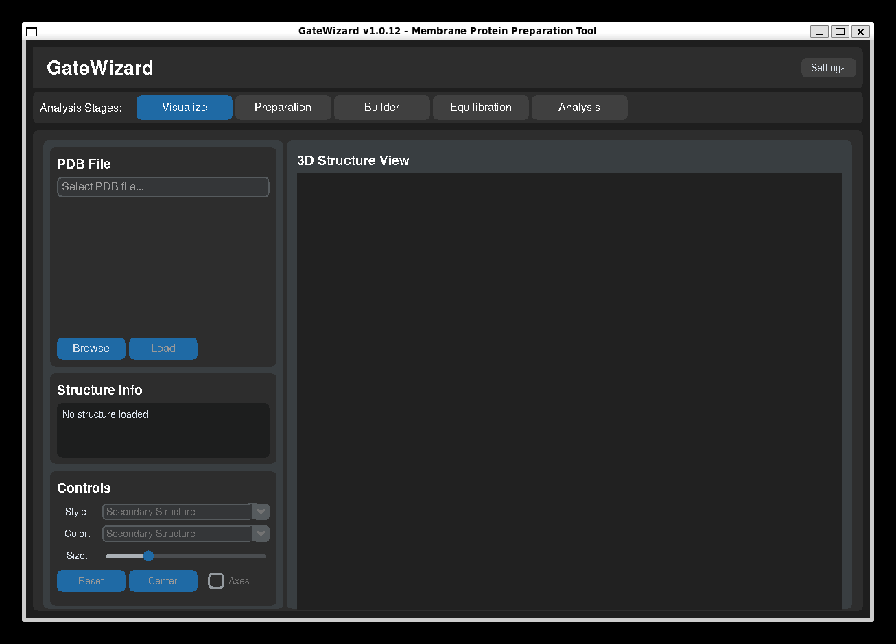
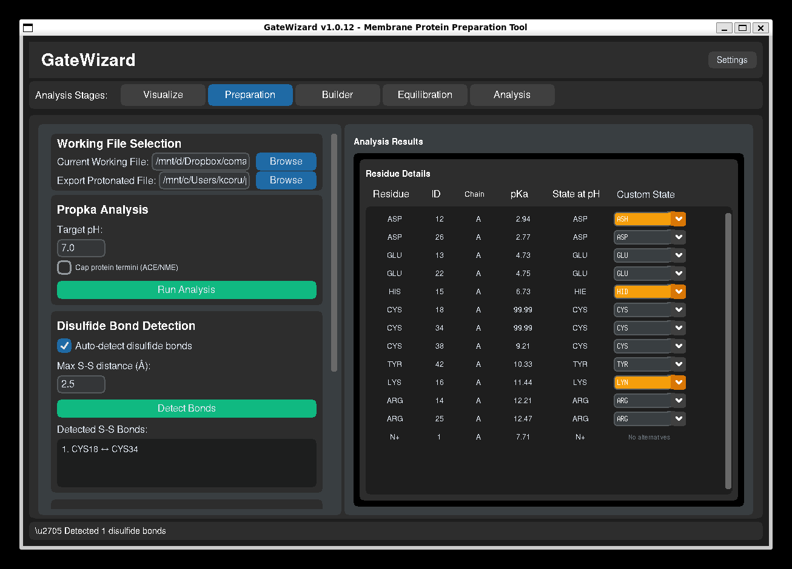
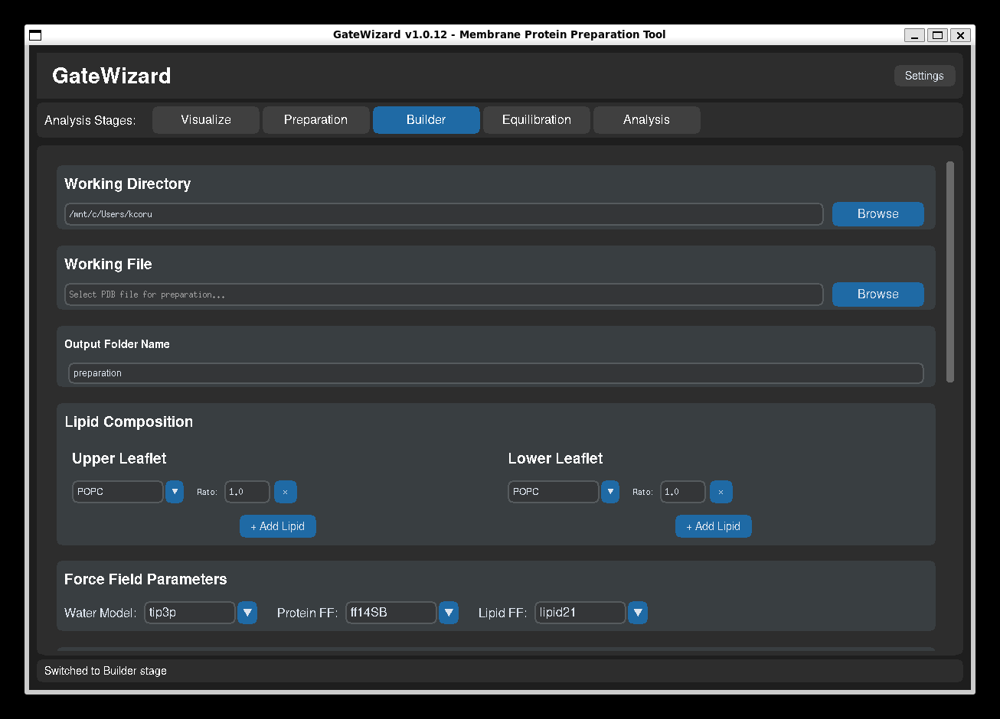
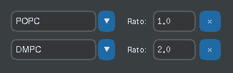
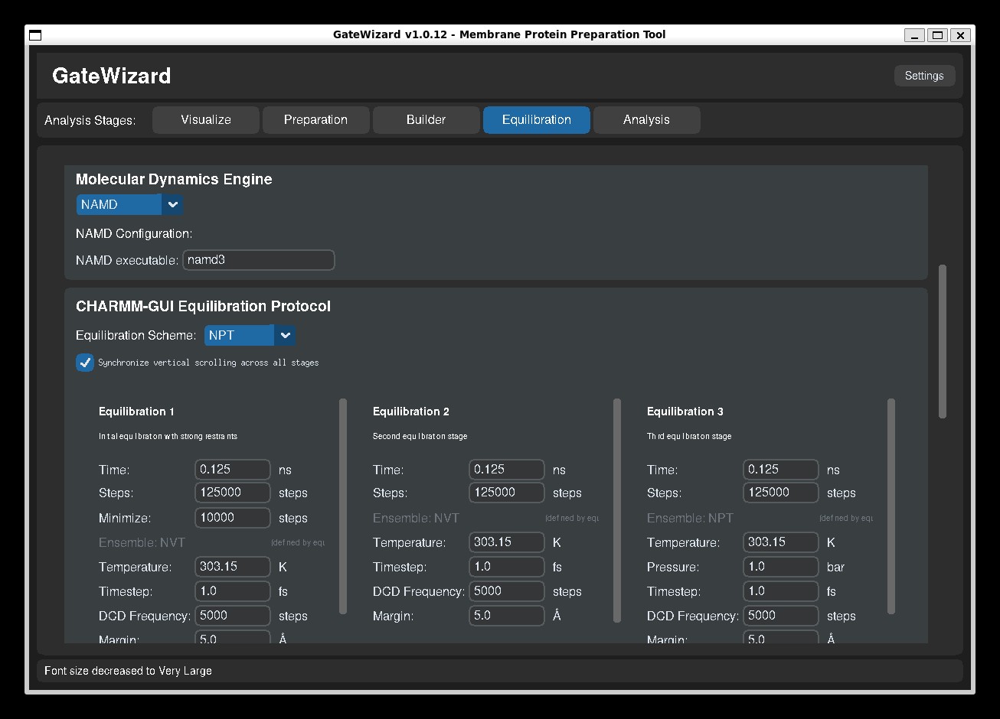

# User Guide

This guide covers the main features and workflows in GateWizard.

## Table of Contents

1. [Getting Started](#getting-started)
2. [Main Interface](#main-interface)
3. [Preparation Tab - Structure Preparation](#preparation-tab-structure-preparation)
4. [Builder Tab - System Building](#builder-tab-system-building)
5. [Equilibration Tab - MD Equilibration](#equilibration-tab-md-equilibration)
6. [Analysis Tab](#analysis-tab)
7. [Visualization](#visualization)

## Getting Started

### Launching GateWizard

The desktop app is **[gatewizard-gui](https://github.com/franciscoadasme/gatewizard-gui)** — install it from [Releases](https://github.com/franciscoadasme/gatewizard-gui/releases). The `gatewizard` pip package is the Python API only and does not provide a terminal launcher.

## Main Interface

The GateWizard interface consists of several main tabs:

- **Preparation**: Protein structure preparation and pKa calculations
- **Builder**: Membrane system building and setup
- **Analysis**: Trajectory and energy analysis
- **Visualize**: Structure and simulation visualization

**Main Interface:**



*GUI: Visualize tab.*


### Navigation

- Click on tabs to switch between different features
- Each tab has its own input/output sections
- Status messages appear at the bottom of the window
- Use keyboard shortcuts for quick access (Ctrl+Q to quit)
- Use F1 to see all available shortcuts

## Preparation Tab - Structure Preparation

The Preparation tab is used for protein structure preparation and protonation state analysis.

### Basic Workflow



*GUI: Propka analysis.*

1. **Load PDB File**
   - Click "Browse" to select your PDB file

2. **Set pH Value**
   - Enter the desired pH (default: 7.0)
   - This determines protonation states of ionizable residues

3. **Configure Options**
   - **Protein Capping**: Add ACE/NME caps to termini

4. **Run Analysis**
   - Click "Run Analysis"
   - Results will show pKa values for each ionizable residue
   - Protonation states are assigned based on pH

5. **Detect Bonds**
   - Select Auto-detect disulfide bonds
   - Set the maximum distance between S-S atoms to be considered

5. **Export Results**
   - Save the prepared structure
   - Export pKa data for further analysis

### Protein Capping

Protein capping adds protective groups to protein termini:

- **ACE (N-terminus)**: Acetyl cap prevents artificial charges
- **NME (C-terminus)**: N-methylamide cap neutralizes terminus

**When to use capping:**
- For fragments or peptides
- When termini should not be charged
- Before molecular dynamics simulations of protein segments

**How to use:**

1. Enable "Cap protein termini" checkbox

2. Run Propka analysis

3. Capped structure will be saved automatically

### Understanding pKa Results

The results table shows:

- **Residue**: Amino acid and position
- **ID**: Residue ID
- **Chain**: Chain of the protein
- **pKa**: Calculated pKa value
- **State at pH**: State at specified pH
- **Custom State**: State to define

## Builder Tab - System Building



*GUI: Builder tab.*

The **Builder** tab provides an interface for building membrane protein systems using **packmol-memgen** and **AmberTools**.

### Overview

The Builder tab automates the process of:

1. Packing the protein into a lipid membrane
2. Adding water and ions
3. Parametrizing the system for molecular dynamics simulations
4. Generating all necessary input files (topology, coordinates, restraints)

### Workflow Steps

#### 1. Set Working Directory

- **Purpose**: Defines where all generated files will be stored
- **Click "Browse"** to select or create a folder for your project
- All output files will be organized in subdirectories within this location

#### 2. Select Working File (PDB)

- **Input**: Your prepared protein structure (ideally from Propka analysis)
- **Requirements**: 
  - Clean PDB format
  - Proper protonation states if using propka results
  - Pre-oriented if using that option
- **Browse** to select your PDB file

#### 3. Set Output Folder Name

- **Default**: "preparation_protein"
- **Customizable**: Give a meaningful name for your system
- **Result**: Creates a subfolder within working directory

#### 4. Configure Lipid Composition

**Upper Leaflet:**

- Select one or more lipid types (POPC, POPE, POPS, etc.)
- Set molar ratios (1:1, 1:2, ...)
- Common: 100% POPC for simple systems (1.0 ratio)



**Lower Leaflet:**

- Can match upper leaflet (symmetric) or differ (asymmetric)
- Supports complex compositions (e.g., 70% POPC + 30% CHOL)

**Available Lipid Types**:

- Phospholipids: POPC, POPE, POPS, DOPC, DPPC
- Cholesterol: CHOL
- Specialized: POPG, DOPE, and many more, please check the [Available Lipid Models](api/builder.md/#example-4-available-lipid-models) example in the API to see the full lipid list.

#### 5. Select Force Fields

**Water Model**: TIP3P, TIP4P, SPC/E

- Default: TIP3P (most common for biological systems)

**Protein Force Field**: ff14SB, ff19SB, ff14IDPSFF

- Default: ff14SB (reliable for most proteins)
- ff19SB: Improved backbone parameters

**Lipid Force Field**: lipid21, lipid17, lipid14

- Default: lipid21 (most recent)

#### 6. System Options

**Protein is pre-oriented** (checked by default)

- Your protein is already positioned correctly in membrane
- Uncheck if protein needs automatic orientation

**Run parametrization with tleap** (checked by default)

- Generates topology (.prmtop) and coordinates (.inpcrd)
- Required for MD simulations
- Uncheck to only pack the system

**Add salt** (checked by default)

- Neutralizes system and adds physiological ionic strength
- Concentration: 0.15 M (default, physiological)
- Cation: K+ (default)
- Anion: Cl- (default)

**Water layer thickness**: 17.5 Å (default)

- Distance of water above and below membrane/protein
- Adjust for larger proteins or specific requirements

**Skip protonation (preserve propka results)** (checked by default)

- Preserves your protonation states from Propka analysis
- Residue names like GLH, ASH, HIP are kept
- Prevents tleap from re-protonating based on default pKa

#### 7. Validate and Start Preparation

##### 1. **Click "Validate Inputs"**
   - Checks all parameters
   - Verifies file existence
   - Ensures lipid ratios are valid
   - Enables "Start Preparation" button

##### 2. **Click "Start Preparation"**
   - Launches packmol-memgen to pack the system
   - Runs tleap for parametrization (if enabled)
   - Generates all necessary files
   - Process runs in background

#### 8. Monitor Progress

The **Progress** section shows:
- Job name and status
- Start time
- Current stage
- Completion status
- Links to output directories

**Refresh** button updates the status of all jobs

### Output Files

After successful preparation, you'll find:

**In `{output_folder_name}/` directory:**

- `bilayer_*.pdb` - Packed system structure
- `system.prmtop` - AMBER topology file
- `system.inpcrd` - AMBER coordinate file
- `system_solv.pdb` - Solvated system PDB
- Various log files for troubleshooting

### Tips and Best Practices

1. **Always run Propka first** to determine correct protonation states
2. **Use "Load Defaults"** to quickly populate recommended force fields
3. **Check log files** if preparation fails
4. **Use meaningful names** for output folders to organize multiple systems
5. **Keep parametrization enabled** unless you have specific reasons not to

### Troubleshooting

**"PDB file not found"**: Check file path and permissions

**"Parametrization failed"**: 
- Check for non-standard residues
- Verify protonation states
- Review tleap log files

**"Process failed"**: See log files in output directory for details

---

## Equilibration Tab - MD Equilibration



*GUI: Equilibration tab.*

The **Equilibration** tab automates the generation and execution of multi-stage equilibration protocols for molecular dynamics simulations using **NAMD**, **OpenMM**, and **GROMACS**.

### Overview

Equilibration is critical before production MD simulations. This tab:

1. Generates a series of equilibration stages with gradually relaxing restraints
2. Creates engine-specific input files based on CHARMM-GUI-style protocols
3. Handles minimization and equilibration
4. Supports NVT, NPT, NPAT, and NPγT ensembles
5. Can run simulations in the background

### Workflow Steps

#### 1. Set Working Directory

- Select the directory containing your prepared system
- Should contain `.prmtop` and `.inpcrd` files from Builder tab

#### 2. Set Output Folder Name

- Default: "equilibration"
- Creates a subfolder for equilibration files

#### 3. Select MD Engine

Currently supported: **NAMD**, **OpenMM**, and **GROMACS**

- NAMD 2.x and NAMD 3 compatible
- OpenMM uses engine-specific Python runner scripts and DCD output
- GROMACS equilibration uses CHARMM-GUI templates under the hood
- GPU acceleration supported where the engine allows it

#### 4. Configure Engine Settings

**NAMD Executable**:

- Default: "namd3"
- Change if using namd2 or custom path

**OpenMM**:

- Uses the generated `openmm_run.py` runner
- DCD output is written with periodic wrapping enabled for periodic systems

**GROMACS**:

- Uses `gmx` for `grompp` / `mdrun`
- Colvars activation lines are injected automatically when COM restraints are enabled

#### 5. Select Equilibration Scheme

**Available Schemes:**

**NVT (Constant Volume, Temperature)**

- For initial equilibration
- No pressure control
- Quick equilibration

**NPT (Constant Pressure, Temperature)**

- Most common for protein systems
- Isotropic pressure coupling
- Standard for protein-water systems

**NPAT (Constant Pressure, Area, Temperature)**

- Fixed membrane area (XY plane)
- Semi-isotropic pressure (Z-axis only)
- Prevents membrane from shrinking/expanding

**NPγT (Constant Surface Tension)**

- Surface tension control
- Membrane-water interface systems

#### 6. Set Simulation Parameters

**Temperature**: 310.15 K (default, 37°C physiological)

- Range: 273-350 K typically
- Higher for denaturation studies

**Pressure**: 1.0 bar (default, atmospheric)

**Timestep**: 1.0-2.0 fs

- 1.0 fs for minimization/initial stages
- 2.0 fs for production with constrained hydrogens

#### 7. Configure Protocol Stages

The equilibration protocol consists of 6 stages + production:

**Stage 1: Equilibration 1 - Strong Restraints**

- Duration: 0.125 ns (125 ps)
- Includes initial minimization (10,000 steps)
- Strong restraints on protein backbone (10 kcal/mol/Ų)
- Purpose: Remove bad contacts

**Stage 2: Equilibration 2 - Heavy Restraints**

- Duration: 0.125 ns
- Moderate restraints (2.5-5.0 kcal/mol/Ų)
- Purpose: Allow side chains to relax

**Stage 3: Equilibration 3 - Moderate Restraints**

- Duration: 0.125 ns
- Reduced restraints (1.0-2.5 kcal/mol/Ų)
- Purpose: Relax protein-lipid interface

**Stage 4: Equilibration 4 - Light Restraints**

- Duration: 0.125 ns
- Minimal restraints (0.5-1.0 kcal/mol/Ų)
- Purpose: Equilibrate lipid headgroups

**Stage 5: Equilibration 5 - Minimal Restraints**

- Duration: 0.125 ns
- Very light restraints (0.1-0.5 kcal/mol/Ų)
- Purpose: Final equilibration

**Stage 6: Equilibration 6 - Final Equilibration**

- Duration: 0.125 ns
- Nearly unrestrained (0.1 kcal/mol/Ų)
- Purpose: Verify system stability

**Production**

- Duration: 100.0 ns (customizable)
- No restraints
- Full dynamics

**Per-Stage Customization**:

- Adjust duration (time_ns)
- Set CPU cores or enable GPU
- Modify restraint strengths
- Change timestep
- **Atom count display**: Each constraint row shows the number of matching atoms (requires a PDB to be loaded)
- **Edit selection (⚙)**: Click the gear icon to modify the MDAnalysis selection string for any constraint
- **Add custom selection (+)**: Add new named selections (e.g., ligands) to all stages
- **Auto-detect ligands**: When a system folder is selected, non-standard residues are automatically detected and added as `ligand_<RESNAME>` entries

#### 8. Generate Input Files

**Click "Generate Input Files"**

This creates:

- Engine-specific configuration files for each stage
- Restraint files (PDB format with beta factors)
- Run script (`run_equilibration.sh`)
- Protocol summary (`protocol_summary.json`)

If COM restraints are enabled, GateWizard also writes the corresponding colvars
file and injects the activation block into the generated NAMD or GROMACS input
files automatically.

**Output Structure:**
```
equilibration/namd/
├── step1_equilibration.conf
├── step2_equilibration.conf
├── ...
├── step6_equilibration.conf
├── step7_production.conf
├── step1_restraints.pdb
├── step2_restraints.pdb
├── ...
├── run_equilibration.sh
└── protocol_summary.json
```

#### 9. Run Equilibration

**Click "Run Equilibration"**

Options:

- **Background process**: Runs independently, terminal can be closed
- **Progress tracking**: Monitor via log files
- **Stage-by-stage**: Each stage runs sequentially
- **Automatic**: Stops on error

**Monitoring:**

- Check `.log` files for each stage
- Review DCD trajectory files
- Monitor energy output

### COM Restraints

GateWizard can generate centre-of-mass / centre-of-geometry restraints for
protein-membrane systems.

- NAMD writes `com_restraint.col` and adds `colvars on` / `colvarsConfig ...`
   to the generated `.conf` files.
- GROMACS writes `com_restraint.dat` and adds `colvars-active = yes` /
   `colvars-configfile = ...` to the generated `.mdp` files.

These restraints are intended to keep the protein centered and reduce the
bilayer splitting effect in visualisation, without changing the simulation
physics.

### Restraint System

Restraints gradually released across stages:

| Stage | Protein Backbone | Protein Sidechain | Lipid Heads | Water | Ions |
|-------|------------------|-------------------|-------------|-------|-------|
| 1     | 10.0            | 5.0               | 2.5         | 0.0   | 10.0 
| 2     | 5.0             | 2.5               | 2.5         | 0.0   | 0.0
| 3     | 2.5             | 1.0               | 1.0         | 0.0   | 0.0
| 4     | 1.0             | 0.5               | 0.5         | 0.0   | 0.0
| 5     | 0.5             | 0.1               | 0.1         | 0.0   | 0.0
| 6     | 0.1             | 0.0               | 0.0         | 0.0   | 0.0
| Prod  | 0.0             | 0.0               | 0.0         | 0.0   | 0.0

Units: kcal/mol/Ų

### Common Use Cases

**Case 1: Standard Membrane Protein Equilibration**
```
Scheme: NPAT
Temperature: 310.15 K
Pressure: 1.0 bar
Timestep: 2.0 fs
Protocol: Default 6-stage + production
GPU: Enabled for faster stages
```

For membrane systems, enabling COM restraints is recommended when you want to
reduce rigid-body drift in the output trajectories.

**Case 2: Quick Test Equilibration**
```
Reduce all stage times to 0.05 ns
Total: ~0.5 ns
Use for testing system stability
```

**Case 3: Extended Equilibration**
```
Increase each stage to 0.5 ns
Add longer production (10+ ns)
For large conformational changes
```

### Best Practices

1. **Always minimize first**: Stage 1 includes minimization
2. **Use NPgT for membranes**: Preserves membrane surface tension
3. **Monitor energy**: Should stabilize without drift
4. **Check temperature**: Should be stable within ±1-2 K
5. **Verify pressure**: Fluctuates but centered on target
6. **Review trajectories**: Visual inspection for artifacts
7. **Test on small system first**: Verify protocol before production

### COM Restraints

If your protein drifts within the membrane or the bilayer splits across the
periodic boundary in a viewer, enable COM restraints in the equilibration setup.
GateWizard will write the colvars file and inject the required activation lines
into the generated engine inputs automatically.

- NAMD: `com_restraint.col`, `colvars on`, `colvarsConfig ...`
- GROMACS: `com_restraint.dat`, `colvars-active = yes`, `colvars-configfile = ...`

### Running on HPC Clusters

The generated `run_equilibration.sh` can be adapted for:

- SLURM job scheduler
- PBS/Torque systems
- SGE clusters

Modify the script header to add:
```bash
#SBATCH --nodes=1
#SBATCH --ntasks-per-node=16
#SBATCH --gres=gpu:1
#SBATCH --time=24:00:00
```

### Troubleshooting

**"No topology files found"**: Run Builder tab first

**"NAMD executable not found"**: 

- Install NAMD or specify full path
- Test: `namd3 --version`

**"Simulation crashes"**:

- Check for atom overlaps (increase minimization)
- Verify system was properly prepared
- Review energy components in log files

**"System explodes"**:

- Timestep too large (try 1.0 fs)
- Insufficient minimization
- Bad initial structure

**"Slow performance"**:

- Enable GPU if available
- Increase CPU cores for non-GPU stages
- Check system size vs hardware

## Analysis Tab

The Analysis tab provides tools for analyzing molecular dynamics trajectories and energy data.

### Structural Analysis

Analyze trajectory files (.dcd, .xtc, .trr) with various metrics:

#### RMSD (Root Mean Square Deviation)

Measures structural deviation over time:

1. **Load Topology**: Select PSF or PDB topology file
2. **Add Trajectories**: Load one or more trajectory files
3. **Assign Time** (optional): Specify simulation time for each file
4. **Select Analysis Type**: Choose "RMSD"
5. **Configure**:
   - Reference frame (default: 0)
   - Atom selection (default: protein)
   - Alignment option
6. **Run Analysis**: Calculate and plot RMSD

#### RMSF (Root Mean Square Fluctuation)

Measures per-residue flexibility:

1. Load topology and trajectories
2. Select "RMSF" analysis type
3. Choose atom selection (backbone, C-alpha, etc.)
4. Run analysis
5. Results show flexibility per residue

#### Distance Analysis

Track distances between specific atoms or residues:

1. Load topology and trajectories
2. Select "Distances"
3. Define atom pairs (e.g., "resid 10 and name CA" to "resid 50 and name CA")
4. Run analysis
5. Plot shows distance evolution over time

#### Radius of Gyration

Measures compactness of the structure:

1. Load topology and trajectories
2. Select "Radius of Gyration"
3. Choose atom selection
4. Run analysis
5. Rg values indicate structural compactness

### Energetic Analysis

Analyze NAMD log files for energies, temperature, and pressure:

1. **Load Log Files**: Add one or more NAMD .log files
2. **Assign Time** (optional): Specify simulation time for each file
   - If assigned: Points distributed evenly across time
   - If not assigned: Uses timestep column
3. **Select Data**: Choose what to plot (TOTENG, TEMP, PRESSURE, etc.)
4. **Configure Units**:
   - X-Axis: ps, ns, or µs
   - Y-Axis (Energy): kcal/mol or kJ/mol
5. **Plot**: Visualize energy evolution

### Plot Customization

Both Structural and Energetic Analysis offer plot customization:

- **Title**: Custom plot title
- **Axis Labels**: Customize X and Y labels
- **Units**: Change display units
- **Colors**: Background and line colors
- **Ranges**: Set X and Y axis limits
- **Export**: Save plots as PNG or SVG

### Exporting Data

Multiple export formats available:

- **CSV**: Spreadsheet-compatible format
- **JSON**: Structured data format
- **NumPy**: For Python analysis (.npz files)
- **Plots**: PNG or SVG images

## Visualization

The Visualize tab provides structure viewing and analysis display.

### Features

- Load and display protein structures
- View molecular dynamics trajectories
- Inspect protonation states
- Examine system setup

### Controls

- Rotate: Left-click and drag
- Zoom: Scroll wheel
- Pan: Right-click and drag
- Reset view: Double-click

## Tips and Best Practices

### Structure Preparation

1. Always clean PDB files before analysis
2. Check protonation states carefully
3. Use capping for fragments
4. Verify hydrogen placement

### Trajectory Analysis

1. **Assign times correctly**: For concatenated trajectories, assign each file's duration
2. **Choose appropriate selections**: Use "protein and name CA" for faster RMSD
3. **Align structures**: Enable alignment for RMSD calculations
4. **Check convergence**: RMSD should plateau in equilibrated simulations

### Energy Analysis

1. **Sequential files**: Assign times to place files one after another
2. **Unit selection**: Choose appropriate units for your field (ns, kcal/mol common in MD)
3. **Multiple properties**: Plot multiple energy terms to check system stability
4. **Export data**: Save data for further statistical analysis

### Performance

- Large trajectories (>1000 frames) may take time to load
- Use atom selections to speed up analysis
- Close unused tabs to free memory
- Export results regularly

## Keyboard Shortcuts

- **Ctrl+Q**: Quit application
- **Ctrl+O**: Open file (in relevant contexts)
- **Ctrl+S**: Save (in relevant contexts)
- **Tab**: Navigate between fields

## Common Workflows

### Workflow 1: Prepare Protein for MD

1. Load PDB in Preparation tab
2. Set pH and enable cleaning
3. Run Propka
4. Review and save prepared structure
5. (Optional) Add capping if needed
6. Move to Builder tab for further setup

### Workflow 2: Analyze MD Trajectory

1. Go to Analysis tab → Structural Analysis
2. Load topology file (PSF/PDB)
3. Add trajectory files in order
4. Assign times if files are from separate runs
5. Select RMSD analysis
6. Run and examine results
7. Export plot and data

### Workflow 3: Check System Stability

1. Go to Analysis tab → Energetic Analysis
2. Load NAMD log files
3. Assign simulation times
4. Plot TOTENG, TEMP, and PRESSURE
5. Verify:
   - Energy is stable (no drift)
   - Temperature is constant (±1-2 K)
   - Pressure fluctuates around target
6. Export data for records

## Next Steps

- Explore the [Analysis Features](analysis.md) in detail
- Check [Troubleshooting](troubleshooting.md) for common issues
- Review [API Reference](api/index.md) for scripting

---

*For questions or issues, please contact the developers.*
