# User Guide

This guide matches the **[gatewizard-gui](https://github.com/franciscoadasme/gatewizard-gui)** desktop app (Electron). The `gatewizard` pip package is the Python API only — it does not open this window.

Recapture the PNGs under `docs/images/user-guide/` at 1920×1080 or 1600×900, dark theme, full window. Names are fixed so the page does not drift.

## Pages

The left **activity bar** switches pages:

| Page | What it does |
|------|----------------|
| **Visualize** | 3D structures, trajectories, representations, mutate / split / superimpose, figures and movies |
| **Preparation** | PropKa pKa table, protonation, disulfide bonds, ACE/NME caps, inline 3D |
| **Builder** | packmol-memgen leaflets, salt, tleap, job cards |
| **Equilibration** | NAMD / GROMACS / OpenMM / Amber schemes, Generate, Watch / Pull, cluster |
| **Tools** | Fix PBC and other trajectory utilities |
| **Analysis** | Structural (RMSD/RMSF/APL) and energetic log plots |

Across the top: **working-directory** bar (project folder). 
Gear icon: **Settings** (clusters, GPU, paths). 
Status bar: backend health and **RAM**.

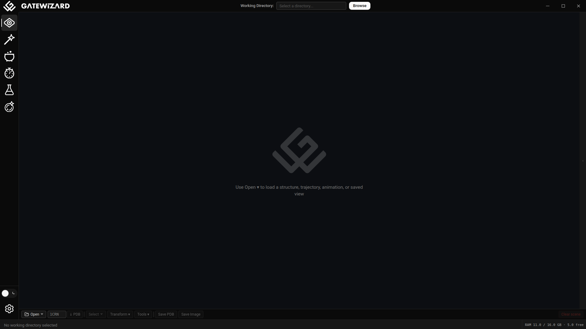

*Visualize workspace*

## Visualization

1. **Open** a PDB/mmCIF (or paste an RCSB id).
2. Use the toolbar: **Open / Select / Tools / Save Image**.
3. **Representations** dock: cartoon, licorice, surface, coloring, selections.
4. Orbit with the left mouse button; **Ctrl+scroll** zooms more slowly.

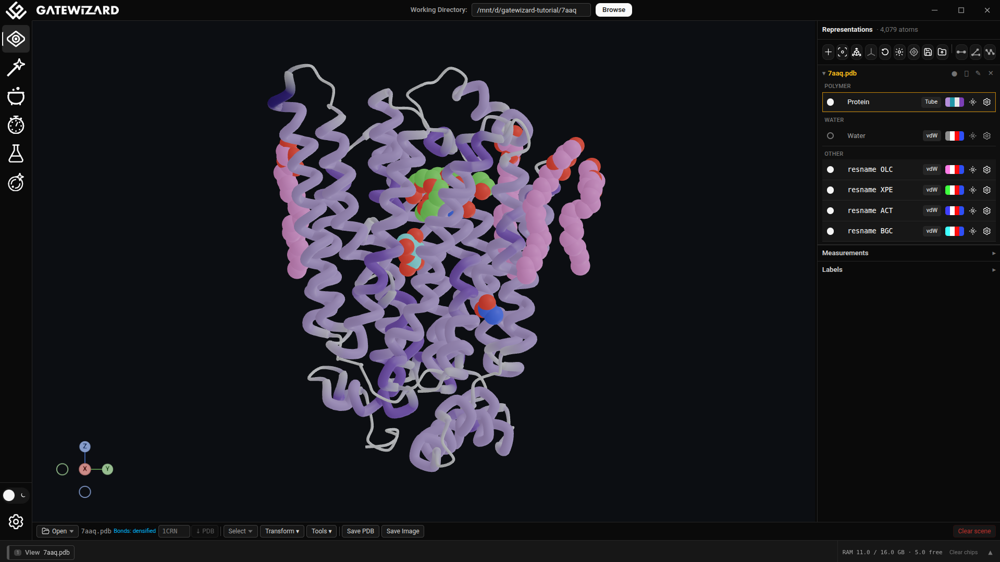

### Trajectories

Load a topology + DCD/XTC/TRR (or PSF+DCD). The play slider and optional **Traj-smooth** cards appear once frames are available.

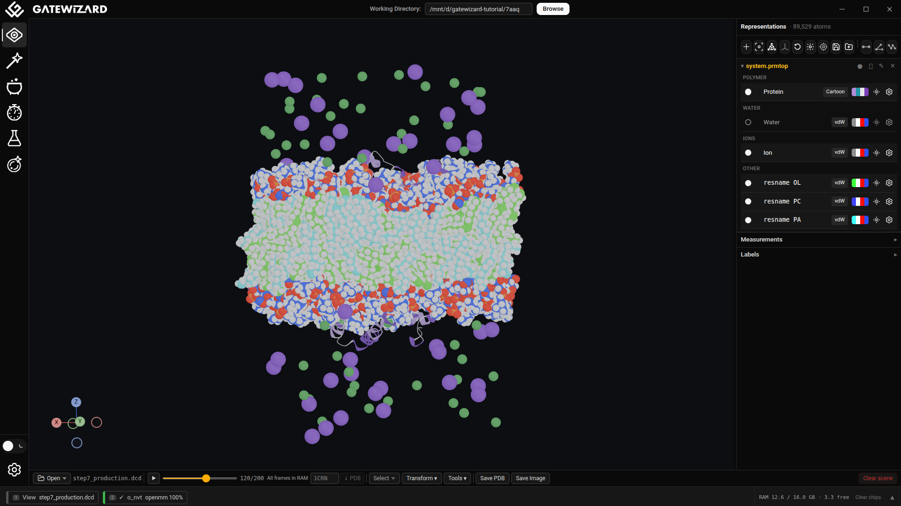

### Animation

Turn **Animate** on for a keyframe timeline. Export GIF/WebM/PNG (transparent background is available for those formats; MP4/MOV stay opaque).

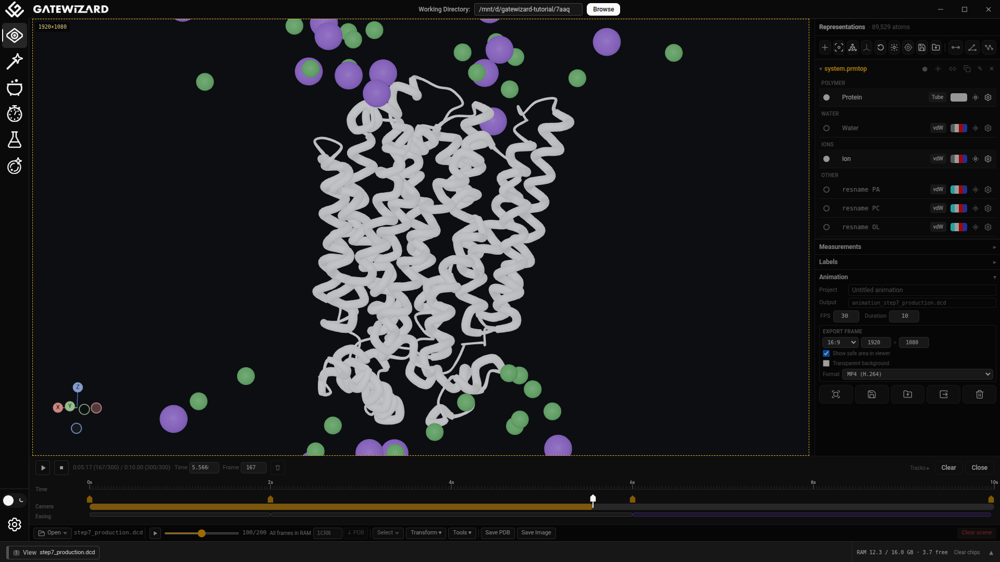

### Tools on Visualize

**Tools ▾** includes mutate residue, split chain, superimpose, and related edits. Mutate writes a new structure into the session.

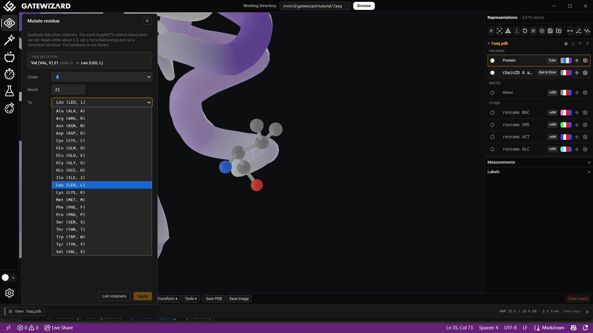

**Save Image** opens the figure dialog (size, scale, transparent PNG, yellow crop overlay).

## Preparation

PropKa table plus an inline 3D view of the working PDB.

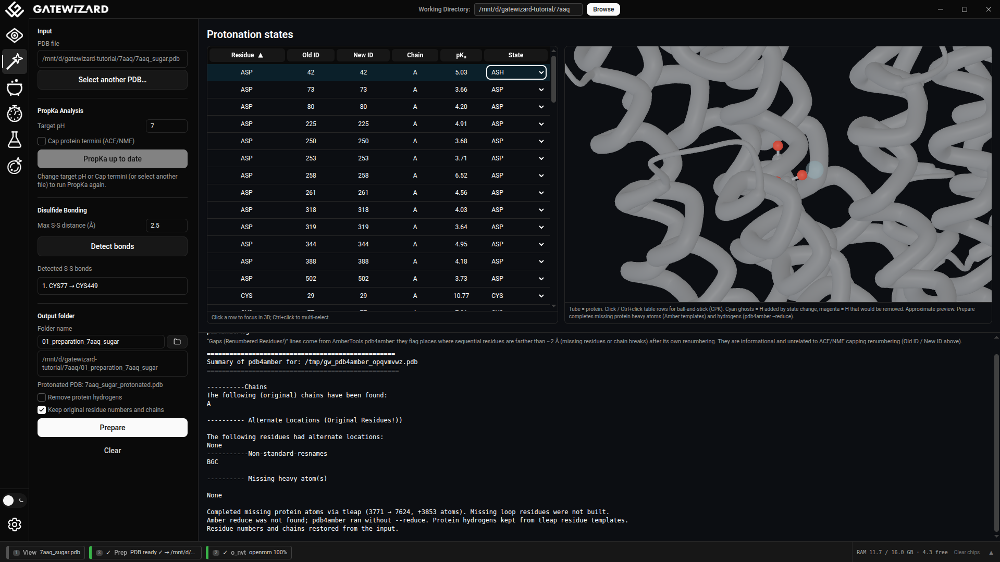

1. Set the working directory (top bar) and load a PDB.
2. Choose pH and optional **protein capping** (ACE/NME).
3. Run analysis. The table lists residue, Old ID, New ID, chain, pKa, and state at pH.
4. Auto-detect disulfide bonds if needed, then **Prepare** (missing protein heavy atoms from Amber templates, PropKa names, AmberTools hydrogens). Missing loop residues are not built. Stale CONECT/LINK records are dropped. If the Amber `reduce` binary is missing, Prepare keeps tleap hydrogens and still writes a prepared PDB.

**Keep original residue numbers and chains** is on by default. PropKa and AmberTools still add hydrogens; residue and chain ids stay as in the input (a missing loop that jumps from 200 to 205 stays that gap). Uncheck it for sequential Amber numbering (tleap / MD).

Capping is for fragments and termini that should not stay charged in MD. The capper still writes ACE as residue 1 and shifts the chain for its own file; **Prepare** with preserve on puts the protein numbers back. New ACE/NME then get N-terminus − 1 (residue **0** if the chain starts at 1) and C-terminus + 1. The capper mapping file is kept for later Builder/PropKa steps.

## Builder

Leaflet composition, water/ions, and parametrization. Each run is a **job card** under the project folder.

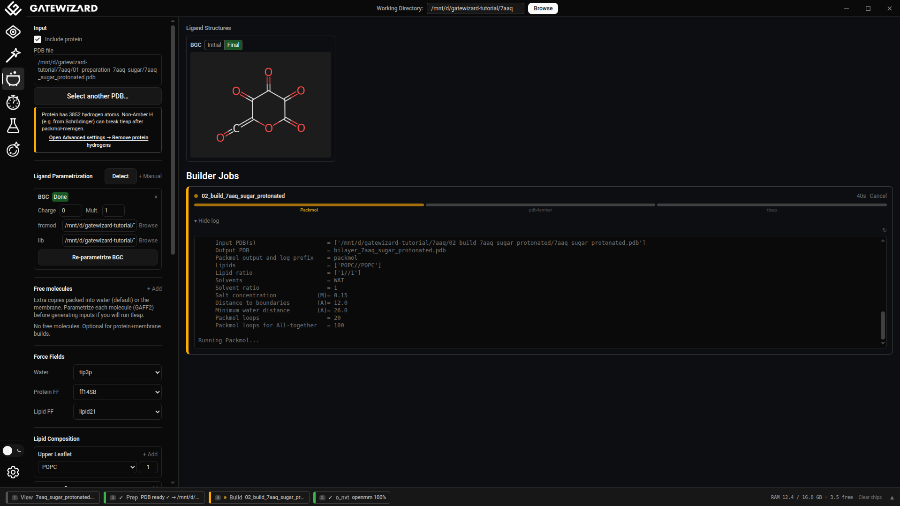

1. Working file: prepared protein (or uncheck protein for bilayer-only and set membrane XY).
2. Upper/lower lipids and ratios.

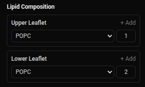

3. Water model, protein FF, lipid FF, salt, water thickness.
4. Validate, then generate inputs / start preparation. Watch the job card; **Cancel** stops a running `run_preparation.sh`.

Keep **Skip protonation** on when the PDB already has PropKa names (ASH, GLH, HIP, CYX).

## Equilibration

Pick an engine (NAMD, GROMACS, OpenMM, Amber), a scheme (NVT/NPT/…), then **Generate**.

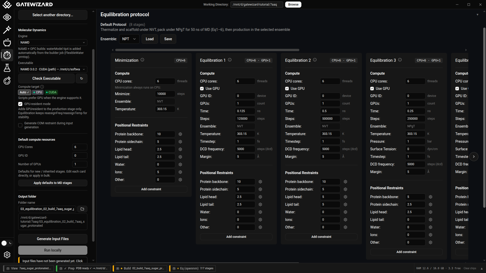

### Jobs

Progress cards: **Watch** (local logs), **Pull** (sync from a remote job), and per-stage status.

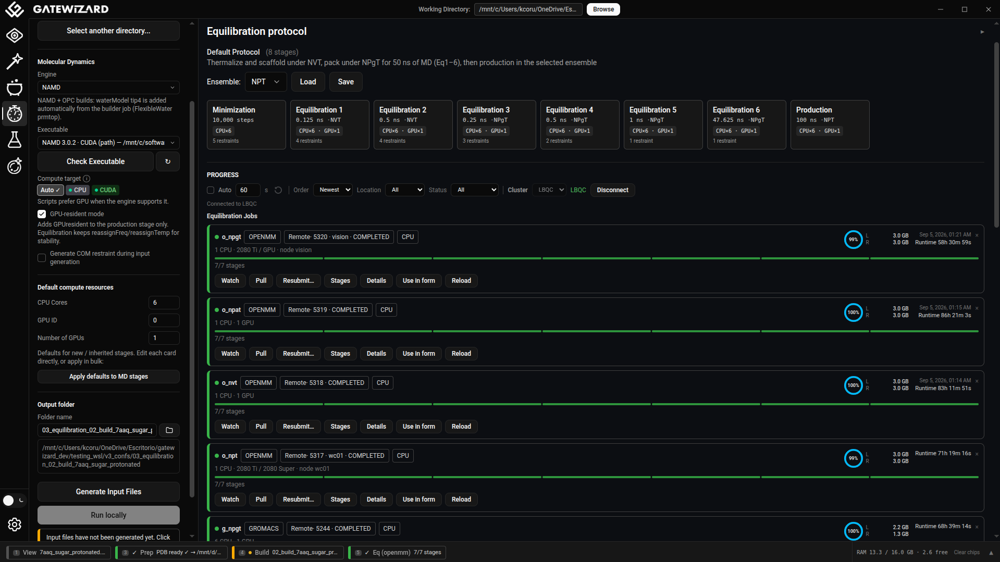

### Cluster

**Run on cluster** uses Settings → Clusters (SSH, workdir, Slurm). The dialog writes a cluster run script next to the local equilibration folder.

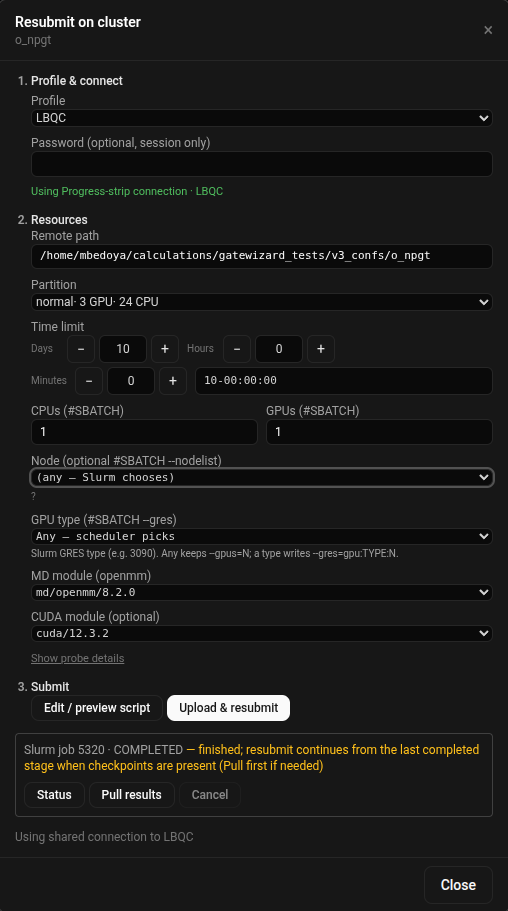

## Tools

**Fix PBC** unwraps/centers a trajectory for analysis or Visualize. Other tools on this page stay job-based (status JSON in the project folder).

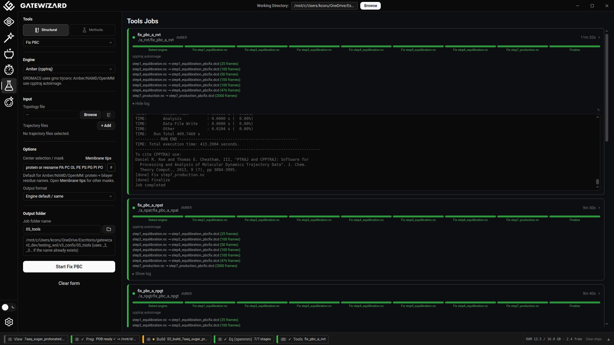

Folder-wide job scans pause while you are on Visualize so playback stays smooth.

## Analysis

Two modes on the same page:

- **Structural** — RMSD, RMSF, distances, Rg, area-per-lipid / thickness (FATSLiM, GridMAT, or lipyphilic).
- **Energetic** — NAMD / OpenMM / GROMACS / Amber log plots. Engine selector chooses the parser.

Selections use MDAnalysis syntax (`protein and name CA`). Multi-file runs need per-file times so the x-axis is in ns, not concatenated steps. Details: [Analysis features](analysis.md).

## Settings and clusters

Gear → **Clusters**: host, user, key, remote workdir, optional scratch. GPU safe mode is session-only unless you change it here.

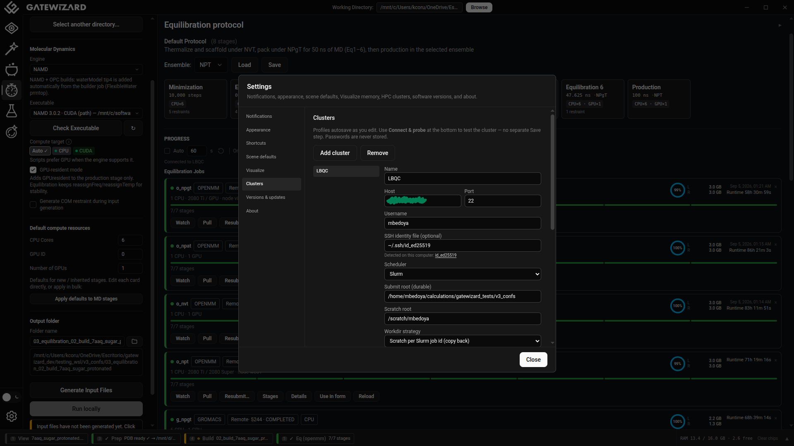

## Status bar

The footer shows backend connectivity and **system RAM** (not polled while you stay on Visualize).

## Python API

For scripts, use the [API reference](api/index.md) and [method dictionary](api/dictionary.md). Copy any `tests/<module>_examples/*_example_NN.py` — those files are what pytest runs and what the docs include.
